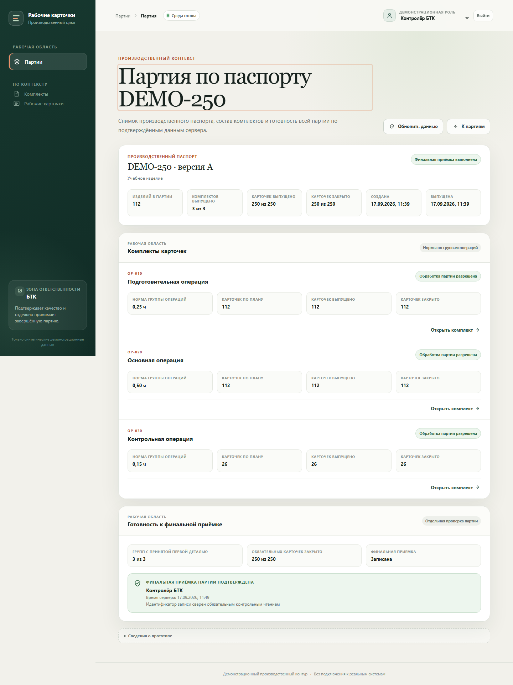
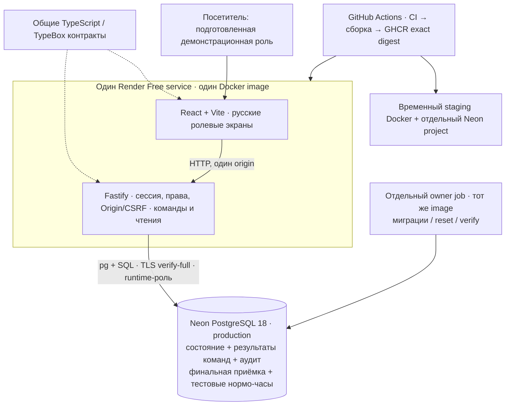

# WorkCard-Lifecycle — жизненный цикл производственной карточки

**Независимый портфолио-кейс:** от бумажного задания и правил приёмки до работающего веб-приложения с ролевым процессом, PostgreSQL и публичным демо. Предметная основа — личный производственный опыт автора, ретроспективное интервью с бывшим мастером и обезличенная рабочая карточка. Данные и цифровой процесс синтетические; внедрения на заводе и измеренного производственного эффекта нет.

[Открыть демо](https://work-card-demo.onrender.com) · [Показ за 5–7 минут](docs/portfolio/demo-script.md#короткий-показ) · [Экраны](docs/portfolio/screenshots.md) · [Ретроспектива](docs/portfolio/engineering-retrospective.md)

**Версии исходников и демо различаются.** Исходники с исправлениями аудита прошли [CI 7/7 для `2d4609ad…`](https://github.com/AI-shoks/WorkCard-Lifecycle/actions/runs/36449212344). Публичное демо сохраняет прежний релиз `1195892…`; исправления FA-01/02 туда не размещались. Цель завершения — портфолио-кейс с явными ограничениями этого демо. Подготовлен согласованный состав с основной веткой; его собственные commit/CI и итоговая приёмка ещё впереди — [финальный аудит](docs/project/final-audit.md#граница-завершения-портфолио--2026-09-29).

## Задача и моя роль

Сделать явными ответственность и условия перехода задания: кто выпускает карточки, кто назначает и фиксирует работу, когда БТК разрешает обработку партии и чем закрытие одной карточки отличается от приёмки всей партии. История должна объяснять результат действия, а повтор или конкурентный запрос — не создавать дубликат.

Моя роль — автор кейса: исследование и границы задачи, модель предметной области, требования и критерии приёмки, русский ролевой UX, реализация frontend/backend, проверки и выпуск демонстрации. Работа прослеживается от [происхождения решений](docs/project/decision-provenance.md) через [требования](docs/requirements/requirements-traceability.md) к коду и [проверкам](docs/engineering/quality-gates.md). Интервью не выдаётся за формальное обследование предприятия; [позиционирование](docs/project/case-study-positioning.md) отделяет наблюдения от проектных решений.

## Реализованный процесс

**ПДБ создаёт партию и выпускает комплекты → мастер назначает и ведёт работу → БТК принимает первую деталь и каждую карточку → БТК отдельно принимает завершённую партию.** Администратор просматривает журнал и создаёт тестовую запись нормо-часов закрытой карточки.

- Партия содержит несколько комплектов по группам операций. Норма сохраняется снимком; карточка не является серийным номером физической детали.
- Приёмка первой детали разрешает обработку только своего комплекта. Рабочий видит свои назначения; начало и завершение фиксирует мастер.
- Финальная приёмка доступна после принятых первых деталей и закрытия всех обязательных карточек. Это отдельная неизменяемая запись БТК, а не автоматически вычисленный статус.
- Тестовый учёт сохраняет нормо-часы один раз. Денежных расчётов и связи с бухгалтерией нет; этот учёт не является условием финальной приёмки.

Канонический пример: **112 изделий → 3 комплекта (112 + 112 + 26) → 250 карточек**. Это заданный синтетический план демонстрации, а не универсальная формула производства. Распределение первого комплекта `1 + 59 + 52` даёт исполнителям 60 и 52 карточки без выдуманных диапазонов номеров деталей. [Команды](apps/api/src/workflow-service.ts) · [Данные примера](apps/api/src/demo-fixtures.ts).



Реальная SPA, локальный успешный браузерный проход от **17 сентября 2026 года**. Это исторический снимок, не текущие данные публичного сервиса. [Происхождение и остальные экраны](docs/portfolio/screenshots.md).

## Архитектура



Это модульный монолит: API раздаёт собранную SPA, PostgreSQL хранит текущее состояние, а аудит объясняет изменения. Запись нормо-часов находится в той же БД. Схема показывает реализованные компоненты: `pg` и SQL, без отдельного payroll-сервиса. [Код API](apps/api/src/app.ts) · [Контракты](packages/contracts/src/workflow.ts) · [Deployment](docs/release/deployment.md).

| Решение                                                            | Зачем оно нужно                                                                      |
| ------------------------------------------------------------------ | ------------------------------------------------------------------------------------ |
| Одна транзакция для изменения, результата команды и аудита         | Ошибка записи не оставляет частично выполненное действие                             |
| Версии агрегатов, блокировки строк и сохранённый результат команды | Конкурентное изменение получает конфликт, повтор доставки — прежний результат        |
| Успех UI после ответа команды и контрольного чтения                | При потере ответа интерфейс перечитывает данные без автоматического повтора действия |
| Полный серверный журнал массовой операции                          | Выпуск проверяется по всем 254 событиям: партия + 3 комплекта + 250 карточек         |
| Раздельные runtime и owner, закрытие API при просроченном reset    | Браузер и сервер приложения не получают административные полномочия БД               |

Подробности и цена решений — в [ретроспективе](docs/portfolio/engineering-retrospective.md). Подготовленные пользователи позволяют показать роли, но не заменяют персональную идентификацию, SSO или промышленную модель доступа.

## Что проверено

Ниже сохранённые результаты конкретных версий, а не новый прогон текущего рабочего дерева.

| Доказательство                                                                                                                                                                     | Результат и граница                                                                                                                            |
| ---------------------------------------------------------------------------------------------------------------------------------------------------------------------------------- | ---------------------------------------------------------------------------------------------------------------------------------------------- |
| [CI релизного SHA](https://github.com/AI-shoks/WorkCard-Lifecycle/actions/runs/35210700261)                                                                                        | 7 успешных jobs: код/БД, контейнер, безопасность, compact/canonical браузер, performance, release contract                                     |
| [Публикация образа](https://github.com/AI-shoks/WorkCard-Lifecycle/actions/runs/35211261430)                                                                                       | Одна сборка, публичное скачивание по digest; сохранённый Trivy scan без HIGH/CRITICAL на дату проверки                                         |
| [Staging и публичное демо](https://github.com/AI-shoks/WorkCard-Lifecycle/actions/runs/35452096053)                                                                                | Реальный браузер → API → PostgreSQL: 250 закрытых карточек, отдельная финальная приёмка, 254 события выпуска, чтение той же записи нормо-часов |
| [Recovery canonical](https://github.com/AI-shoks/WorkCard-Lifecycle/actions/runs/36316059944) и [compact](https://github.com/AI-shoks/WorkCard-Lifecycle/actions/runs/36320856998) | Полный и сокращённый процессы на recovery-БД; отказ API после реальных 192,58 часа без reset и восстановление после owner reset                |

Релиз: source SHA `1195892f15f2f240dd04f39e8388d6bb8802d9a7`. [Manifest](docs/release/manifests/1195892f15f2f240dd04f39e8388d6bb8802d9a7.json) и [release assets](https://github.com/AI-shoks/WorkCard-Lifecycle/releases/tag/work-card-1195892f15f2f240dd04f39e8388d6bb8802d9a7) связывают образ и отчёты; [quality gates](docs/engineering/quality-gates.md) сохраняют историю, условия и неуспешные попытки. Число 254 относится только к событиям выпуска. **Rollback drill не проверен: предыдущего совместимого образа нет.**

Первоначальный финальный аудит 27 сентября выполнен статически на checkout с HEAD `4e813f5a9641abe3068d1dfc544399d557028316` и локальными изменениями; приложение и тестовые сценарии при нём не запускались. FA-01/02 сначала закрыты локально, затем commit `2d4609ad0188a0ec2e77ef1065195971aa14c455` прошёл [CI 36449212344, attempt 1](https://github.com/AI-shoks/WorkCard-Lifecycle/actions/runs/36449212344): 7/7 checks success, включая audit/negative assertions, полный browser lifecycle и остальные обязательные gates. [Отчёт аудита](docs/project/final-audit.md) отделяет эти результаты от исторического релиза и ручного подтверждения пользователя; публичный образ не менялся, полный DoD требует отдельного решения для выбранной версии.

## Как открыть и показать

1. Откройте [демо](https://work-card-demo.onrender.com) и дождитесь пробуждения сервиса.
2. Выберите «Специалист ПДБ», затем «Новая партия»: паспорт показывает группы операций, количества карточек и нормы.
3. Используйте [сценарий показа за 5–7 минут](docs/portfolio/demo-script.md#короткий-показ). Полный проход 250 карточек описан отдельно и не обещается за несколько минут.

Демо общее для посетителей. Сброс изменений и сессий запланирован ежедневно; готовой завершённой партии может не быть. Бесплатный контур допускает сон, холодный старт и недоступность по квотам. При сбое расписания требуется обслуживание владельцем; после 26 часов без успешного reset API закрывается. Если демо недоступно, используйте [снимки экранов](docs/portfolio/screenshots.md) и сохранённые отчёты.

Локально нужны Docker Desktop с Linux engine и свободные порты. Из каталога `WorkCard-Lifecycle`:

```powershell
docker compose up --build --wait --wait-timeout 180
docker compose run --rm --no-deps readiness
```

После успешной readiness-проверки откройте [localhost:3000](http://localhost:3000/). Подготовка окружения, явный выбор env-файла для host-команд и диагностика — в [инструкции запуска](docs/engineering/local-development.md). Инструкции сверены с кодом и конфигурацией без запуска; команды не требуют удаления существующих томов.

## Ограничения и дальнейшая работа

Нет отрицательного контроля и доработки, переназначения, повторного выпуска, редактирования паспортов/норм, серийной прослеживаемости деталей и реальных выплат. Цифровая приёмка не заменяет физические подписи БТК. Производительность на синтетических данных не является заводским SLA. [Scope](docs/product/mvp-scope.md) · [Подробные ограничения](docs/portfolio/engineering-retrospective.md#ограничения).

На 29 сентября 2026 года этапы 1–11 завершены; сверены 22 DoD и CI исходников `2d4609ad…` — 7/7. **FA-03 закрыт по проверенным исходникам решением D-032 от 29 сентября; этап 12/roadmap открыты.** Объединённый с main состав проходит собственный CI. Последний документированный hosted source — `1195892f15f2f240dd04f39e8388d6bb8802d9a7`; новая размещённая версия и доступность сейчас не подтверждались. В lockfile этого source остаются версии `fast-uri` с известными уязвимостями; обновление зависимостей в исходниках не обновляет сайт. [Границы проверки безопасности](docs/engineering/quality-gates.md#security-после-интеграции--2026-09-29). Пользователь подтвердил ручную проверку демо без точного SHA/окружения; это подтверждение не переносится на изменённый код. Статус и ограничения — в [аудите](docs/project/final-audit.md), [плане](docs/project/project-plan.md) и [backlog](docs/project/backlog.md), [чек-лист ручной проверки](docs/portfolio/demo-script.md#отложенная-ручная-проверка-этапа-12). Исторический GCP/Terraform-вариант сохранён в [отдельном runbook](docs/release/deployment-gcp-history.md); он не является текущим размещением.

[Карта документации](docs/documentation-index.md) · [Домашняя страница проекта](00%20Home.md) · [Архитектурные решения](docs/architecture/adr/README.md) · [Репозиторий](https://github.com/AI-shoks/WorkCard-Lifecycle)
