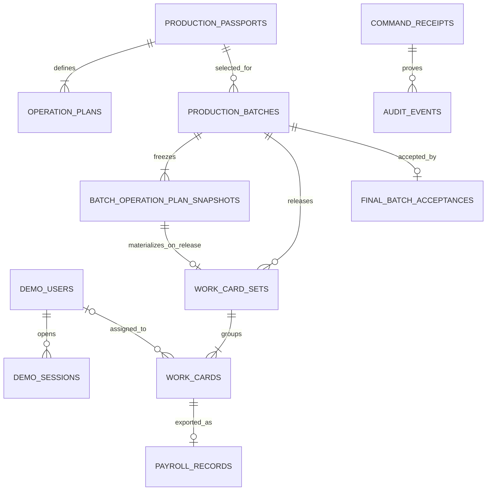

# ER Model

Физическая модель PostgreSQL для [[domain-model]]. Она хранит текущее состояние обычными таблицами и отдельный append-only audit; event sourcing не используется. Имена и constraints сверены статически с SQL migrations `0001`–`0004` по [[0010-pg-sql-and-local-payroll-service|ADR-0010]]; это не результат нового запуска migrations.

## Принципы отображения

- Все предметные ID — UUID, создаваемые приложением. UUID карточки остаётся внутренним ключом и не является номером детали.
- В таблицах нет `sequence_number`, `part_number`, позиции `n из N` или сущности физической детали.
- Норма хранится как `numeric(8,2)` и принадлежит operation scope/комплекту/снимку карточки, но не партии.
- Изменяемый aggregate root имеет `version integer NOT NULL CHECK (version > 0)`.
- Статусы хранятся как `text` с `CHECK`, чтобы migration diff был явным и не зависел от PostgreSQL enum DDL.
- Все времена — `timestamptz` в UTC; API возвращает RFC 3339.
- Мягкого удаления предметных и audit-записей в MVP нет.

## Связи

```mermaid
erDiagram
    DEMO_USERS ||--o{ DEMO_SESSIONS : opens
    PRODUCTION_PASSPORTS ||--|{ OPERATION_PLANS : defines
    PRODUCTION_PASSPORTS ||--o{ PRODUCTION_BATCHES : selected_for
    PRODUCTION_BATCHES ||--|{ BATCH_OPERATION_PLAN_SNAPSHOTS : freezes
    PRODUCTION_BATCHES ||--o{ WORK_CARD_SETS : releases
    BATCH_OPERATION_PLAN_SNAPSHOTS ||--o| WORK_CARD_SETS : materializes_on_release
    WORK_CARD_SETS ||--|{ WORK_CARDS : groups
    DEMO_USERS o|--o{ WORK_CARDS : assigned_to
    PRODUCTION_BATCHES ||--o| FINAL_BATCH_ACCEPTANCES : accepted_by
    WORK_CARDS ||--o| PAYROLL_RECORDS : exported_as
    COMMAND_RECEIPTS ||--o{ AUDIT_EVENTS : proves
```

`audit_events.aggregate_id` — полиморфный UUID без общего FK: целевые таблицы имеют разные жизненные циклы, а append-only событие должно пережить изменение projection. Существование aggregate проверяет application service до insert.

## Reference data и demo-session

### `demo_users`

| Колонка | Тип / constraint |
|---|---|
| `id` | `uuid primary key` |
| `username` | `text not null unique`; синтетический стабильный login, не пароль |
| `display_name` | `text not null` |
| `role_code` | `text not null check in (PLANNER, MASTER, WORKER, QUALITY_CONTROLLER, ADMIN_AUDITOR)` |
| `enabled` | `boolean not null default true` |

Отдельного индекса `(role_code, enabled)` нет. Пользователи синтетические; паролей и реальных кадровых данных нет.

### `demo_sessions`

| Колонка | Тип / constraint |
|---|---|
| `id` | `uuid primary key` — opaque session ID из подписанной cookie |
| `demo_user_id` | `uuid not null references demo_users(id)` |
| `csrf_token_hash` | `bytea not null` |
| `created_at`, `expires_at`, `idle_expires_at`, `last_seen_at` | `timestamptz not null`; check ограничивает порядок timestamps |
| `generation` | `bigint not null default 1 check > 0`; generation текущего допуска |

Индексы: `(expires_at)`, `(demo_user_id)`. Истёкшая/idle/disabled session удаляется при неуспешной аутентификации; создание новой session очищает все истёкшие rows под общим advisory lock и применяет лимит 500. Owner-only daily reset удаляет оставшиеся sessions вместе с mutable demo aggregates; предметные команды sessions не создают.

### `production_passports`

`id uuid PK`, `product_code text`, `revision text`, `product_name text`, `planned_quantity integer check > 0`, `data_provenance text = SYNTHETIC_DEMO`, `created_at timestamptz`; `unique(product_code, revision)`. Reference rows доступны API только для чтения. API проецирует `product_code` как `code`.

### `operation_plans`

| Колонка | Тип / constraint |
|---|---|
| `id` | `uuid primary key` |
| `passport_id` | `uuid not null references production_passports(id)` |
| `operation_number` | `integer not null check (operation_number > 0)`; API `position` |
| `scope_code`, `operation_name` | `text not null`; API отображает `operation_name` как `scopeName` |
| `norm_hours` | `numeric(8,2) not null check (norm_hours > 0)` |
| `planned_card_count` | `integer not null check (planned_card_count > 0)` |

Constraints: `unique(passport_id, operation_number)`, `unique(passport_id, scope_code)`. Migration `0003` приводит первоначальный `numeric(10,4)` к `numeric(8,2)`, отклоняя потерю точности/диапазона.

### Служебное состояние

`schema_migrations` хранит `version integer PK`, `name text unique`, `checksum char(64)` и `applied_at timestamptz`; migration runner проверяет неизменность всей применённой истории.

`demo_maintenance_state` — singleton row: `singleton boolean PK CHECK(singleton)`, `maintenance boolean`, `maintenance_requested boolean`, `generation bigint CHECK > 0`, nullable `last_reset_verified_at timestamptz` и `runtime_role_name name`. Новая БД начинается с закрытым gate. Runtime имеет только `SELECT`; owner управляет maintenance, generation и verified timestamp по [[database-bootstrap]].

## Партия и snapshots

### `production_batches`

| Колонка | Тип / constraint |
|---|---|
| `id` | `uuid primary key` |
| `quantity` | `integer not null check (quantity > 0)` |
| `source_passport_id` | `uuid not null references production_passports(id)` |
| `passport_code_snapshot`, `passport_revision_snapshot`, `product_name_snapshot` | `text not null` |
| `lifecycle_status` | `text not null check in (CREATED, RELEASED, FINAL_ACCEPTED)` |
| `final_acceptance_id` | `uuid null`, deferred FK добавляется после таблицы acceptance |
| `version` | `integer not null check (version > 0)` |
| `created_at`, `released_at`, `final_accepted_at` | `timestamptz`; последние два nullable по состоянию |
| `created_by`, `released_by` | `uuid references demo_users(id)`; release actor nullable до выпуска |

Same-row checks связывают lifecycle с обязательными timestamps: `CREATED` не имеет release/final fields; `RELEASED` имеет release и не имеет final; `FINAL_ACCEPTED` имеет оба времени и `final_acceptance_id`.

### `batch_operation_plan_snapshots`

`id uuid PK`, `batch_id FK`, `source_operation_plan_id FK`, `position`, `scope_code`, `scope_name`, `norm_hours`, `planned_card_count`. Значения копируются в транзакции `CreateProductionBatch` и после этого неизменяемы. Constraints повторяют положительность и `unique(id, batch_id)`/`unique(batch_id, position)`/`unique(batch_id, scope_code)`. Runtime role может только читать и вставлять snapshots.

Snapshot создаётся при создании партии, а не при выпуске: последующее изменение seed/reference data не меняет уже выбранный паспорт.

## Комплекты и карточки

### `work_card_sets`

| Колонка | Тип / constraint |
|---|---|
| `id` | `uuid primary key` |
| `batch_id` | `uuid not null references production_batches(id)` |
| `plan_snapshot_id` | `uuid not null references batch_operation_plan_snapshots(id)` |
| `scope_code_snapshot`, `scope_name_snapshot` | `text not null` |
| `norm_hours_snapshot` | `numeric(8,2) not null check > 0` |
| `planned_card_count` | `integer not null check > 0` |
| `gate_status` | `text not null check in (FIRST_ARTICLE_PENDING, SERIAL_ALLOWED)` |
| `first_article_work_card_id` | `uuid null`, deferred FK после создания `work_cards`; заполняется уже при выборе первой карточки до открытия gate |
| `first_article_controller_id`, `first_article_accepted_at` | nullable, заполняются вместе с открытием gate |
| `version` | `integer not null check > 0` |
| `released_at` | `timestamptz not null` |

Constraints: composite FK `(plan_snapshot_id, batch_id)` на snapshot той же партии, `unique(batch_id, plan_snapshot_id)`, `unique(id, batch_id)` и partial `unique(first_article_work_card_id)` where not null. Same-row check требует пустые acceptance fields для pending gate и полный набор для `SERIAL_ALLOWED`.

### `work_cards`

| Колонка | Тип / constraint |
|---|---|
| `id` | `uuid primary key`; технический ID без пользовательской последовательности |
| `work_card_set_id`, `batch_id` | UUID; composite FK `(work_card_set_id, batch_id)` гарантирует принадлежность той же партии |
| `batch_quantity_snapshot` | `integer not null check > 0` |
| `scope_code_snapshot`, `scope_name_snapshot` | `text not null` |
| `norm_hours_snapshot` | `numeric(8,2) not null check > 0` |
| `purpose` | nullable `FIRST_ARTICLE` / `SERIAL`; определяется один раз при assignment |
| `status` | `RELEASED`, `ASSIGNED`, `IN_PROGRESS`, `COMPLETED`, `CLOSED` |
| `closure_type` | nullable; `FIRST_ARTICLE_ACCEPTANCE` или `SERIAL_QUALITY_CONFIRMATION` только для `CLOSED` |
| `assignee_id` | nullable FK на `demo_users`; application service дополнительно требует роль `WORKER` |
| `version` | `integer not null check > 0` |
| `released_at`, `assigned_at`, `started_at`, `completed_at`, `closed_at` | `timestamptz` по достигнутому состоянию |
| `released_by`, `assigned_by`, `started_by`, `completed_by`, `closed_by` | FK на `demo_users`; release actor обязателен, остальные появляются по состоянию |

Checks требуют `purpose/assignee` пустыми только в `RELEASED` и заполненными после назначения. `closure_type` пуст до `CLOSED` и соответствует purpose в терминальном состоянии. Набор timestamps/actors монотонно дополняется согласно state machine. Команд обратного изменения purpose/assignee в API нет; результаты выполнения integration tests учитываются отдельно в [[quality-gates]].

Индексы:

- `(work_card_set_id, status, id)` для списков и completion predicate;
- `(assignee_id, status, id)` для worker projection;
- `(batch_id, status)` для aggregate counts;
- `(work_card_set_id, purpose)` partial unique where `purpose = 'FIRST_ARTICLE'` — не более одной first-article карточки в комплекте.

Deferred FK `work_card_sets.first_article_work_card_id → work_cards.id` и application check подтверждают, что карточка принадлежит тому же комплекту; SQL migration добавляет deferred constraint trigger для cross-row принадлежности.

## Неизменяемые результаты

### `final_batch_acceptances`

`id uuid PK`, `batch_id uuid not null unique`, `controller_id uuid not null`, `accepted_at timestamptz not null`, `command_id uuid not null unique`, `resulting_batch_version integer not null`. Runtime role имеет только `SELECT/INSERT`. `production_batches.final_acceptance_id` получает unique deferred FK; deferred constraint trigger подтверждает взаимное соответствие `acceptance.batch_id = batch.id`, чтобы acceptance и batch link коммитились атомарно.

### `payroll_records`

`id uuid PK`, `work_card_id uuid not null unique`, `beneficiary_id uuid not null`, `norm_hours_snapshot numeric(8,2) not null check > 0`, `exported_by uuid not null`, `exported_at timestamptz not null`, `command_id uuid not null unique`. Runtime role имеет только `SELECT/INSERT`; запись не содержит денег, ставок, налогов или фактического времени.

## Идемпотентность и аудит

### `command_receipts`

| Колонка | Назначение |
|---|---|
| `command_id uuid primary key` | клиентский idempotency key |
| `command_type text` | тип команды, неизменяемый для этого ID |
| `actor_id uuid`, `actor_role text` | доверенный контекст выполнения |
| `request_fingerprint char(64)` | fingerprint запроса; одинаковый ID с другим body/target не допускается |
| `correlation_id uuid not null unique` | объединяет все события команды |
| `state text` | `IN_PROGRESS` внутри транзакции, затем `SUCCEEDED`; deferred constraint trigger запрещает commit незавершённой строки |
| `http_status integer`, `result_type text`, `result_id uuid`, `response_body jsonb` | стабильный replay результата |
| `event_count integer not null` | ожидаемое число audit events успешной команды |
| `created_at`, `completed_at` | времена команды |

Первая вставка receipt сериализует одинаковый `commandId` через unique index. Любая ошибка откатывает всю транзакцию вместе с `IN_PROGRESS` row.

### `audit_events`

`id uuid PK`, `event_type text`, `aggregate_type text`, `aggregate_id uuid`, `aggregate_version integer`, `occurred_at timestamptz`, `actor_id`, `actor_role`, `command_id FK`, `correlation_id`, `payload jsonb not null default '{}'`. Constraints:

- `unique(aggregate_type, aggregate_id, aggregate_version)`;
- FK `(command_id)` на `command_receipts` — deferred до конца транзакции;
- index `(aggregate_type, aggregate_id, aggregate_version, occurred_at, id)`;
- index `(correlation_id, occurred_at, id)`;
- index `(command_id)`.

Runtime role имеет `SELECT/INSERT`, но не `UPDATE/DELETE`; trigger дополнительно отклоняет mutation существующих audit rows. Payload хранит только необходимые snapshots/changes и не содержит cookie, CSRF token, stack trace или секреты.

## Порядок миграций

1. `0001_foundation.sql`: синтетические users, passports, operation plans.
2. `0002_backend-vertical-slice.sql`: sessions, batches/snapshots, sets/cards, receipts, immutable results, audit, cross-links и triggers.
3. `0003_align-operation-plan-norm-precision.sql`: проверяемое приведение точности нормы к `numeric(8,2)`.
4. `0004_demo-maintenance-state.sql`: persistent gate и session generation.

`migration-runner.ts` создаёт history table и runtime role, применяет каждый новый SQL-файл в отдельной транзакции, затем обновляет grants отдельной транзакцией. Initial seed — отдельная owner-операция, не migration-файл. Применённые файлы защищены проверкой checksums; destructive schema migration требует отдельного review. Проверка на чистой PostgreSQL 18 является gate; доказательства конкретных запусков — [[quality-gates]].

## Проверяемые свойства

- fixture создаёт `3` sets и `250` cards, при этом у всех `batch_quantity_snapshot = 112`;
- в `production_batches` нет `norm_hours`;
- отсутствует любая sequence/part identity;
- уникальные ограничения блокируют вторую final acceptance и payroll record;
- stale version update затрагивает `0` rows и преобразуется в conflict;
- audit row нельзя изменить или удалить runtime-пользователем;
- snapshot остаётся прежним после изменения seed/reference row в тесте.
