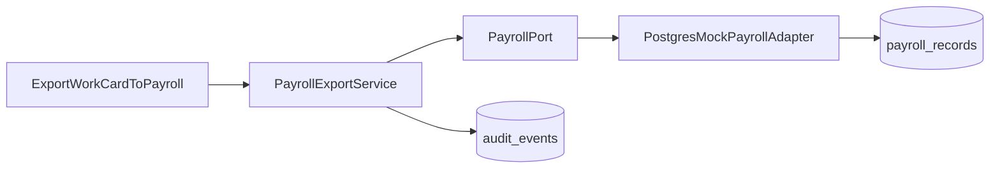

# Mock Integrations

MVP демонстрирует границу payroll, но не вызывает реальную внешнюю систему. `ExportWorkCardToPayroll` создаёт одну локальную immutable `PayrollRecord` через application port.

## Граница



`PayrollPort` позволяет позднее заменить adapter, не смешивая внешний transport с domain rules. В MVP adapter и audit участвуют в одной локальной PostgreSQL transaction; outbox, retry worker и сетевой delivery отсутствуют.

## Входной контракт

Application command:

```ts
type ExportWorkCardToPayroll = {
  commandId: string;
  workCardId: string;
  expectedCardVersion: number;
};
```

`actorId`/роль поступают только из trusted session. Service под lock проверяет:

- роль `ADMIN_AUDITOR`;
- существование и актуальную version карточки;
- `status = CLOSED`;
- наличие `assigneeId`;
- положительный operation-scoped `normHoursSnapshot`.

## Результат

```ts
type PayrollRecord = {
  id: string;
  workCardId: string;
  beneficiaryId: string;
  normHoursSnapshot: string;
  exportedBy: string;
  exportedAt: string;
};
```

В записи намеренно отсутствуют деньги, валюта, ставка, налог, коэффициент, фактическое время, статус выплаты и реальный кадровый идентификатор.

## Идемпотентность

`payroll_records.work_card_id` — уникальный business key.

1. Первый допустимый command вставляет record, `WorkCardExportedToPayroll`, success receipt и возвращает `201`.
2. Replay того же `commandId` возвращает сохранённый response без новых rows/events.
3. Новый `commandId` для уже экспортированной карточки возвращает существующую record с `200`/`Idempotent-Replay: true`; event не создаётся.
4. Два concurrent insert сериализуются unique index; loser перечитывает committed winner.
5. WorkCard не меняет status/version от export: payroll record — отдельный immutable result.

Повтор с тем же `commandId`, но другим `workCardId` или actor, отклоняется как `COMMAND_ID_REUSED`.

## Ошибки

| Условие | API result | Побочный эффект |
|---|---|---|
| карточка не `CLOSED` | `409 STATE_CONFLICT` | нет |
| нет assignee | `422 INVALID_BENEFICIARY` | нет |
| stale version | `409 VERSION_CONFLICT` | нет |
| запрещённая роль | `403 ACTION_FORBIDDEN` | нет |
| DB недоступна | `503 SERVICE_UNAVAILABLE` | transaction rollback |

Mock не симулирует случайные внешние failures: это создало бы ложное впечатление о реальной integration delivery. Failure injection допускается только в integration tests атомарности.

## Read contract

`GET /api/v1/work-cards/{workCardId}/payroll-record` доступен `ADMIN_AUDITOR`. Он возвращает существующую запись или `404`; GET не создаёт export и не пишет audit.

В UI record явно помечена «Демонстрационная запись нормо-часов» и сопровождается границей: «Не является расчётом или выплатой».

## Путь к реальной интеграции — вне MVP

Реальный adapter потребует нового ADR: outbox в транзакции, delivery worker, authentication/secret rotation, provider idempotency key, retry/dead-letter, reconciliation и data/privacy agreement. Прямая HTTP-команда внутри текущей DB transaction запрещена: rollback БД не отменит уже выполненный внешний side effect.

## Проверки

- first export создаёт ровно record + event;
- повтор любым допустимым способом возвращает ту же record;
- snapshot нормы совпадает с карточкой, а не с партией;
- concurrent export не создаёт дубль;
- запрет/ошибка не создают receipt успеха;
- API/schema не содержат денежных полей;
- UI и README честно называют интеграцию mock.
