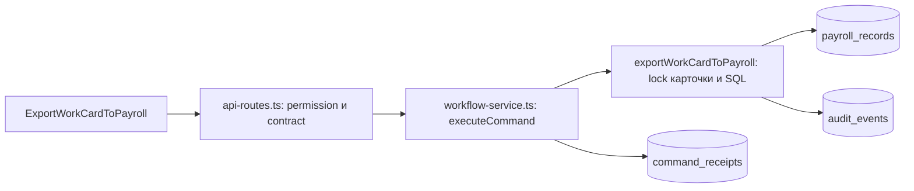

# Mock Integrations

MVP демонстрирует границу payroll, но не вызывает реальную внешнюю систему. `ExportWorkCardToPayroll` создаёт одну локальную immutable `PayrollRecord` в общем application service согласно [[0010-pg-sql-and-local-payroll-service|ADR-0010]].

## Граница


```mermaid
flowchart LR
    Command[ExportWorkCardToPayroll] --> Route[api-routes.ts: permission и contract]
    Route --> Executor[workflow-service.ts: executeCommand]
    Executor --> Service[exportWorkCardToPayroll: lock карточки и SQL]
    Service --> Record[(payroll_records)]
    Service --> Audit[(audit_events)]
    Executor --> Receipt[(command_receipts)]
```

`PayrollPort`, `PayrollExportService` и `PostgresMockPayrollAdapter`, предполагавшиеся историческим ADR-0006, не реализованы. `exportWorkCardToPayroll` использует тот же `PoolClient` общего `executeCommand`, что receipt и audit. Это одна локальная PostgreSQL transaction; outbox, retry worker и сетевой delivery отсутствуют. Выделение границы внешнего provider остаётся будущей работой при появлении реальной интеграции.

## Входной контракт

Application command:

```ts
type ExportWorkCardToPayroll = {
  commandId: string;
  workCardId: string;
  expectedCardVersion: number;
};
```

`actorId`/роль поступают только из trusted session; route требует `ADMIN_AUDITOR`. Service под lock проверяет:

- существование и актуальную version карточки;
- `status = CLOSED`;
- наличие `assigneeId`;
- `normHoursSnapshot` берётся из карточки; положительность обеспечивают SQL constraints карточки и новой payroll record.

## Результат

```ts
type PayrollRecord = {
  id: string;
  workCardId: string;
  beneficiary: { id: string; displayName: string };
  normHoursSnapshot: string;
  exportedBy: { id: string; displayName: string };
  exportedAt: string;
  commandId: string;
};
```

В записи намеренно отсутствуют деньги, валюта, ставка, налог, коэффициент, фактическое время, статус выплаты и реальный кадровый идентификатор.

## Идемпотентность

`payroll_records.work_card_id` — уникальный business key.

1. Первый допустимый command вставляет record, `WorkCardExportedToPayroll`, success receipt и возвращает `201`.
2. Replay того же `commandId` возвращает сохранённый response без новых rows/events.
3. Новый `commandId` для уже экспортированной карточки после version/state checks возвращает существующую record с `200`/`Idempotent-Replay: true`; создаёт собственный success receipt/correlation с `event_count = 0`, но не новый payroll result/event.
4. Две команды сериализуются `FOR UPDATE` одной карточки; следующая после lock читает committed result. Unique `work_card_id` дополнительно запрещает дубликат на уровне БД.
5. WorkCard не меняет status/version от export: payroll record — отдельный immutable result.

Повтор с тем же `commandId`, но другим command type, actor/role или request fingerprint (включая `workCardId` и version), отклоняется как `COMMAND_ID_REUSED`.

## Ошибки

| Условие | API result | Побочный эффект |
|---|---|---|
| карточка не `CLOSED` | `409 STATE_CONFLICT` | нет |
| нет assignee | `409 STATE_CONFLICT` | нет; такое `CLOSED` состояние также запрещено SQL lifecycle constraint |
| stale version | `409 VERSION_CONFLICT` | нет |
| запрещённая роль | `403 ACTION_FORBIDDEN` | нет |
| DB недоступна | `503 SERVICE_UNAVAILABLE` | transaction rollback |

Mock не симулирует случайные внешние failures: это создало бы ложное впечатление о реальной integration delivery. Failure injection допускается только в integration tests атомарности.

## Read contract

`GET /api/v1/work-cards/{workCardId}/payroll-record` доступен `ADMIN_AUDITOR`. Он возвращает существующую запись или `404`; GET не создаёт export и не пишет audit.

В UI record явно помечена «Демонстрационная запись нормо-часов» и сопровождается границей: «Не является расчётом или выплатой».

## Путь к реальной интеграции — вне MVP

Реальный adapter потребует нового ADR: outbox в транзакции, delivery worker, authentication/secret rotation, provider idempotency key, retry/dead-letter, reconciliation и data/privacy agreement. Прямая HTTP-команда внутри текущей DB transaction запрещена: rollback БД не отменит уже выполненный внешний side effect.

## Проверки

Ниже перечислены проверяемые свойства; наличие соответствующего теста не означает, что он выполнен на текущем рабочем дереве. Сохранённые результаты и их версии — [[quality-gates]] и [[requirements-traceability]].

- first export создаёт ровно record + event;
- повтор любым допустимым способом возвращает ту же record;
- snapshot нормы совпадает с карточкой, а не с партией;
- concurrent export не создаёт дубль;
- запрет/ошибка не создают receipt успеха;
- API/schema не содержат денежных полей;
- UI и README честно называют интеграцию mock.
