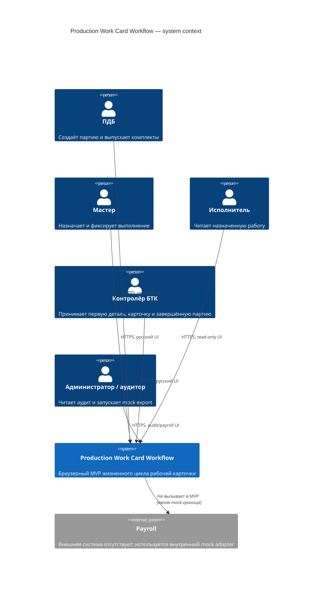
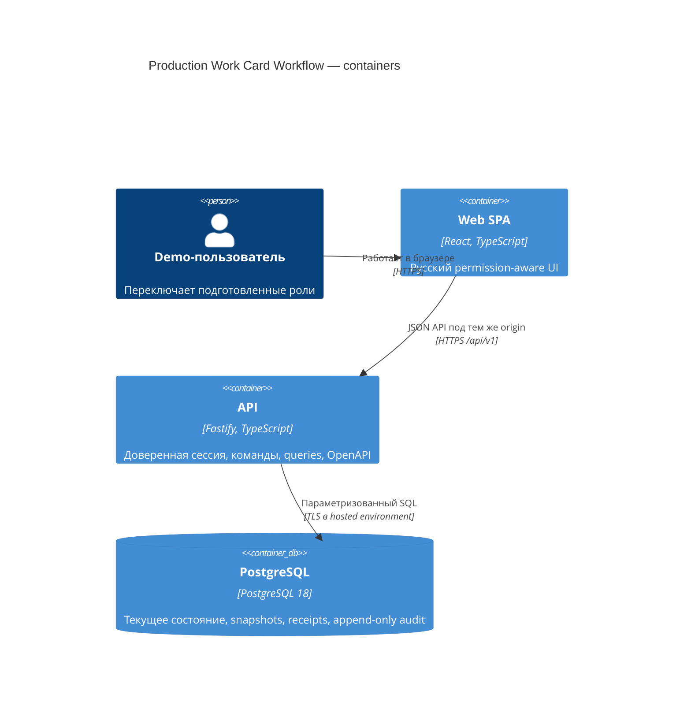

# System Context

Production Work Card Workflow — независимое demo-приложение. Оно хранит только синтетические производственные данные и не подключается к реальным MES, ERP, кадровым или расчётным системам.

## Контекст



Mock payroll показан как внешняя граница смысла, но не как реальная сеть: реализация MVP записывает единственную `PayrollRecord` в собственную БД через порт [[mock-integrations]].

## Контейнеры



В production API раздаёт статическую сборку SPA и JSON API под одним origin. В development Vite работает отдельным процессом, но проксирует `/api` в API, поэтому browser security model остаётся same-origin.

## Границы доверия

1. **Браузер недоверенный.** `role`, `actorId`, `assigneeId`, versions и hidden controls из клиента не дают полномочий.
2. **API — граница авторизации.** Он восстанавливает actor/role из подписанной demo-session, проверяет route permission и mutation Origin/CSRF до schema, затем валидирует разрешённые caller state, gate и версии.
3. **PostgreSQL — граница атомарности.** Предметные изменения, command receipt и audit events коммитятся одной транзакцией.
4. **Reference data синтетические и read-only.** UI не редактирует паспорта, operation plans или нормы.
5. **Mock payroll не является реальной интеграцией.** Нет исходящего HTTP, денег, персональных начислений или фоновой доставки.

## Backend-модули

| Модуль | Ответственность | Не владеет |
|---|---|---|
| `demo-auth` | подготовленные demo-users, серверная session, role switch, CSRF | production IAM, пароли, RBAC editor |
| `passports` | read-only паспорта и operation plans | интерактивное редактирование технологии/норм |
| `batches` | создание партии, snapshot, выпуск, финальная приёмка | состояние отдельной карточки |
| `work-card-sets` | operation scope, first-article gate, массовое назначение | финальная приёмка партии |
| `work-cards` | assignment, lifecycle, per-card quality confirmation | идентичность физической детали |
| `audit` | append-only события и полный query по `correlationId` | восстановление текущего состояния через replay |
| `payroll` | порт и идемпотентный mock adapter | денежный расчёт или внешняя доставка |

Модули вызываются через application services; route handlers только аутентифицируют запрос, валидируют contract и преобразуют результат/ошибку в HTTP.

## Основной поток данных

```mermaid
sequenceDiagram
    actor User as Demo-пользователь
    participant Web as React SPA
    participant API as Fastify API
    participant DB as PostgreSQL

    User->>Web: Подтверждает действие
    Web->>API: POST commandId + expectedVersion(s)
    API->>API: session, permission, Origin/CSRF, schema
    API->>DB: BEGIN; receipt; deterministic locks
    API->>DB: validate state/gate/version
    API->>DB: state changes + audit events + receipt
    API->>DB: COMMIT
    API-->>Web: resource + versions + correlationId
    Web->>API: GET актуальной projection
    API-->>Web: server state
```

Клиент показывает успех только после ответа API и обязательного чтения всех затронутых projections с проверкой согласованности. Mutation не попадает в offline/background queue. При конфликте, сетевой неопределённости или нарушении целостности UI очищает прежние диалог/selection и автоматически выполняет только безопасные чтения; частичные результаты не применяются. Если чтение не завершилось, команды остаются заблокированы до явного повтора чтения. Следующая команда требует нового решения по свежим данным.

## Frontend-модули

| Модуль | Ответственность |
|---|---|
| `App`, `demo-session`, `session-scope` | server-backed identity, память CSRF, shell и очистка границы роли |
| `app-routing`, `App`, `permission-guards` | семь маршрутов, History API, безопасные deep links и проекция разрешений до загрузки экрана |
| `api-client`, `read-model` | `/api/v1`, runtime validation, problem details, request context и cursor pagination |
| `batch-commands`, `master-commands`, `quality-commands`, `payroll-commands` | явные команды, версии и обязательная проверка read-back |
| `admin-audit` | server-side correlation query, все страницы и authoritative totals |
| `command-recovery`, экраны | восстановление полного текущего состояния без автоматического повтора команды |

Экран рабочего получает только доступные ему назначения; чужие audit/payroll routes не монтируют защищённые данные. Frontend guards улучшают UX, а доверенный actor и окончательное решение о доступе принадлежат API.

## Runtime и deployment shapes

| Среда | Процессы | Данные |
|---|---|---|
| Local | Compose запускает `app` со SPA/API, `database` и одноразовые `migrate`/`seed`; host development использует отдельные Vite/API процессы | именованный Docker volume; допустим явный reset только командой разработчика |
| CI | build/test jobs + чистая PostgreSQL service/container | ephemeral database на job |
| Hosted demo | один OCI application container + managed PostgreSQL | migrations перед rollout, backup/restore определяются этапом 10 |

## Нефункциональные границы MVP

- один регион и один экземпляр API достаточны; correctness не зависит от in-memory locks;
- API stateless кроме подписанной/DB-backed demo-session;
- нет broker, cache, WebSocket, offline mode или cron jobs;
- список карточек использует cursor pagination, а не выдачу всех `250` rows по умолчанию;
- health endpoints разделяют liveness и readiness;
- системные UTC timestamps отображаются пользователю в локальной зоне браузера;
- технические UUID и enum доступны API/закрытому developer context, но не называются номерами деталей в производственном UI.

## Граница готовности

Backend-контейнеры, health checks и серверные модули реализованы на этапах 6–7; история их локальной и удалённой проверки приведена в [[quality-gates]]. Текущий frontend содержит связанные с API производственные экраны и команды этапа 8. Факт наличия кода не заменяет browser demo, текущий clean-container и CI для implementation SHA: состояние этих gates принадлежит [[backlog]]. Hosted TLS/network/operations относятся к этапу 10, поэтому схема hosted demo не является заявлением о production deployment.
