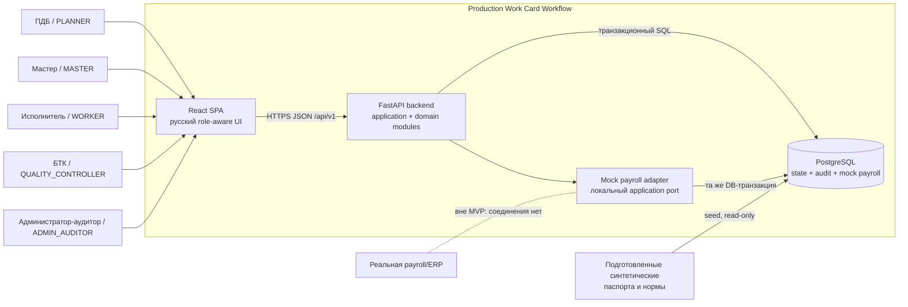
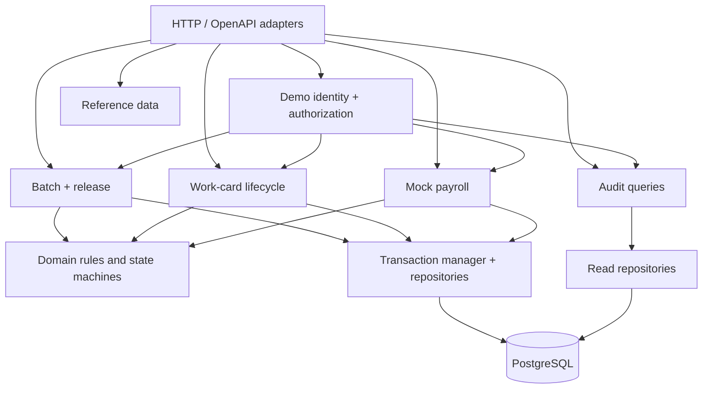

# System Context

Системная граница MVP v1 и ответственность frontend/backend. Компоненты реализуются как модульный монолит по [[technology-stack]]; диаграмма не добавляет новые производственные роли или внешние интеграции.

## Контекст

## Пользователи и доверие

| Контекст | Разрешённое намерение | Ограничение |
|---|---|---|
| `PLANNER` | выбрать seed-паспорт, создать партию, один раз выпустить комплекты | не редактирует операции и нормы |
| `MASTER` | назначить карточки и зафиксировать start/complete | не подтверждает качество |
| `WORKER` | читать собственное назначение | не отправляет lifecycle-команды |
| `QUALITY_CONTROLLER` | принять first article, подтвердить одну serial WorkCard, отдельно принять завершённую партию | positive-only, без цифровой копии физической подписи |
| `ADMIN_AUDITOR` | читать audit и создать/получить mock payroll record | не меняет производственный lifecycle |

Browser считается недоверенной средой. Actor и role берутся только из подписанного server-issued demo session; UUID, role, versions и purpose из запроса всегда перепроверяются backend.

## Контейнеры и ответственность

### React SPA

- реализует экраны и состояния из [[screen-map]], [[ui-states]] и [[permission-ux]];
- читает только `/api/v1`, не подключается к PostgreSQL;
- скрывает чужие controls, но не считается authorization boundary;
- отправляет `commandId`, CSRF token и ожидаемые версии;
- после `409` не повторяет команду автоматически, а перечитывает затронутые ресурсы;
- не выводит UUID как номер детали и не выводит `FinalBatchAcceptance` из `CLOSED` карточек.

### FastAPI backend

- устанавливает trusted demo identity и проверяет permission до раскрытия целевых данных;
- валидирует schema, предметные предусловия, gate, state и versions;
- координирует межагрегатные команды в одной PostgreSQL-транзакции;
- создаёт полный audit-набор и current-state changes атомарно;
- выдаёт OpenAPI, безопасные Problem Details и server query по `correlationId`;
- не содержит endpoints для rework, reassignment, negative acceptance или реальной payroll.

### PostgreSQL

- хранит current state, immutable snapshots и optimistic `version`;
- обеспечивает PK/FK, check/unique constraints и атомарность;
- хранит append-only `audit_events`, но не используется как event store;
- обеспечивает единственность `FinalBatchAcceptance` по `batchId` и `PayrollRecord` по `workCardId`;
- хранит read-only seed reference data и mock payroll result.

### Mock payroll adapter

- является локальной реализацией application port, а не сетевой системой;
- создаёт одну неизменяемую запись нормы в той же БД-транзакции, что и audit event;
- не рассчитывает деньги и не отправляет данные наружу;
- может быть заменён реальным adapter только новым scope/ADR и иной стратегией доставки.

## Backend modules

Модули являются кодовыми границами одного deployable приложения. Прямые HTTP-вызовы между ними, distributed transactions и broker отсутствуют.

## Поток команды

1. SPA получает trusted session/CSRF context и актуальные resource versions.
2. API проверяет session, permission и JSON schema.
3. Application service открывает транзакцию и блокирует цели в каноническом порядке.
4. Domain rules проверяют state/gate/invariants/expected versions.
5. Репозитории сохраняют current state, receipt и все audit events.
6. Только после commit API возвращает authoritative representation, versions, `commandId` и `correlationId`.
7. SPA заменяет cache серверным ответом. Optimistic success для бизнес-команд не используется.

## Поток чтения

Read endpoints не вызывают domain mutations. Обычные demo-роли читают производственные представления по [[roles-permissions]]; только `ADMIN_AUDITOR` читает историю, `correlationId` context и payroll. Pagination и filters применяются на backend.

## Deployment boundary

- same-origin HTTPS: SPA и `/api/v1` доступны с одного origin;
- application container не принимает прямые входящие DB connections;
- PostgreSQL доступен только application service и migration job;
- migrations выполняются отдельной командой до запуска новой версии;
- реальные MES/ERP/payroll, email, files и message broker отсутствуют.

Подробные контейнеры, health checks и secrets относятся к этапам 6 и 10, но не могут ослаблять [[security-baseline]].

## За пределами системы

- редактирование технологических паспортов и норм;
- индивидуальная идентификация физических деталей;
- отрицательная приёмка, отклонение и rework;
- физические или цифровые подписи БТК;
- реальные расчёты и передача payroll;
- уведомления, аналитика и интеграционная шина.

## Проверяемые границы

- browser не может изменить данные напрямую или назначить себе роль;
- отказ API не оставляет current state, receipt или success event;
- mock payroll не выполняет network I/O;
- полный audit массовой команды получается server-side по одному `correlationId`;
- `ConfirmWorkCardQuality` не создаёт `FinalBatchAcceptance`;
- только `RecordFinalBatchAcceptance` меняет партию `RELEASED → FINAL_ACCEPTED`.
