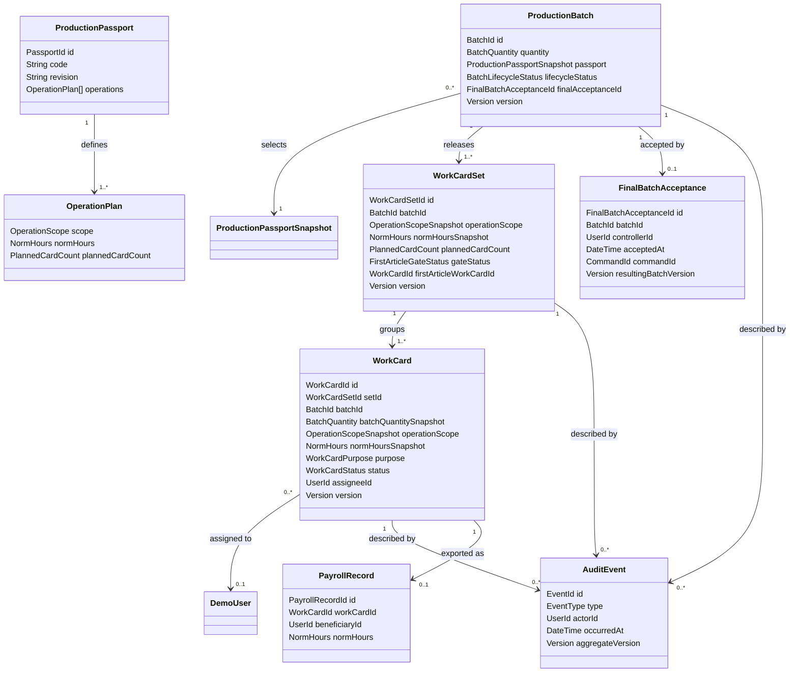

# Domain Model

Концептуальная модель MVP v1. Она исправляет кардинальности и ответственность согласно [[decision-provenance]], но не задаёт таблицы, ORM или HTTP-контракты: они появятся в [[er-model]] и [[api-contracts]].

## Принципы модели

- `ProductionBatch` ссылается на снимок подготовленного паспорта и не хранит один норматив партии;
- одна партия после выпуска имеет **несколько** `WorkCardSet` по операциям или группам операций;
- `WorkCardSet` владеет operation scope, нормой, плановым числом карточек и first-article gate;
- `WorkCard` имеет внутренний UUID, но не `SequenceNumber`, номер детали или серийную идентичность;
- `batchQuantitySnapshot` задаёт контекст партии и не является позицией `n из N`;
- мастер фиксирует lifecycle карточки; исполнитель остаётся assignee и бенефициаром;
- `FirstPieceAcceptance`, `FinalBatchAcceptance` и цифровое закрытие отдельной `WorkCard` имеют разный scope и происхождение;
- `FinalBatchAcceptance` вводится как отдельная неизменяемая запись уровня партии; она не является состоянием `WorkCard` и не заменяет физические подписи БТК;
- межагрегатные команды выпуска, назначения и first-article acceptance координируются прикладным сервисом в одной транзакции;
- audit log хранит факты, но не восстанавливает текущее состояние через event sourcing.

## Концептуальные связи

`ProductionPassport` и `OperationPlan` — подготовленные read-only reference data. Состав внешних ключей, индексов и ограничений будет принят на этапе архитектуры.

## Канонический fixture

| Объект | Значение |
|---|---|
| `ProductionBatch.quantity` | `112` |
| комплекты | три operation scopes |
| `plannedCardCount` | `112`, `112`, `26` |
| сумма карточек | `250` |
| `WorkCard.batchQuantitySnapshot` | `112` у каждой карточки |
| распределение первого комплекта | один исполнитель `60`, второй `52`; сумма `112` |

Точное соотношение количества партии, состава комплектов и их суммы (`112 → 112 + 112 + 26 = 250`), коды operations и значения норм синтетические. Fixture иллюстрирует возможную кардинальность, а не наблюдавшийся производственный случай или идентификацию деталей.

## Гранулярность приёмки

| Понятие | Происхождение | Scope | Представление MVP |
|---|---|---|---|
| `FirstPieceAcceptance` | `CONFIRMED_AS_IS` (`ASIS-005`) | первая деталь перед серией конкретного operation-scoped комплекта | `AcceptFirstArticle` закрывает first-article WorkCard и открывает gate комплекта |
| `FinalBatchAcceptance` | `CONFIRMED_AS_IS` + `TO_BE_DECISION` (`ASIS-010`, `ASIS-011`, `TOBE-008`, `D-021`) | вся завершённая партия; физическое свидетельство — подписи БТК на карточках | `RecordFinalBatchAcceptance` создаёт одну неизменяемую запись, не являющуюся цифровой подписью |
| `WorkCardQualityConfirmation` | `TO_BE_DECISION` (`TOBE-006`, `D-009`, `D-020`) | одна завершённая serial WorkCard | `ConfirmWorkCardQuality` переводит только эту карточку в `CLOSED` |

`CLOSED` отдельной карточки не является записью `FinalBatchAcceptance`, а набор закрытых карточек не создаёт её неявно. Закрытие всех обязательных карточек — только предусловие отдельной команды уровня партии.

## Reference data

### `ProductionPassport`

Подготовлен технологом в исходной ответственности и представлен seed-данными MVP.

**Состояние:** ID, код, ревизия, наименование изделия и непустой упорядоченный набор `OperationPlan`.

### `OperationPlan`

**Состояние:** operation scope одной операции/группы, положительный `NormHours` и положительный `PlannedCardCount`. В MVP каждый создаваемый комплект обязательно начинает с first-article gate.

Норма и план карточек не редактируются интерактивным `PLANNER`.

## Агрегаты

### `ProductionBatch`

**Состояние:** `BatchId`, положительный `BatchQuantity`, неизменяемый `ProductionPassportSnapshot`, `CREATED | RELEASED | FINAL_ACCEPTED`, список созданных `WorkCardSetId`, необязательный `finalBatchAcceptanceId` и версия.

**Ответственность:** валидировать количество, запретить повторный выпуск, зафиксировать состав выпущенных комплектов и не допустить более одной финальной приёмки. Партия не содержит `normHours` и не предполагает один комплект.

### `FinalBatchAcceptance`

Неизменяемая запись, создаваемая только `RecordFinalBatchAcceptance`.

**Состояние:** уникальный `FinalBatchAcceptanceId`, уникальный `BatchId`, `controllerId`, `acceptedAt`, исходный `commandId` и результирующая версия партии.

**Ответственность:** доказать отдельный цифровой факт финальной приёмки завершённой партии. Запись не хранит изображение/сертификат подписи, не выводится из карточек и не редактируется после создания.

### `WorkCardSet`

Изменяемый корень агрегата operation-scoped комплекта.

**Состояние:** `WorkCardSetId`, `BatchId`, `OperationScopeSnapshot`, `NormHoursSnapshot`, `PlannedCardCount`, `FIRST_ARTICLE_PENDING | SERIAL_ALLOWED`, необязательный `firstArticleWorkCardId`, версия и дата выпуска.

**Ответственность:** сохранить контекст и норму комплекта, зарегистрировать ровно одну first-article карточку и не разрешить серийную работу до положительной приёмки. Комплект не владеет последующим состоянием всех карточек как вложенных сущностей.

### `WorkCard`

Главный операционный корень агрегата.

**Состояние:**

- внутренние UUID `WorkCardId`, `WorkCardSetId`, `BatchId`;
- неизменяемые `BatchQuantitySnapshot`, `OperationScopeSnapshot`, `NormHoursSnapshot`;
- `purpose = FIRST_ARTICLE | SERIAL`, определяемый при первом назначении;
- необязательный `assigneeId`;
- `RELEASED`, `ASSIGNED`, `IN_PROGRESS`, `COMPLETED` или `CLOSED`;
- версия, времена и субъекты значимых переходов.

**Отсутствующие данные:** `sequenceNumber`, номер/серийный номер детали, позиция `n из N` и ссылка на физическую деталь.

**Ответственность:** владеть назначением и состоянием, проверять допустимый переход мастера и терминальность `CLOSED`. `AcceptFirstArticle` переводит first-article карточку `COMPLETED → CLOSED` и меняет gate комплекта; синтетическое per-card `ConfirmWorkCardQuality` закрывает только serial WorkCard. Ни один переход карточки не фиксирует финальную приёмку партии.

### `PayrollRecord`

**Состояние:** `PayrollRecordId`, уникальный `WorkCardId`, исполнитель-бенефициар, снимок нормы карточки и время экспорта.

**Ответственность:** обеспечить не более одной неизменяемой записи на карточку. Повтор export возвращает существующий результат.

## Value objects и reference entities

| Объект | Тип | Назначение |
|---|---|---|
| `BatchQuantity` | Value Object | Положительное количество партии. |
| `PlannedCardCount` | Value Object | Положительное число карточек конкретного комплекта. |
| `NormHours` | Value Object | Положительная operation-scoped норма. |
| `ProductionPassportSnapshot` | Value Object | Неизменяемые паспорт и планы комплектов на момент создания партии. |
| `OperationScopeSnapshot` | Value Object | Коды/названия одной операции или группы операций. |
| `FirstArticleGateStatus` | Enum | `FIRST_ARTICLE_PENDING`, `SERIAL_ALLOWED`. |
| `BatchLifecycleStatus` | Enum | `CREATED`, `RELEASED`, `FINAL_ACCEPTED`. |
| `WorkCardPurpose` | Enum | `FIRST_ARTICLE`, `SERIAL`; не является номером детали. |
| `ExpectedVersion` | Value Object | Ожидаемая клиентом версия агрегата. |
| `Role` | Enum | `PLANNER`, `MASTER`, `WORKER`, `QUALITY_CONTROLLER`, `ADMIN_AUDITOR`. |
| `WorkCardStatus` | Enum | Канонические состояния из [[work-card-state-machine]]. |
| `AuditEvent` | Append-only record | Факт каждой успешной изменяющей команды. |
| `DemoUser` | Reference entity | Синтетическая личность/роль; `WORKER` также assignee и beneficiary. |

## Владение инвариантами

| Инвариант | Владелец | Дополнительная защита |
|---|---|---|
| Положительное количество и существующий паспорт | `ProductionBatch` | API validation, constraints |
| Один выпуск и все комплекты плана | `ProductionBatch` + release service | транзакция, release marker |
| Operation scope, норма и planned count комплекта | `WorkCardSet` | snapshots, constraints |
| Уникальные UUID карточек без sequence | card factory | PK/UUID uniqueness |
| Полнота fixture `112 + 112 + 26 = 250` | release service | integration test |
| Ровно одна first-article карточка и gate | `WorkCardSet` | транзакция assignment/acceptance |
| Атомарное массовое назначение | assignment service + `WorkCard` | одна транзакция |
| Переходы выполняет мастер, контроль — БТК | `WorkCard` + backend permissions | role checks |
| Одна финальная приёмка только завершённой партии | `ProductionBatch` + final acceptance service | unique `batchId`, consistent completion read, transaction |
| Одна payroll-запись | `PayrollRecord` | unique `workCardId` |
| Состояние и история согласованы | transaction boundary | audit event в той же транзакции |

## Транзакционные границы MVP

1. **Создание партии:** партия и `ProductionBatchCreated`.
2. **Выпуск:** отметить партию выпущенной, создать все комплекты/карточки и события.
3. **First-article assignment:** зарегистрировать карточку в комплекте, назначить её и записать события.
4. **Serial mass assignment:** проверить gate и все карточки, применить назначения и события.
5. **Переход карточки:** мастер меняет одну карточку и пишет событие.
6. **First-article acceptance:** закрыть карточку, открыть gate комплекта и записать события обоих агрегатов.
7. **Digital per-card quality confirmation:** закрыть одну serial WorkCard и записать событие, не создавая `FinalBatchAcceptance`.
8. **Final batch acceptance:** проверить актуальную версию партии и согласованную полноту всех комплектов/карточек, создать `FinalBatchAcceptance`, перевести партию в `FINAL_ACCEPTED` и записать `FinalBatchAccepted` одной транзакцией.
9. **Mock export:** создать первую `PayrollRecord` и событие либо вернуть существующую запись без нового факта.

Стратегия блокировок и API появится в [[transactions-concurrency]] и [[api-contracts]].

## Вне модели MVP v1

- сущность физической детали и серийная прослеживаемость;
- `SequenceNumber` и пользовательская нумерация карточек;
- отрицательная приёмка, доработка и повторный first-article gate;
- цифровая копия/сертификат физической подписи БТК и вывод финальной приёмки из статусов карточек;
- отрицательная финальная приёмка, причины брака и rework;
- редактирование/версионный каталог паспортов и норм;
- повторный выпуск, переназначение, фактическое время и денежные расчёты.
