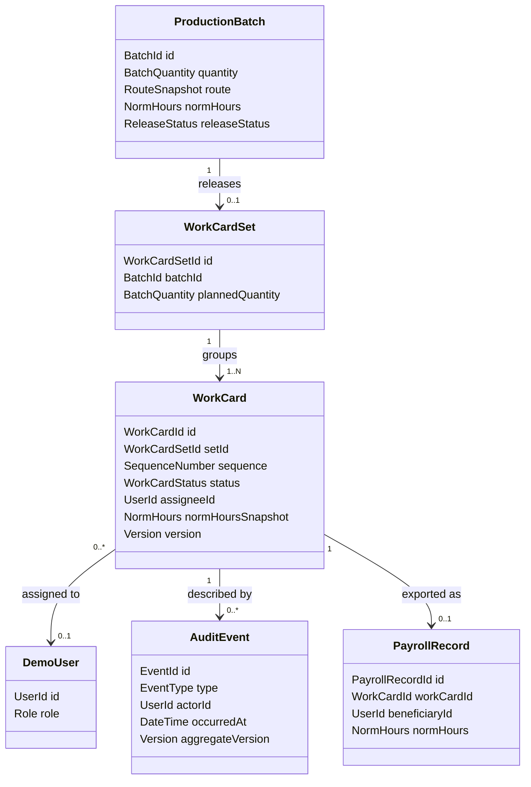

# Domain Model

Концептуальная модель предметной области MVP v1. Она определяет ответственность объектов и границы согласованности, но не задаёт таблицы, ORM-модели или HTTP-контракты: они будут описаны в [[er-model]] и [[api-contracts]].

## Принципы модели

- `WorkCard` — отдельная единица жизненного цикла и отдельный агрегат, чтобы карточки одной партии могли изменяться независимо.
- `WorkCardSet` группирует выпущенные карточки, но не владеет их последующим состоянием.
- межагрегатные операции выпуска и массового назначения координируются прикладным сервисом в одной транзакции;
- норматив копируется в карточку при выпуске как неизменяемый снимок для будущего mock export; это не является версионным справочником норм;
- демонстрационные пользователи и роли являются ссылочными данными, а не частью производственных агрегатов;
- audit log хранит факты и не используется для выполнения команд или восстановления текущего состояния в MVP.

## Концептуальные связи

Связи на диаграмме концептуальны. Состав внешних ключей, индексов и ограничений будет принят отдельно на этапе технической архитектуры.

## Агрегаты

### `ProductionBatch`

Корень агрегата производственной партии.

**Состояние:**

- `BatchId`;
- положительное `BatchQuantity`;
- `RouteSnapshot` с идентификатором и названием синтетического маршрута;
- положительные `NormHours`;
- признак выпуска и ссылка на созданный `WorkCardSet` после выпуска;
- версия для optimistic concurrency.

**Ответственность:** валидировать параметры партии, запретить повторный выпуск и зафиксировать, какой комплект был выпущен. После выпуска количество, маршрут и норматив партии неизменяемы в MVP.

### `WorkCardSet`

Неизменяемый после выпуска корень агрегата комплекта.

**Состояние:** `WorkCardSetId`, `BatchId`, плановое количество и дата выпуска.

**Ответственность:** обозначить единственный комплект партии и сохранить ожидаемое количество карточек. Комплект не меняет состояния отдельных `WorkCard` и не содержит их как вложенные сущности агрегата.

### `WorkCard`

Главный операционный корень агрегата.

**Состояние:**

- `WorkCardId`, `WorkCardSetId`, `BatchId` и порядковый номер экземпляра;
- неизменяемые снимки маршрута и нормо-часов;
- необязательный `assigneeId`;
- одно из состояний `RELEASED`, `ASSIGNED`, `IN_PROGRESS`, `COMPLETED`, `MASTER_CONFIRMED`, `CLOSED`;
- версия для optimistic concurrency;
- сведения о времени и субъекте последних значимых переходов, если они нужны для проверки инварианта.

**Ответственность:** владеть назначением, проверять допустимые переходы, принадлежность действия исполнителю и терминальность закрытого состояния. Положительное подтверждение БТК переводит карточку из `MASTER_CONFIRMED` непосредственно в `CLOSED`.

### `PayrollRecord`

Корень агрегата демонстрационного начисления, создаваемый при первом успешном mock payroll export.

**Состояние:** `PayrollRecordId`, уникальный `WorkCardId`, исполнитель-бенефициар, снимок нормо-часов и время экспорта.

**Ответственность:** обеспечить не более одной записи на карточку. Повтор той же команды возвращает существующий результат и не создаёт новый доменный факт.

## Прочие доменные объекты

| Объект | Тип | Назначение |
|---|---|---|
| `BatchQuantity` | Value Object | Положительное целое число экземпляров. |
| `NormHours` | Value Object | Положительное десятичное значение с единым правилом точности. Конкретная точность будет закреплена в [[er-model]]. |
| `RouteSnapshot` | Value Object | Неизменяемые код и название синтетического маршрута на момент выпуска. |
| `SequenceNumber` | Value Object | Номер карточки внутри комплекта от `1` до `N`. |
| `ExpectedVersion` | Value Object | Версия, которую клиент ожидает изменить. |
| `Role` | Enum | `PLANNER`, `MASTER`, `WORKER`, `QUALITY_CONTROLLER`, `ADMIN_AUDITOR`. |
| `WorkCardStatus` | Enum | Состояния линейного MVP workflow. Канонические переходы задаёт [[work-card-state-machine]]. |
| `AuditEvent` | Append-only record | Факт успешного значимого действия; хранится согласованно с изменением агрегата. |
| `DemoUser` | Reference entity | Синтетическая личность и роль для демонстрации permissions. |

## Владение инвариантами

| Инвариант | Владелец | Дополнительная защита |
|---|---|---|
| Положительные количество и норматив | `ProductionBatch` и value objects | Валидация API, ограничения БД |
| Один выпуск и один комплект на партию | `ProductionBatch` | Уникальность `WorkCardSet.batchId`, транзакция выпуска |
| Ровно `N` уникальных карточек | Сервис выпуска + фабрика карточек | Одна транзакция, уникальность `(setId, sequence)` |
| Атомарное массовое назначение | Сервис массового назначения + каждая `WorkCard` | Одна транзакция |
| Допустимый переход и исполнитель действия | `WorkCard` | Backend permissions |
| Отсутствие потерянных обновлений | Каждый изменяемый агрегат | Optimistic locking по версии |
| Одна запись начисления на карточку | `PayrollRecord` / сервис экспорта | Уникальность `workCardId` |
| Согласованность состояния и истории | Транзакция команды | Audit event в той же транзакции |

## Транзакционные границы MVP

1. **Выпуск:** отметить партию выпущенной, создать `WorkCardSet`, создать ровно `N` карточек и audit events — одна транзакция.
2. **Массовое назначение:** проверить все выбранные карточки, применить все назначения и записать события — одна транзакция.
3. **Переход карточки:** изменить одну `WorkCard`, увеличить версию и записать событие — одна транзакция.
4. **Mock export:** проверить закрытую карточку и создать первую `PayrollRecord` вместе с событием экспорта — одна транзакция.

Подробная стратегия конкурентного доступа будет зафиксирована в [[transactions-concurrency]].

## Вне модели MVP v1

- отклонение БТК, `REWORK_REQUIRED` и повторные циклы;
- редактирование или версионный каталог норм;
- повторный выпуск комплекта;
- фактический учёт времени и денежные расчёты;
- реальные учётные записи предприятия, подразделения, станки, материалы и склад;
- реальные интеграционные модели MES, ERP и payroll.
