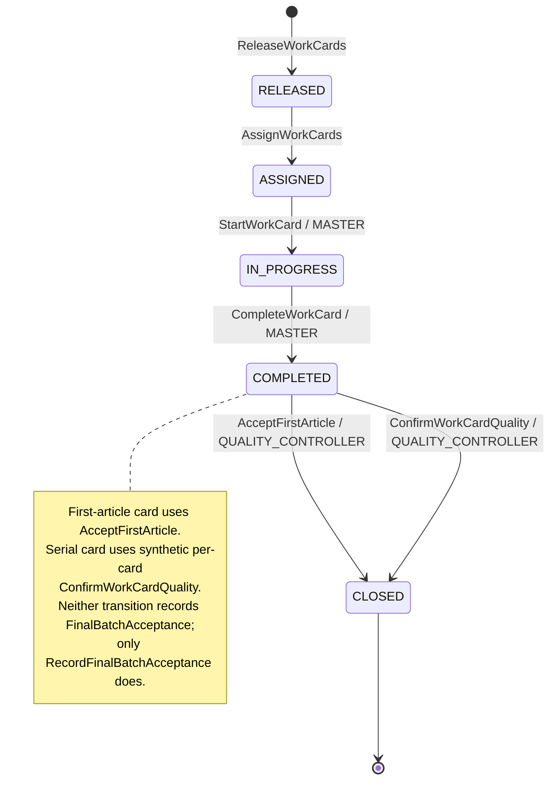
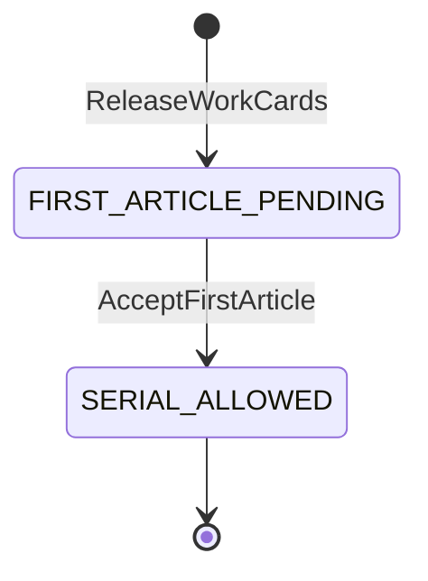
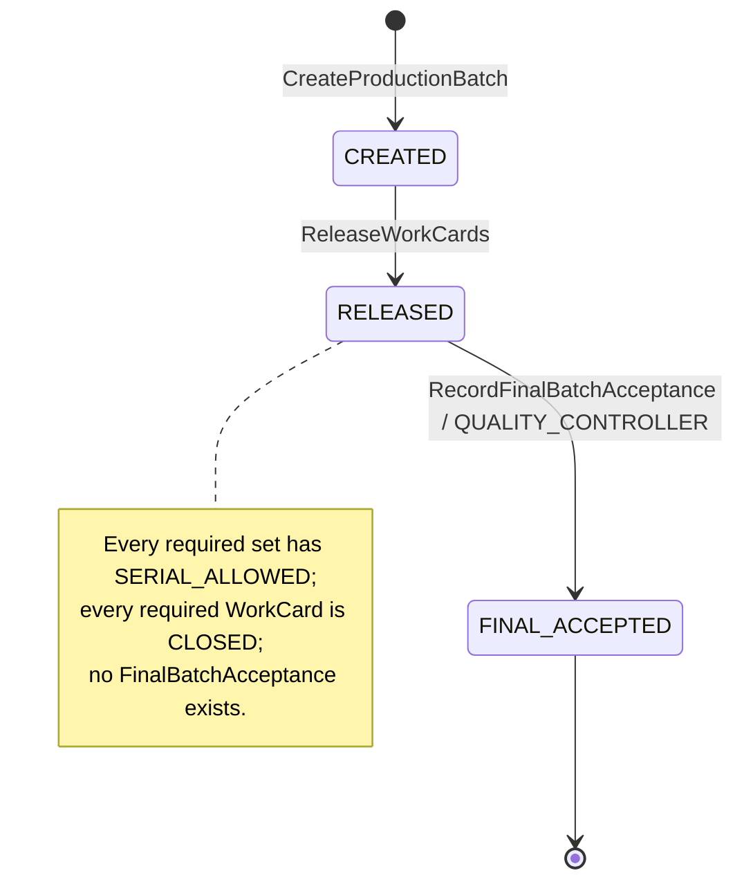

# WorkCard State Machine

Канонический автомат `WorkCard`, связанный first-article gate `WorkCardSet` и отдельный lifecycle партии. Мастер фиксирует выполнение; назначенный исполнитель не отправляет lifecycle-команды. `WorkCardId` не является номером детали, а `CLOSED` не является записью финальной приёмки всей партии.

## Диаграмма карточки

## Gate комплекта

При `FIRST_ARTICLE_PENDING` комплект может зарегистрировать и провести только одну first-article карточку. Остальные serial-карточки не назначаются и не запускаются до `SERIAL_ALLOWED`.

## Состояния карточки

| Состояние | Значение | Обязательные данные |
|---|---|---|
| `RELEASED` | Внутренняя карточка выпущена в operation-scoped комплекте, но не назначена. | UUID, set/batch, `batchQuantitySnapshot`, operation/norm snapshots |
| `ASSIGNED` | Мастер назначил карточку исполнителю и зафиксировал purpose. | `assigneeId`, `FIRST_ARTICLE | SERIAL` |
| `IN_PROGRESS` | Мастер зафиксировал начало назначенной работы. | assignee, субъект/время старта |
| `COMPLETED` | Мастер зафиксировал завершение; требуется положительное действие БТК. | assignee, субъект/время завершения |
| `CLOSED` | First-article gate пройден либо отдельная serial WorkCard цифрово закрыта синтетическим per-card подтверждением. | тип цифрового действия, субъект/время закрытия; финальная приёмка партии не выводится |

Состояния `MASTER_CONFIRMED` нет: отдельное подтверждение мастера дублировало бы факт, который уже фиксирует мастер командой `CompleteWorkCard`.

## Переходы

| Из | Команда | Роль и ограничение | В | События | Правила |
|---|---|---|---|---|---|
| создание | `ReleaseWorkCards` | `PLANNER`, атомарный выпуск всех комплектов | `RELEASED` | `WorkCardReleased` | `BR-012`–`BR-016` |
| `RELEASED` | `AssignWorkCards` | `MASTER`; first article или открытый serial gate | `ASSIGNED` | `WorkCardAssigned` | `BR-020`–`BR-024` |
| `ASSIGNED` | `StartWorkCard` | `MASTER`; gate соответствует purpose | `IN_PROGRESS` | `WorkCardStarted` | `BR-030` |
| `IN_PROGRESS` | `CompleteWorkCard` | `MASTER` | `COMPLETED` | `WorkCardCompleted` | `BR-031` |
| `COMPLETED` | `AcceptFirstArticle` | БТК; зарегистрированная first-article карточка и pending gate | `CLOSED` | `WorkCardQualityConfirmed`, `FirstArticleAccepted` | `BR-032` |
| `COMPLETED` | `ConfirmWorkCardQuality` | БТК; serial-карточка и `SERIAL_ALLOWED`; per-card `TO_BE_DECISION` | `CLOSED` | `WorkCardQualityConfirmed` | `BR-033`–`BR-036` |

## Lifecycle партии и финальной приёмки

`RecordFinalBatchAcceptance` создаёт отдельную неизменяемую запись и `FinalBatchAccepted`. Она не добавляет состояние в автомат WorkCard: закрытие одной или всех WorkCard лишь выполняет предусловие и не создаёт финальную приёмку неявно. Физические подписи БТК остаются отдельным AS-IS-свидетельством.

## Универсальные проверки

1. backend устанавливает доверенную роль;
2. загружает карточку и, когда требуется, комплект;
3. проверяет точные роли, purpose, gate и исходное состояние; для финальной приёмки — согласованную полноту всех обязательных set/card;
4. сверяет версии всех изменяемых агрегатов;
5. применяет изменение, увеличивает версии и сохраняет полный набор audit events одной транзакцией.

Отказ не создаёт состояние или событие успеха по `BR-001`–`BR-003`, `BR-050`–`BR-062`.

## Запрещённые переходы MVP

- lifecycle-команда от `WORKER`, `PLANNER` или `ADMIN_AUDITOR`;
- serial assignment/start до first-article acceptance;
- более одной first-article карточки комплекта;
- завершение без начала;
- положительное действие БТК до `COMPLETED` или не для соответствующего purpose/gate;
- любое изменение после `CLOSED`;
- финальная приёмка до `SERIAL_ALLOWED` всех обязательных комплектов или до закрытия всех необходимых WorkCard;
- вторая финальная приёмка партии новым `commandId`;
- возврат, отклонение, `REWORK_REQUIRED`, переназначение и повторный выпуск.

## Mock payroll

`ExportWorkCardToPayroll` разрешён только для `CLOSED`, но не является переходом. Факт первого export хранится в `PayrollRecord`; повтор идемпотентен.
