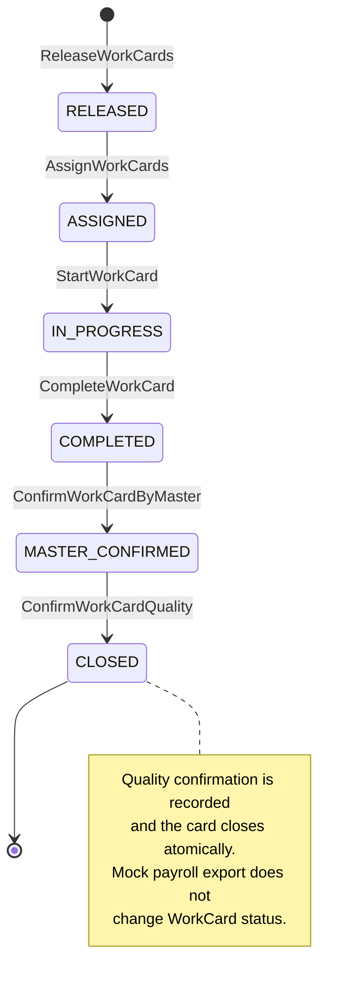

# WorkCard State Machine

Канонический автомат состояний `WorkCard` для линейного workflow MVP v1. Любой переход вне этой схемы запрещён независимо от состояния UI.

## Диаграмма

## Состояния

| Состояние | Значение | Обязательные данные |
|---|---|---|
| `RELEASED` | Карточка выпущена, но ещё не назначена. | `assigneeId = null` |
| `ASSIGNED` | Карточка назначена исполнителю и ожидает начала. | `assigneeId` |
| `IN_PROGRESS` | Назначенный исполнитель выполняет работу. | `assigneeId`, время начала |
| `COMPLETED` | Исполнитель заявил о завершении; требуется проверка мастера. | исполнитель, время завершения |
| `MASTER_CONFIRMED` | Мастер подтвердил выполнение; требуется положительное подтверждение БТК. | субъект и время подтверждения мастера |
| `CLOSED` | БТК подтвердил качество, жизненный цикл завершён. | субъект и время подтверждения БТК/закрытия |

## Переходы

| Из | Команда | Роль и ограничение | В | Событие | Правила |
|---|---|---|---|---|---|
| создание | `ReleaseWorkCards` | Планировщик выпускает партию | `RELEASED` | `WorkCardReleased` | `BR-012`–`BR-016` |
| `RELEASED` | `AssignWorkCards` | Мастер; карточка не назначена | `ASSIGNED` | `WorkCardAssigned` | `BR-020`–`BR-024` |
| `ASSIGNED` | `StartWorkCard` | Только назначенный исполнитель | `IN_PROGRESS` | `WorkCardStarted` | `BR-030` |
| `IN_PROGRESS` | `CompleteWorkCard` | Только назначенный исполнитель | `COMPLETED` | `WorkCardCompleted` | `BR-031` |
| `COMPLETED` | `ConfirmWorkCardByMaster` | Мастер | `MASTER_CONFIRMED` | `WorkCardMasterConfirmed` | `BR-032` |
| `MASTER_CONFIRMED` | `ConfirmWorkCardQuality` | Контролёр БТК | `CLOSED` | `WorkCardQualityConfirmed` | `BR-033`–`BR-035` |

## Универсальные проверки перехода

Перед любым переходом backend обязан:

1. проверить существование карточки;
2. проверить роль и, для действий исполнителя, совпадение `actorId` с `assigneeId`;
3. сравнить `expectedVersion` с текущей версией;
4. проверить точное исходное состояние;
5. применить изменение, увеличить версию на единицу и сохранить audit event в одной транзакции.

Нарушение любой проверки оставляет карточку без изменений согласно `BR-001`–`BR-003` и `BR-050`–`BR-061`.

## Запрещённые переходы MVP

- назначение из любого состояния, кроме `RELEASED`;
- начало или завершение работы не назначенным исполнителем;
- завершение без начала;
- подтверждение мастером до `COMPLETED` или повторное подтверждение;
- подтверждение БТК до `MASTER_CONFIRMED` или повторное подтверждение;
- любое изменение жизненного цикла после `CLOSED`;
- возврат в предыдущее состояние;
- `REWORK_REQUIRED`, отклонение БТК, переназначение и повторный выпуск.

## Mock payroll и состояние карточки

`ExportWorkCardToPayroll` разрешён только для `CLOSED`, но не является переходом state machine. Факт первого экспорта хранится в отдельной `PayrollRecord`; повторный экспорт идемпотентен согласно `BR-040`–`BR-044`.

Ветка `REWORK_REQUIRED` будет проектироваться только при переходе к итерации 2 и потребует явного изменения [[mvp-scope]], [[business-rules]], этого автомата и связанных требований.
