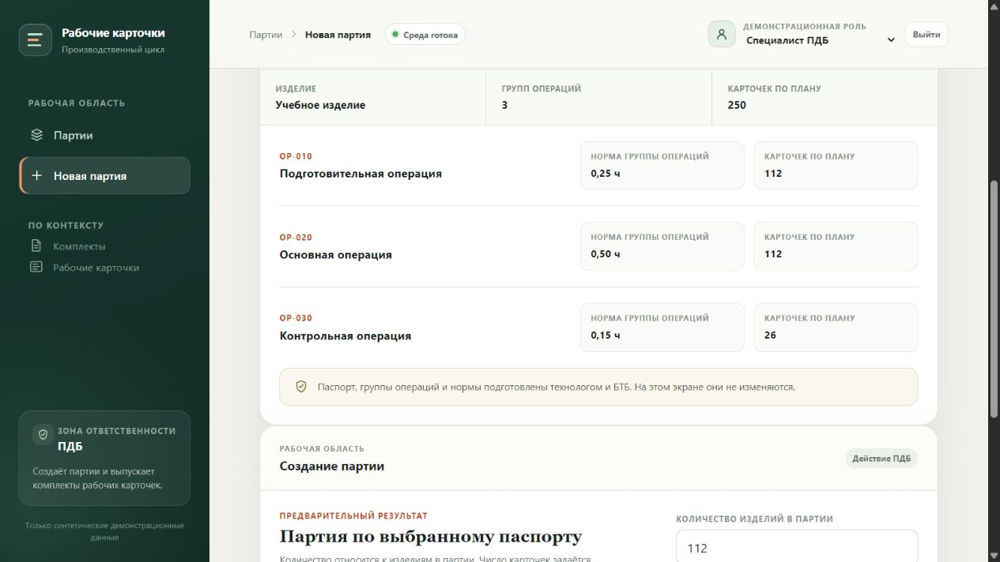
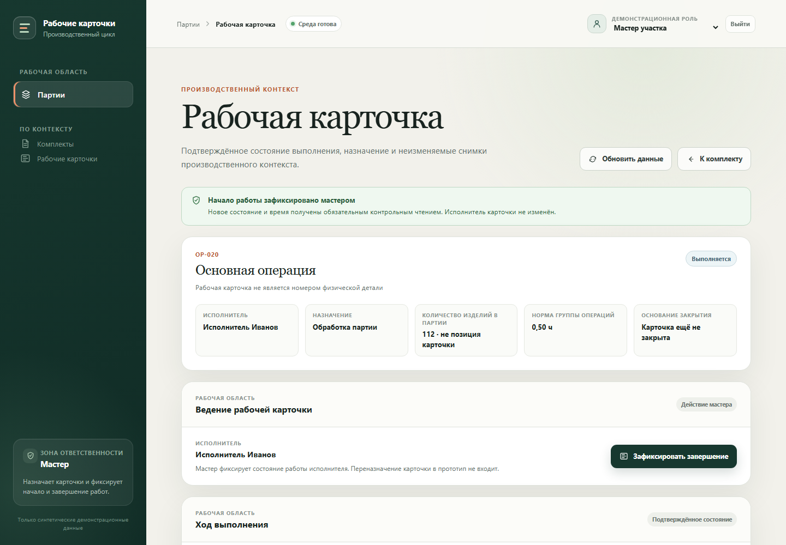
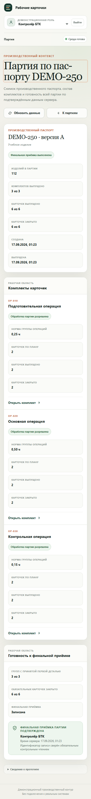

# Экраны работающего приложения

Настоящие снимки SPA с синтетическими данными, без ретуши и подстановки состояний. Здесь показаны три ключевых экрана: паспорт ПДБ, рабочая карточка мастера и финальная приёмка БТК; дополнительно — мобильное представление. Снимки иллюстрируют интерфейс, а результаты проверок подтверждаются отдельными отчётами. [Короткий сценарий](demo-script.md#короткий-показ) · [Архитектура](../../README.md#архитектура).

## Паспорт и план выпуска

Роль «Специалист ПДБ», публичное [Render demo](https://work-card-demo.onrender.com), **27 сентября 2026 года**. Видны три группы операций, нормы и план 112 + 112 + 26 карточек. Это снимок видимой области после прокрутки, а не макет. Партия для съёмки не создавалась; после ежедневного reset список партий был пуст.

## Рабочая карточка мастера

Состояние «Выполняется»: назначенный исполнитель, норма группы операций, количество изделий и действие мастера «Зафиксировать завершение». Текст явно отделяет рабочую карточку от номера физической детали.

**Исторический диагностический снимок локальной проверки сентября.** Исходный canonical-прогон завершился ошибкой; этот кадр показывает только реально отображавшийся экран и не используется как доказательство успешного lifecycle. Успешный отдельный canonical-прогон и его итог показаны ниже. Такое происхождение сохранено в [описании файлов](images/sources.json).

## Финальная приёмка

Роль «Контролёр БТК», локальный canonical-проход **17 сентября 2026 года**. Партия содержит 112 изделий, три комплекта и 250 закрытых карточек. Внизу отдельная запись финальной приёмки с контролёром и серверным временем; она подтверждена контрольным чтением. Это сохранённая локальная партия, не состояние публичной БД сегодня.

## Мобильное представление

Мобильный профиль браузера с viewport шириной 390 px; это не проверка на физическом мобильном устройстве. **Compact-сценарий: 112 изделий, три комплекта по две карточки, всего шесть.** На экране дата 17 сентября по московскому времени; начало исходного отчёта — 16 сентября UTC. Этот снимок не является мобильным доказательством всех 250 карточек.

## Происхождение и проверяемость

[sources.json](images/sources.json) сохраняет SHA256 каждого неизменённого PNG, относительный путь исходного файла, hash локального отчёта и его итоговые счётчики. В нём нет cookies, токенов, реквизитов БД или реальных персональных данных. Исходные локальные отчёты остаются в ignored `.quality-results`; их пути служат происхождением, а не обещанием публичной загрузки. Снимки финальной приёмки сохраняет [браузерный сценарий](../../quality/browser/lifecycle.spec.ts) после реальных UI-действий и контрольного чтения API.

| Материал | Исходный результат | Что он подтверждает |
|---|---|---|
| Desktop final acceptance | `.quality-results/render-neon-local/browser-canonical.json`, 2 успешных теста, 0 неуспешных | Локальный canonical-процесс и отображение его итоговой партии |
| Mobile final acceptance | `.quality-results/render-neon-local/browser-compact.json`, 4 успешных теста, 0 неуспешных | Локальный compact-процесс, включая мобильный профиль |
| Рабочая карточка | `canonical-initial-failure/browser-canonical.json`, неуспешная попытка | Только видимое состояние интерфейса на момент снимка |
| Публичный паспорт | Съёмка 27 сентября, обычная серверная demo-session | Доступность экрана и подготовленных данных на момент съёмки |

Старым снимкам не приписывается релизный SHA. Публичные проверки образа имеют собственные доказательства: [deploy run](https://github.com/AI-shoks/WorkCard-Lifecycle/actions/runs/35452096053), [canonical recovery receipt](https://github.com/AI-shoks/WorkCard-Lifecycle/releases/download/work-card-1195892f15f2f240dd04f39e8388d6bb8802d9a7/supplemental-recovery-qualification-36316059944.json) и [compact recovery receipt](https://github.com/AI-shoks/WorkCard-Lifecycle/releases/download/work-card-1195892f15f2f240dd04f39e8388d6bb8802d9a7/supplemental-recovery-compact-36320856998.json). При упаковке 27 сентября шесть recovery reports и два receipts сверены с опубликованными SHA256; сами сценарии повторно не запускались. Оба receipts оставляют rollback drill непроверенным. Полные условия — в [отчёте размещения](../release/deployment.md).

При финальном аудите 27 сентября сохранённые изображения и подписи сопоставлены с `sources.json`, счётчиками исходных локальных отчётов и текущим сценарием сохранения кадра. Новая съёмка и браузерный проход не выполнялись; точный source SHA локальных снимков в provenance не закреплён. Поэтому они подтверждают описанный исторический интерфейс и результаты своих прогонов, но не приёмку текущего рабочего дерева.
