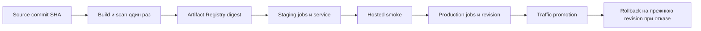

# Deployment

Этот документ фиксирует целевую схему выпуска для публичного portfolio demo. Он определяет hosting, идентичность образа, полномочия БД, secrets, проверки и rollback, но **не является свидетельством фактического развёртывания**.

## Состояние решения

| Результат | Состояние на 2026-09-06 |
|---|---|
| Hosting и managed PostgreSQL выбраны | принято: Google Cloud Run + Cloud SQL for PostgreSQL 18 по [[0007-cloud-run-and-cloud-sql-release|ADR-0007]] |
| Правило source SHA + image digest | принято; формат release record определён ниже |
| Reviewable IaC | [Terraform root](../../infra/terraform/README.md) описывает 167 resource changes, включая две изолированные WIF-границы, отдельные deployer/smoke impersonation targets, reset и узкий production IAM operator; `fmt`, `validate` и strict plan-safety проходят локально, обязательный удалённый gate добавлен в CI, но ещё не запускался |
| Release image workflow | реализован как ручной `main`-only `workflow_dispatch`; локально проверен, но не запускался |
| Staging orchestration и smoke runner | `deploy.yml`, exact-digest job/revision validators, HTTPS/browser smoke, log correlation и append-only evidence реализованы и локально проверены; provisioning и hosted run отсутствуют |
| Runtime pre-deploy controls | sanitized health, structured Pino, bounded Cloud Run proxy mode и fail-fast Unix-socket URL реализованы и локально проверены; hosted qualification отсутствует |
| IAM/demo operations hardening | локально реализованы capacity/session cleanup, owner-only reset, deletion guards и runbooks; WIF, IAM, reset cadence и teardown в GCP не исполнялись и hosted evidence отсутствует |
| Конкретный release image | не создан и не опубликован; source SHA и registry digest ещё не присвоены |
| Cloud resources, DNS, secrets и базы | не создавались; `terraform apply` не запускался |
| Staging smoke и production promotion | staging implementation готова к review, production пока только критерии; запусков и evidence URL нет |

Нельзя подставлять локальный Docker image ID вместо registry digest или объявлять SHA этапа 9 релизным образом. Фактические значения появляются только после отдельного воспроизводимого build/push и проверки registry metadata.

## Выбранная платформа и контуры

Используются Cloud Run service для единого контейнера SPA/API, Cloud Run Jobs для конечных DB-команд, Artifact Registry с immutable tags, Secret Manager, Cloud Logging/Monitoring и отдельный Cloud SQL for PostgreSQL 18 в каждом runtime-контуре. Все ресурсы размещаются в `europe-west1`; registry, service и БД не разносятся по регионам.

Официальные свойства, на которых основано решение:

- Cloud Run принимает image reference с точным digest, а созданная revision неизменяема: [Deploy container images](https://docs.cloud.google.com/run/docs/deploying);
- Artifact Registry различает immutable digest и tag и умеет запрещать перенос tag на другой образ: [Repository and image names](https://docs.cloud.google.com/artifact-registry/docs/docker/names);
- Cloud Run Job завершается успехом только при успешном завершении всех tasks и пишет execution logs: [Execute jobs](https://docs.cloud.google.com/run/docs/execute/jobs);
- Cloud Run поддерживает revision без production traffic и явное переключение/возврат трафика: [Rollbacks and traffic migration](https://docs.cloud.google.com/run/docs/rollouts-rollbacks-traffic-migration);
- Cloud SQL PostgreSQL поддерживает major 18, а PITR восстанавливает состояние в отдельный instance: [Cloud SQL editions](https://docs.cloud.google.com/sql/docs/postgres/choose-edition) и [PITR](https://docs.cloud.google.com/sql/docs/postgres/backup-recovery/pitr).

| Граница | Staging | Production |
|---|---|---|
| GCP project | отдельный project, доступ только release identity | отдельный project с ручным approval на promotion |
| Cloud Run service | приватный для IAM; smoke runner получает короткоживущий identity token; `min=0`, `max=1` | публичный portfolio demo с demo-auth, не production IAM; `min=0`, `max=1` |
| Cloud SQL | отдельный disposable instance/database только с синтетическими данными | отдельный single-region instance только с разрешёнными синтетическими данными |
| Secret Manager | уникальные staging secrets и числовые versions | уникальные production secrets и числовые versions |
| Logs/metrics | отдельный project scope | отдельный project scope и uptime alert |

Общий Artifact Registry находится в отдельном release project. Runtime projects имеют только чтение нужного repository; staging и production получают один и тот же digest. Terraform принимает конкретные project IDs и канонические service origins как обязательные inputs; в Git есть только placeholder example, а реальные значения ещё не назначались.

Для portfolio demo допустим single-zone Cloud SQL без заявленного application SLA/HA. Production обязан иметь automated backups и PITR; staging может пересоздаваться. Перед созданием ресурсов отдельно подтверждаются доступность billing/account для оператора, актуальная смета, `destroyBy` и budget alerts. Обычные budget alerts только уведомляют и **не являются hard spending cap**: они не останавливают ресурсы и не гарантируют верхнюю границу расходов. Cloud SQL тарифицируется независимо от scale-to-zero Cloud Run и является основной постоянной статьёй расходов.

Первый release ограничен одним application instance: это удерживает PostgreSQL pool в пределах 10 соединений и соответствует single-process rate limiter. Увеличение `max` требует заново рассчитать DB connections и явно принять, что rate limit станет per-instance либо получит общий backend.

## Идентичность единственного образа

Release build выполняется один раз из чистого checkout после всех обязательных CI gates. Целевая платформа — `linux/amd64`. Повторная сборка «того же релиза» для production запрещена.

```text
SOURCE_SHA=<ровно 40 lowercase hex символов>
IMAGE_TAG=europe-west1-docker.pkg.dev/<release-project>/work-card/work-card:${SOURCE_SHA}
IMAGE_DIGEST=sha256:<ровно 64 lowercase hex символа из Artifact Registry>
IMMUTABLE_IMAGE=europe-west1-docker.pkg.dev/<release-project>/work-card/work-card@${IMAGE_DIGEST}
APP_VERSION=${SOURCE_SHA}
```

Правила фиксации:

1. Repository включает immutable tags; `latest`, branch tag и повторно используемый environment tag не участвуют в deployment.
2. OCI label `org.opencontainers.image.revision` и `APP_VERSION` равны `SOURCE_SHA`.
3. После push pipeline получает digest из Artifact Registry, проверяет формат и соответствие tag → digest.
4. App service, `migrate`, `reset`, `seed` и `verify` jobs обоих контуров ссылаются только на `IMMUTABLE_IMAGE`.
5. После создания revision pipeline сравнивает resolved digest платформы с release record; несовпадение останавливает выпуск.
6. Текущий production digest, предыдущий рабочий digest и все образы в rollback window 30 дней защищены от cleanup.

Для каждого опубликованного кандидата создаётся несекретный неизменяемый `docs/release/manifests/<SOURCE_SHA>.json` по [release manifest schema](release-manifest.schema.json). Это только build/scan contract: source SHA и CI run, tag, registry manifest digest, exact `image@digest`, image config digest, OCI revision, platform, build/scan run, семантически проверенный Trivy report и checksum всех SQL migrations. Генератор валидирует JSON Schema и межполевые связи до записи, а существующий файл не перезаписывает.

Последующие staging/production/smoke/promotion/rollback факты не дописываются в initial manifest. Они сохраняются отдельными последовательными файлами `docs/release/evidence/<SOURCE_SHA>/0001.json`, `0002.json`, … по [release evidence schema](release-evidence.schema.json). Appender валидирует привязку к тому же `sourceSha` и `immutableImage`, строго возрастающее время, непрерывный sequence и SHA-256 предыдущего record, затем создаёт только новый файл с exclusive-write. Build workflow указывает будущий каталог, но не создаёт его и не добавляет `null`, `not-requested` или placeholder evidence; запись появляется только после реально наблюдавшегося события.



## Release image workflow без deployment

Корневой `.github/workflows/release.yml` реализует третью задачу этапа 10. Единственный trigger — ручной `workflow_dispatch`; candidate обязан быть текущим full SHA ветки `main` и иметь успешный push-run `ci.yml` со всеми семью обязательными jobs, включая `Release and IaC contract`. Workflow не принимает произвольный SHA и не запускается автоматически после merge.

Publish job собирает `linux/amd64` image ровно один раз до cloud authentication. Затем `google-github-actions/auth` получает short-lived credential через service-account impersonation без JSON key. WIF provider принимает только неизменяемые repository/owner IDs, `main`, `workflow_dispatch` и точный `.github/workflows/release.yml`; publisher имеет только repository-level `roles/artifactregistry.writer`. GitHub Actions configuration содержит три несекретные repository variables: release project ID, provider resource name и publisher service-account email.

После отказа при уже существующем full-SHA tag workflow выполняет один push, получает digest командой `gcloud artifacts docker images describe`, pull-ит exact `image@digest` и сравнивает его config ID с локальной сборкой. OCI revision label, `APP_VERSION` и platform проверяются до scan. Trivy получает tar именно pulled published digest; HIGH/CRITICAL или ошибка scanner блокируют manifest. Генератор не принимает произвольный parseable JSON за успех: он требует Trivy SchemaVersion 2, `container_image`, точный tar target, совпадающие config/repository digests, `linux/amd64`, OCI revision, реальные package-scan targets и отсутствие findings. После scan новый short-lived credential ещё раз разрешает tag и exact digest в Artifact Registry. Только совпадение обоих значений, успешная schema/semantic validation и checksum отчёта создают manifest и 30-дневный workflow artifact; repository write, `terraform apply`, Cloud Run job/deploy и promotion отсутствуют.

До отдельного разрешения WIF/registry не создаются и workflow не запускается. Поэтому реализация pipeline не является свидетельством опубликованного образа; фактический `<SHA>.json` появится только после успешного разрешённого run и затем может быть отдельно просмотрен и добавлен в Git.

## Staging orchestration без выполненного deployment

Корневой `.github/workflows/deploy.yml` реализует кодовую часть пятой задачи этапа 10. Он имеет только ручной trigger из `main`, требует точную фразу `DEPLOY EXACT DIGEST TO STAGING`, serializes staging runs и использует GitHub Environment `staging`. Preflight принимает лишь успешный `release.yml` run того же SHA, скачивает artifact по конкретному run ID и заново валидирует manifest, Trivy report, `sourceSha`, OCI label и `buildScanRunUrl`. Ни build, ни tag deployment, ни Terraform внутри workflow нет.

Привилегированная deployment job получает short-lived WIF credential `work-card-deployer`. До исполнения она сравнивает manifest digest с Artifact Registry и проверяет существующие Cloud Run jobs `migrate`, `seed`, `verify`: exact image, отдельную workload service account, фиксированные command/args, ровно один task/parallelism, нулевые retries, exact env boundary, numeric Secret Manager versions и один staging Cloud SQL mount. Execution overrides запрещены; порядок — `migrate → seed → verify`, затем тот же цикл ещё раз для idempotence/history evidence. После jobs workflow требует существующий healthy staging service с одной 100%-revision для rollback, создаёт candidate с `--no-traffic`, до переключения проверяет Ready/exact digest/source label/runtime-only secrets/app identity/socket mount, фиксирует previous revision и только затем переводит 100% traffic. Rollback output фиксируется завершившимся no-traffic step; при любой последующей ошибке restore повторно читает previous revision и переключает traffic только если она всё ещё Ready и не reconciling.

Hosted job не наследует deployer credential. Тот же workflow-bound WIF provider может impersonate отдельную `work-card-smoke`, но её единственная ресурсная роль — `roles/run.invoker` на private staging service; JSON key, Secret Manager и Cloud SQL access не выдаются. Узкий broker в родительском smoke process обменивает GitHub OIDC только на audience-bound ID token этой service account, проверяет issuer/audience/email/lifetime и обновляет token до истечения. Browser process не получает GitHub OIDC, Google credential env, DB/owner credentials или deployer identity; он читает только текущий ID token из режимного temporary file, который удаляется после запуска и не попадает в artifacts/trace.

Smoke проверяет IAM denial без token, sanitized live/ready, SPA/JS/CSS MIME и security headers, обязательную app-auth, Origin/CSRF/role rejections без side effect, Cloud Run proxy/rate-limit key и канонический browser lifecycle `112 → 3 → 250`, три first-article gates, `250/250 CLOSED`, финальную приёмку, audit `254/254` и payroll read-back. Установка Chromium предшествует первому token exchange; browser lifecycle выполняется до намеренного исчерпания rate-limit bucket, имеет zero retries и 25-минутный safety timeout при обновлении короткоживущего token за две минты до expiry. Playwright добавляет token через one-hop fetch только к точному staging origin и блокирует внешние запросы, поэтому header не переносится на redirect origin. Прямой DB read-back в hosted mode отсутствует.

После успешного smoke deployer используется отдельно и только как уже описанный log viewer: validator находит allowlisted completion logs по server-generated request IDs, сопоставляет Cloud Trace с platform request logs, сравнивает status/client IP, требует распознанные INFO/WARNING и отвергает заранее внедрённые query/header/body/DB markers. Deployment и smoke candidates проходят [release evidence schema](release-evidence.schema.json), после чего exclusive appender формирует два последовательных hash-chained records с job execution IDs, revision/digest, numeric versions и SHA-256 smoke/observation reports. Это workflow artifacts, а не автоматический commit.

Неисполненный workflow не является provisioning runbook для первой service resource: до запуска должны существовать проверенные jobs, private staging service и previous 100%-revision из отдельно одобренных Terraform phases. Для первого clean staging операторская последовательность всё ещё включает отдельные plan/apply approvals и обязана сохранить общий порядок `migrate → seed → verify → deploy → smoke`; точная разбивка initial service phase проверяется перед разрешением реального прохода. Сейчас repository variables/outputs не назначены, `terraform apply`, `release.yml`, `deploy.yml` и hosted запросы не выполнялись.

## Отдельные DB jobs и owner boundary

Один image используется с разными командами. Каждая job имеет `tasks=1`, `parallelism=1`, `maxRetries=0`, конечный timeout и exact digest. Автоматический schedule отсутствует.

| Workload | Команда image | DB-доступ | Secrets |
|---|---|---|---|
| `work-card-migrate` | `node dist/migrate.js` | schema owner + право создавать/изменять runtime role | `MIGRATION_DATABASE_URL`, `APP_DATABASE_PASSWORD`; `APP_DATABASE_USER` — несекретная конфигурация |
| `work-card-reset` | `node dist/reset-demo.js` | schema owner; транзакционно удаляет только mutable demo rows и проверяет reference fixtures | только `MIGRATION_DATABASE_URL` |
| `work-card-seed` | `node dist/seed.js` | тот же owner; только начальный bootstrap или явное изменение fixture | те же значения, потому что текущий CLI валидирует общий migration config |
| `work-card-verify` | `node dist/verify-database.js` | только runtime role | `DATABASE_URL`; `APP_DATABASE_USER` — несекретная конфигурация |
| `work-card-app` | `node dist/server.js` | только runtime role | `DATABASE_URL`, `SESSION_SIGNING_SECRET` |

`MIGRATION_DATABASE_URL` никогда не передаётся service/revision приложения. App service account не имеет IAM-доступа к owner secret; DB-job identities не могут менять Cloud Run traffic. Job запускает только release deployer через `roles/run.jobsExecutor`, без overrides. Это две независимые границы: GCP IAM защищает чтение secret, PostgreSQL grants защищают данные после подключения.

Последовательность для чистого staging:

1. создать пустую БД и обе DB credentials;
2. выполнить `migrate` и дождаться exit `0`;
3. выполнить идемпотентный `seed` и дождаться exit `0`;
4. выполнить `verify` runtime-ролью;
5. только после этого создать/обновить service revision.

Для обычного production release `seed` не запускается. Он разрешён только при первом bootstrap либо при явном изменении канонического synthetic fixture с отдельным approval. Перед production migration публичный invoker временно снимается, внешний отказ доступа подтверждается, активные запросы дренируются дольше максимального request/transaction timeout, и лишь затем запускается job. Это сохраняет правило [[transactions-concurrency]]: deployment migration не идёт параллельно runtime traffic.

Migration failure останавливает выпуск до rollout. Down migrations не выполняются. Любая несовместимая или destructive migration требует expand/contract плана, restore rehearsal и отдельного ADR до допуска в production.

## IAM исполнителя release и maintenance

Единственный machine principal, который изменяет production service IAM и запускает существующие DB jobs, — `serviceAccount:work-card-deployer@<release-project>.iam.gserviceaccount.com` (`release_identities.release_deployer` из Terraform output).

| Граница | Минимальное разрешение | Scope |
|---|---|---|
| Deployment revision | `roles/run.developer` | staging и production projects |
| Выполнение существующей DB job | `roles/run.jobsExecutor` | каждая из `migrate`, `reset`, `seed`, `verify` |
| Attach workload identity | `roles/iam.serviceAccountUser` | пять конкретных service accounts каждого runtime-контура |
| Закрыть/открыть public invocation | custom role `workCardPublicInvokerPolicyOperator`: только `run.services.getIamPolicy`, `run.services.setIamPolicy` | единственный production service `work-card-app` |
| Image read | `roles/artifactregistry.reader` | один release repository |

`roles/run.developer` умеет читать service IAM policy, но не даёт `run.services.setIamPolicy`; поэтому одного его недостаточно для maintenance runbook. Project-wide `roles/run.admin` не выдаётся. Custom permission `setIamPolicy` всё же позволяет изменить любую binding policy конкретного сервиса, поэтому orchestration обязана принимать только точный toggle `allUsers roles/run.invoker`, сравнивать остальной policy и завершаться ошибкой при любом другом diff.

Deployment orchestration аутентифицируется без JSON key через отдельный `github-deployment` WIF pool/provider. Trust принимает только настроенные immutable GitHub repository/owner IDs, `refs/heads/main`, `workflow_dispatch` и точный `AI-shoks/WorkCard-Lifecycle/.github/workflows/deploy.yml@refs/heads/main`; два отдельных `roles/iam.workloadIdentityUser` binding ведут к `work-card-deployer` и `work-card-smoke`. Publisher workflow `release.yml` использует другой pool и другую service account. Deployer сохраняет привилегированную deploy/actAs boundary, а smoke identity имеет только staging invocation; outputs пока не назначены, WIF не provisioned и локально проверенный `deploy.yml` ещё не является работающей hosted automation.

У deployer нет прямой роли `roles/secretmanager.secretAccessor`. Это не означает принципиальной невозможности получить payload: сочетание deploy permission и `roles/iam.serviceAccountUser` позволяет присоединять workload identity к Cloud Run workload и тем самым косвенно выполнять код с её разрешениями. Поэтому доступ к deployer WIF, изменение workflow, неожиданный revision/job execution и secret-access audit от workload identity входят в одну привилегированную threat boundary и требуют incident response/rotation.

## Production public-IAM maintenance runbook

Runbook применяется только к `migrate` и ежедневному `reset`. Его production-вариант ещё не автоматизирован; будущая production job должна работать под WIF-authenticated `work-card-deployer`, как реализованная staging job в `deploy.yml`. Использование личного `gcloud` login или service-account key запрещено. Перед запуском оператор фиксирует production project/service/origin, execution purpose, approver и каталог временных evidence-файлов. `OPERATION` допускает только `migrate` или `reset`; параметры/secret overrides запрещены.

Ниже обязательный алгоритм для Linux runner. Placeholder-значения нельзя выполнять; реальные значения берутся только из просмотренных Terraform outputs.

```bash
set -euo pipefail

: "${PRODUCTION_PROJECT:?from reviewed Terraform output}"
: "${PRODUCTION_ORIGIN:?canonical https://*.run.app origin}"
: "${RELEASE_PROJECT:?from reviewed Terraform output}"
: "${OPERATION:?migrate or reset}"

REGION=europe-west1
SERVICE=work-card-app
EXPECTED_ACCOUNT="work-card-deployer@${RELEASE_PROJECT}.iam.gserviceaccount.com"
case "$OPERATION" in migrate|reset) JOB="work-card-${OPERATION}" ;; *) exit 64 ;; esac

test "$(gcloud auth list --filter=status:ACTIVE --format='value(account)' | tr -d '\r')" = "$EXPECTED_ACCOUNT"
mkdir -p "$RUNNER_TEMP/work-card-public-iam"
BEFORE="$RUNNER_TEMP/work-card-public-iam/before.json"
CLOSED="$RUNNER_TEMP/work-card-public-iam/closed.json"
RESTORED="$RUNNER_TEMP/work-card-public-iam/restored.json"

normalize_policy() {
  jq -S 'del(.etag) | .bindings = ((.bindings // []) | map(.members |= sort) | sort_by(.role, (.condition.expression // "")))' "$1"
}
normalize_without_public() {
  jq -S 'del(.etag) | .bindings = ((.bindings // []) | map(if .role == "roles/run.invoker" then .members |= map(select(. != "allUsers")) else . end) | map(select((.members | length) > 0)) | map(.members |= sort) | sort_by(.role, (.condition.expression // "")))' "$1"
}

gcloud run services get-iam-policy "$SERVICE" \
  --project "$PRODUCTION_PROJECT" --region "$REGION" --format=json > "$BEFORE"
test "$(jq '[.bindings[]? | select(.role == "roles/run.invoker") | .members[]? | select(. == "allUsers")] | length' "$BEFORE")" = 1

restore_public() {
  gcloud run services add-iam-policy-binding "$SERVICE" \
    --project "$PRODUCTION_PROJECT" --region "$REGION" \
    --member=allUsers --role=roles/run.invoker --condition=None >/dev/null
  gcloud run services get-iam-policy "$SERVICE" \
    --project "$PRODUCTION_PROJECT" --region "$REGION" --format=json > "$RESTORED"
  test "$(jq '[.bindings[]? | select(.role == "roles/run.invoker") | .members[]? | select(. == "allUsers")] | length' "$RESTORED")" = 1
  diff -u <(normalize_policy "$BEFORE") <(normalize_policy "$RESTORED")
}
restore_on_exit() {
  status=$?
  trap - EXIT INT TERM
  restore_public || status=$?
  exit "$status"
}
trap restore_on_exit EXIT INT TERM

gcloud run services remove-iam-policy-binding "$SERVICE" \
  --project "$PRODUCTION_PROJECT" --region "$REGION" \
  --member=allUsers --role=roles/run.invoker --condition=None >/dev/null
gcloud run services get-iam-policy "$SERVICE" \
  --project "$PRODUCTION_PROJECT" --region "$REGION" --format=json > "$CLOSED"
test "$(jq '[.bindings[]? | select(.role == "roles/run.invoker") | .members[]? | select(. == "allUsers")] | length' "$CLOSED")" = 0
diff -u <(normalize_without_public "$BEFORE") <(normalize_policy "$CLOSED")
test "$(curl -sS -o /dev/null -w '%{http_code}' "$PRODUCTION_ORIGIN/")" = 403
sleep 35

gcloud run jobs execute "$JOB" --project "$PRODUCTION_PROJECT" --region "$REGION" --wait
gcloud run jobs execute work-card-verify --project "$PRODUCTION_PROJECT" --region "$REGION" --wait

restore_public
trap - EXIT INT TERM
test "$(curl -sS -o /dev/null -w '%{http_code}' "$PRODUCTION_ORIGIN/health/ready")" = 200
```

Перед выполнением алгоритма runner проверяет WIF claims и reviewed environment approval; после — сохраняет checksums трёх policy snapshots, job execution IDs, времена закрытия/drain/возврата и внешние HTTP status в операционное evidence. Сравнение нормализованных `before/closed/restored` обязано доказать, что единственное различие при закрытии — отсутствие `allUsers` в `roles/run.invoker`, а после восстановления policy эквивалентна `before`; `etag` и порядок arrays при сравнении игнорируются. При постороннем diff операция прекращается без job execution.

Если `remove` не подтверждён внешним `403`, job не запускается. Если job/verify падает, `trap` всё равно пытается вернуть public binding; ошибка restore имеет приоритет и объявляется incident. До подтверждённого единственного binding и успешного readiness demo считается закрытым. Для emergency recovery тот же deployer повторяет только `add-iam-policy-binding` и полный post-check; выдавать человеку `roles/run.admin` нельзя.

Локальная реализация и Terraform plan проверяют форму этой схемы, но не подтверждают фактический active account, IAM propagation, drain, job execution или restore — всё это требует hosted evidence.

## Secrets и конфигурация

Полная ownership-матрица хранится в [[environments]]. Для hosted release действуют дополнительные правила:

- staging и production не делят DB passwords, session secret или secret resources;
- secret payload создаётся вне GitHub logs и repository; CI получает доступ через short-lived Workload Identity, без service-account JSON key;
- Cloud Run ссылается на конкретный числовой Secret Manager version, не на `latest`; rollback revision сохраняет прежнюю конфигурацию;
- `SESSION_SIGNING_SECRET` генерируется CSPRNG минимум из 32 random bytes; rotation создаёт новый version и ожидаемо завершает существующие demo sessions;
- DB password URL-encoded до сборки connection URL; raw password и полный URL не печатаются;
- Cloud SQL подключается через встроенный Auth Proxy/Unix socket `/cloudsql/<project>:<region>:<instance>`, а не через открытый произвольный TCP endpoint. Для текущего `pg` формат `DATABASE_URL` использует полностью percent-encoded `host` query parameter и `sslmode=disable`; startup при platform marker отклоняет TCP/raw/ambiguous URL, а unit test проверяет resolved `Client.host`. Наличие mount и соединение проверяются только hosted smoke;
- Secret Manager access audit включён; чтение owner secret runtime identity считается release blocker/incident.

`APP_ORIGIN` не является secret. В каждом контуре он равен **ровно одному** каноническому HTTPS origin выданного Cloud Run service: без path, query и завершающего `/`. Staging и production URL различны. Full browser smoke запускается на каноническом staging URL; revision tag/preview URL не подставляется как второй origin. Для production используется стабильный service URL, поэтому custom domain и отдельный CORS не входят в первый release.

Cloud Run настраивается на container port `3000`, после чего платформа сама передаёт `PORT=3000`; вручную задавать зарезервированный `PORT` нельзя. `HOST=0.0.0.0`, `WEB_DIST_PATH=/opt/work-card/public`, `APP_ENV=staging|production`, `LOG_LEVEL=info` и `APP_VERSION=SOURCE_SHA` являются несекретной revision configuration.

## Эксплуатационная модель общего public demo

Production сохраняет публичный интерактивный режим из [[0008-bounded-public-demo-operations|ADR-0008]]. Demo-auth позволяет выбрать подготовленную роль и выполнять реальные разрешённые mutations, но не выдаётся за production authentication. Tenant isolation не добавляется: все посетители используют одну synthetic DB и видят общий результат. Session entry сообщает это до выбора роли, предупреждает о ежедневном reset и не обещает сохранность данных.

Минимальные эксплуатационные границы:

| Контроль | Контракт |
|---|---|
| Live batches | `DEMO_MAX_BATCHES=20`; следующая `CreateProductionBatch` получает `409 DEMO_CAPACITY_REACHED` без предметного side effect |
| Server sessions | `DEMO_MAX_SESSIONS=500`; 8 часов absolute, 30 минут idle; истёкшая/disabled session удаляется при неуспешной аутентификации, глобальная expired cleanup — при создании session |
| Mutable data reset | owner-only `work-card-reset` не реже чем через 24 часа после предыдущего успеха; он транзакционно очищает sessions, batches/snapshots/sets/cards, receipts, acceptance, payroll и audit, сохраняя и проверяя reference fixtures |
| Missed reset | после 26 часов, capacity stop либо failed reset/verify public binding не возвращается до ручного восстановления |
| Live row retention | целевой максимум 24 часа; прежнее synthetic состояние может оставаться в production backup/PITR до 7 дней |
| Platform logs | 30 дней в `_Default`; payload/body/tokens/DB URL запрещены независимо от срока |
| Данные | только synthetic fixtures и действия посетителей; реальные персональные, кадровые и производственные сведения запрещены |

Reset выполняется тем же public-IAM maintenance runbook: закрыть access, подтвердить внешний `403`, выдержать drain 35 секунд, запустить `work-card-reset` без overrides, затем `work-card-verify`, восстановить ровно один public binding и проверить readiness/reference read. Reference seed после обычного reset не запускается. Если self-check reset обнаружил неполное удаление или отсутствие reference fixtures, транзакция откатывается.

Audit в этой модели — предметная демонстрационная запись, а не долговременное release evidence. Daily reset намеренно удаляет её вместе с aggregate. Release manifests/evidence, IAM snapshots и job execution metadata живут вне demo DB и не удаляются reset. Отдельный Scheduler, per-tenant data, export пользовательских demo-состояний и архивная БД не входят в MVP; до разрешённой automation соблюдение 24-часового окна остаётся обязанностью оператора.

## Health checks

| Проверка | Endpoint | Зависимости | Использование |
|---|---|---|---|
| Startup | `GET /health/ready` | process + PostgreSQL + ожидаемая migration version | не допускать новую instance к traffic до готовности |
| Liveness | `GET /health/live` | только event loop/process | перезапуск зависшего instance; DB outage не создаёт restart loop |
| Hosted readiness | `GET /health/ready` | DB и migration version | staging/prod smoke, uptime check и operator diagnosis |
| Public application | `GET /` + текущие JS/CSS из `index.html` | SPA/API serving path | обнаружить ошибочную раздачу HTML вместо assets |

Cloud Run получает явные HTTP/1 probes: startup `period=5s`, `timeout=3s`, `failureThreshold=24`; liveness `period=10s`, `timeout=3s`, `failureThreshold=3`. Hosted readiness probe, пока он имеет preview-статус платформы, не является единственной защитой rollout: обязательны startup probe, внешний readiness check и smoke. Официальное поведение probes и публичность их endpoints описаны в [Cloud Run health checks](https://docs.cloud.google.com/run/docs/configuring/healthchecks).

Публичные health payloads сокращены до одного `status`: liveness возвращает `200/ok`, readiness — `200/ok` либо `503/unavailable`. Они не содержат `APP_VERSION`, service/revision, database status, migration number или expected version. `SOURCE_SHA`, digest и migration details остаются в release record, revision metadata и operator logs. Endpoint не запускает migration, seed или repair.

## Logs и минимальная наблюдаемость

Приложение и jobs пишут однострочный Pino JSON в `stdout`; Cloud Run автоматически передаёт его в Cloud Logging. Уровни сопоставлены с полем `severity` (`fatal → CRITICAL`, `error → ERROR`, `warn → WARNING`, `info → INFO`, `debug/trace → DEBUG`), `message` и ISO `time`. Base context содержит безопасные service/revision и `appVersion` из `APP_VERSION`. Завершение app request содержит server-generated request ID, method, route template, status и duration; DB jobs — platform execution ID, command, phase/outcome и безопасные migration metadata. Cloud Run поддерживает structured stdout logging: [Logging and viewing logs](https://docs.cloud.google.com/run/docs/logging).

Запрещены query string и фактический URL, request/response body, headers, cookie, CSRF/session tokens, DB URLs/passwords, SQL/parameters и raw driver error/stack. Явный request hook пишет только allowlist; Pino redaction/serializers являются дополнительной границей. Regression test с внедрёнными маркерами остаётся release gate. Предметный append-only audit log в PostgreSQL не заменяется platform logs.

### Proxy/IP trust

`PROXY_TRUST_MODE` допускает только `none|cloud-run`. Local, test и Compose используют `none`, поэтому прямой caller не может изменить `request.ip` заголовком `X-Forwarded-For`. Режим `cloud-run` разрешён config loader только при `APP_ENV=staging|production` и автоматически заданном `K_SERVICE`; Terraform фиксирует его для service. Policy доверяет ровно socket peer платформы и выбирает ближайший справа forwarded address, поэтому произвольный более левый spoofed prefix не становится client IP/rate-limit key.

Эта one-hop policy соответствует принятому прямому `run.app` service path без отдельного external Application Load Balancer. Добавление load balancer/custom domain не входит в первый release и потребует отдельной конфигурации цепочки. Unit/injection tests подтверждают local spoof rejection, right-most client IP и независимые rate-limit buckets, но не наблюдали реальный Cloud Run request. Staging обязана сопоставить фактическую header chain с platform request-log `remoteIp` и подтвердить spoof/rate-limit поведением; до такого evidence hosted proxy qualification не заявляется.

`_Default` bucket хранит application logs 30 дней; Admin Activity/System Event остаются в `_Required` по правилам платформы. Для более долгого хранения отдельный sink не создаётся без измеримой потребности. Актуальные retention defaults: [Cloud Logging quotas and retention](https://docs.cloud.google.com/logging/quotas).

Минимальные production signals:

- uptime check канонического `/health/ready` и `/`;
- alert на последовательную недоступность, всплеск `5xx`, failed Cloud Run Job и failed revision rollout;
- Cloud SQL storage/connection saturation и backup/PITR status;
- release annotation с `SOURCE_SHA`, digest и revision для сопоставления события с logs.

Числовой бизнес-SLA не вводится: это best-effort portfolio demo с синтетическими данными.

## Staging smoke

Staging qualification обязательна для exact digest и проходит на отдельной чистой БД. Реализованный smoke runner не получает owner/runtime DB URL и взаимодействует с приложением только по HTTPS; короткоживущий IAM token даёт доступ к приватному staging service. Ни одного hosted запуска ещё не было.

Promotion gate требует:

1. source SHA имеет все обязательные CI jobs по [[ci-pipeline]], а exact runtime digest прошёл vulnerability scan;
2. `migrate → seed → verify` завершились успешно; повторный `migrate` и повторный `seed` доказали идемпотентность/history checks;
3. `/health/live`, `/health/ready`, `/`, JS/CSS отвечают ожидаемыми status/MIME; TLS и security headers проверены извне;
4. browser проходит канонический synthetic lifecycle `112 → 3 → 250`, три first-article gates, `250/250 CLOSED`, отдельную финальную приёмку, audit `254/254` и один payroll read-back через hosted URL;
5. отдельный негативный probe подтверждает Origin/CSRF и permission rejection без side effect;
6. logs находятся по request/correlation ID, Cloud Logging распознаёт `severity`, а заранее внедрённые query/header/body/token/DB/SQL/error markers отсутствуют;
7. внешний proxy probe сопоставляет app request ID с platform `remoteIp`, подтверждает реальную Cloud Run chain, spoof rejection и rate-limit key; успешные jobs/readiness того же revision подтверждают фактический mounted Cloud SQL socket connection без публикации URL;
8. release record содержит staging revision, exact resolved digest, job execution IDs, smoke run URL и итог `pass`.

Любой пропуск, retry теста для получения зелёного статуса, ручное изменение БД или несовпадение digest делает smoke недействительным.

## Production promotion

Production не rebuild-ит image. Ручное approval разрешает только promotion уже прошедшего staging digest:

1. проверить release record, CI/staging evidence и равенство staging digest кандидату;
2. проверить актуальный PITR/backup и записать recovery timestamp;
3. выполнить production public-IAM maintenance runbook: сохранить/сравнить policy, временно снять только `allUsers roles/run.invoker`, подтвердить внешний `403` и drain, затем выполнить `migrate`; `seed` — только для первого bootstrap по отдельному approval;
4. выполнить runtime `verify`;
5. создать production revision с exact digest, закреплёнными secret versions и `--no-traffic`;
6. по tagged revision проверить sanitized health, root/assets и digest; browser mutation на tag URL не считается same-origin production smoke;
7. направить 100% traffic на новую revision, вернуть public invocation и выполнить bounded smoke на каноническом URL: health/root/assets, demo-session и read-only passport query;
8. записать revision, время, approver, smoke evidence и предыдущую revision в release record.

Автоматический deploy по push, promotion mutable tag и silent fallback на новую сборку запрещены.

## Rollback

| Сбой | Действие |
|---|---|
| До migration | остановить release; production остаётся на прежней revision |
| Migration/job failure | не открывать traffic; сохранить logs/execution ID, исправлять только новым кандидатом |
| Новый revision не проходит pre-traffic checks | оставить 0% traffic, вернуть public invocation к прежней revision |
| Ошибка после promotion | немедленно направить 100% traffic на записанную предыдущую revision/digest, затем проверить health/root/read-only query |
| Ошибка данных или несовместимая schema | остановить mutations/public access; roll forward либо PITR в новый Cloud SQL instance по отдельному incident plan |

Обычный rollback меняет только Cloud Run traffic и не выполняет down migration. Поэтому каждая production migration обязана быть совместима с предыдущей application revision в пределах rollback window. PITR не является штатным rollback: он создаёт другой instance, может потерять изменения после выбранной точки и требует явного решения, сверки данных и смены secret URL.

## Lifetime и двухфазный teardown

Public interactive остаётся режимом доступа на всём одобренном hosting window; time-box здесь ограничивает срок платных ресурсов, а не заменяет продукт на private demo. До первого provisioning владелец записывает UTC `provisionedAt`, `destroyBy`, максимальную смету, billing contact и ссылку на одобрение. Default `destroyBy = provisionedAt + 7 суток`. Одно явное продление допустимо, но итоговый срок не может быть позже `provisionedAt + 30 суток`. Отсутствие подтверждённого продления, недоступный billing contact или наступление deadline означает teardown, даже если budget alert не пришёл.

За 24 часа до deadline оператор уведомляет владельца portfolio, проверяет remote-state access и формирует актуальный inventory. В deadline он:

1. снимает `allUsers roles/run.invoker` production maintenance runbook и не восстанавливает binding;
2. подтверждает внешний `403`, отсутствие активного release run и сохраняет только несекретное release/operational evidence; demo rows не экспортируются как ценные пользовательские данные;
3. создаёт обычный `terraform plan` с текущими inputs и `teardown_mode=false`; неожиданный drift, replacement или destroy сначала расследуется;
4. получает отдельное явное разрешение на **phase A**, меняет только `teardown_mode=true` и строит новый plan. Допустимы только снятие `deletion_policy=PREVENT`, `deletion_protection`, SQL `deletion_protection_enabled` и `retain_backups_on_delete`; любой create/replace/delete останавливает phase A;
5. выполняет одобренный phase-A `terraform apply`, затем сразу строит отдельный `terraform plan -destroy` с теми же reviewed inputs и `teardown_mode=true`;
6. сверяет destroy inventory со всеми 167 управляемыми ресурсами и получает второе, отдельное разрешение на **phase B**. Частичный `-target` teardown запрещён;
7. выполняет `terraform destroy` только после phase-B approval, затем независимо проверяет удаление трёх projects, Cloud SQL/backups, Secret Manager, Cloud Run, registry, WIF и billing linkage; remote state/evidence сохраняется по отдельной retention policy без secret payloads.

Terraform по умолчанию фиксирует `teardown_mode=false`: projects, registry, service accounts, WIF, Cloud SQL/database, secret containers, services и jobs имеют `deletion_policy=PREVENT`, а поддерживаемые ресурсы — дополнительный `deletion_protection=true`. Strict plan-safety отклоняет release review с `teardown_mode=true` или отсутствующим guard. Поэтому обычный `terraform destroy` должен безопасно остановиться; обходить защиту state editing, `-target`, console deletion или ручным изменением policy нельзя.

Phase A и phase B никогда не объединяются в один нерассмотренный запуск. Этот документ описывает будущую процедуру, но не разрешает ни один `apply`/`destroy`: в текущем состоянии ресурсов и hosted evidence нет.

## Критерии готовности этого планирующего шага

- [x] Hosting и managed PostgreSQL выбраны и оформлены ADR.
- [x] Определён build-once release image с полным commit SHA, immutable tag и registry digest.
- [x] Owner migrations/seed отделены от runtime service и runtime verification.
- [x] Зафиксированы secret ownership, version pinning и точное правило `APP_ORIGIN`.
- [x] Описаны health checks, public sanitization, structured logs и retention.
- [x] Определены staging smoke, ручное production promotion и application/data rollback.
- [x] Явно отделён принятый план от фактического deployment evidence.

## Reviewable IaC без provisioning

Вторая задача этапа 10 реализована в [infra/terraform](../../infra/terraform/README.md). Конфигурация фиксирует provider в lockfile и описывает:

- release/staging/production projects, необходимые APIs, least-privilege IAM, immutable Artifact Registry и отдельные GitHub WIF trust boundaries для publisher и deployment workflow с разными deployer/smoke targets;
- отдельные Cloud SQL/Secret Manager/runtime identities контуров, числовые secret versions и owner/runtime boundary;
- Cloud Run services и отдельные `migrate`/`reset`/`seed`/`verify` jobs на одном exact image digest;
- узкий custom role для production public-IAM toggle, demo capacity, startup/liveness probes, log retention/audit config, alerts, production uptime checks, backups/PITR, budgets и teardown guards.

`terraform fmt -check -recursive` и `terraform validate` проходят. Локальный review plan по example inputs даёт `167 to add / 0 to change / 0 to destroy`; strict JSON-проверка подтверждает точные deployer roles, actAs/job/secret matrices, единственный production `allUsers`, custom role из двух permissions, раздельные WIF providers и точные deployer/smoke impersonation targets, reset secret/identity, capacity и deletion guards. Она также не находит materialized secret payloads, root passwords, credential URLs или service-account keys. Сами значения secrets передаются как ephemeral inputs в write-only provider fields и не сохраняются в plan/state.

Это только review plan: remote encrypted/versioned backend ещё не настроен, реальные tfvars/secrets не созданы, cloud credentials не использовались и `terraform apply` не запускался.

## Что ещё блокирует фактический deployment и закрытие этапа 10

- IaC локально проверен, но real inputs, remote backend, billing eligibility/смета и разрешение на `apply` отсутствуют; ни один cloud resource не создан;
- WIF/registry ещё не созданы, три несекретные GitHub variables не назначены и ручной release workflow не запускался; опубликованный image и фактический manifest отсутствуют;
- `deploy.yml`/hosted runner реализованы только локально; assignment deployment-WIF outputs, reset schedule/last-success monitor и первый hosted run ещё не выполнены, поэтому код rollback не доказывает IAM propagation или фактический restore;
- runtime controls локально реализованы, но Cloud Logging severity ingestion, фактическая Cloud Run proxy chain/client IP и соединение через смонтированный Cloud SQL Unix socket ещё не имеют hosted evidence;
- hosted smoke runner имеет локальные negative/contract tests, но ещё не проверял внешний exact digest и Cloud Run/Cloud SQL chain;
- staging/production secrets, backups/PITR, alerts, jobs, revisions и smoke evidence отсутствуют;
- фактические source SHA/digest нельзя заполнить до публикации release image.

Этап 10 закрывается только после реального staging smoke и production promotion/rollback drill с evidence. Выполнены ровно первые 4 из 7 задач: release design, reviewable IaC, release-image workflow и runtime pre-deploy controls; code/config часть пятой задачи не повышает прогресс без hosted qualification. Provisioning, публикация и deployment не выполнялись.
