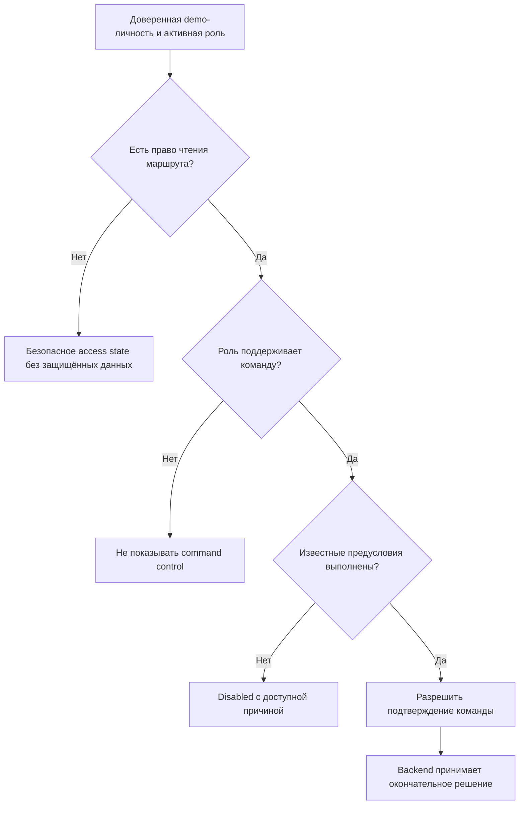

# Permission UX

Правила представления полномочий из [[roles-permissions]] в браузерном UI. Скрытие, disabled-состояние и route guard снижают число ошибочных действий, но не являются контролем безопасности: backend повторно проверяет доверенную роль, владельца, состояние, версию и входные данные.

Основные негативные связи: отказ по роли `NS-002`, запрет переназначения `NS-009`, владение `NS-010`, граница БТК `NS-018`, защита аудита/payroll `NS-019`, tampering `NS-024` и безопасная смена контекста `NS-031` из [[negative-scenarios]].

## Модель решения

Отсутствие кнопки не доказывает отсутствие API-команды, а наличие кнопки не гарантирует успех.

## Когда скрывать, блокировать и отклонять

| Ситуация | UI-представление | Причина |
|---|---|---|
| команда никогда не принадлежит активной роли | скрыть | не создавать ложное ожидание полномочия |
| роль поддерживает команду, но объект ещё не в нужном состоянии | disabled или текст следующего шага | обучить линейному workflow без отправки заведомого запроса |
| `WORKER` читает чужую карточку | скрыть start/complete, показать «Доступно назначенному исполнителю» | широкое чтение не означает владение |
| команда отправлена, а backend отказал | показать окончательный безопасный отказ и refresh | UI мог устареть или быть подменён |
| защищённый маршрут истории/payroll | не показывать ссылку; прямой URL — access state | данные доступны только `ADMIN_AUDITOR` |
| состояние/версия изменились после загрузки | убрать устаревший результат после refresh | не обходить concurrency/state machine |
| функция вне MVP | не показывать ни enabled, ни disabled control | это не «скоро доступное» действие текущего workflow |

Отклонение БТК, возврат, доработка, переназначение, снятие назначения, отдельное закрытие и повторный выпуск не отображаются даже disabled-элементами.

## Матрица маршрутов

| Маршрут | Planner | Master | Worker | Quality Controller | Admin / Auditor |
|---|:---:|:---:|:---:|:---:|:---:|
| `S-01` список партий | ✓ | ✓ | ✓ | ✓ | ✓ |
| `S-02` новая партия | ✓ | — | — | — | — |
| `S-03` партия | ✓ | ✓ | ✓ | ✓ | ✓ |
| `S-04` комплект/карточки | ✓ | ✓ | ✓ | ✓ | ✓ |
| `S-05` карточка | ✓ | ✓ | ✓ | ✓ | ✓ |
| `S-06` история | — | — | — | — | ✓ |
| `S-07` payroll | — | — | — | — | ✓ |

Для `S-02` клиентский route guard перенаправляет к `S-01` с сообщением о роли. Для `S-06` и `S-07` прямой запрос не должен сначала загрузить данные, а затем скрыть их.

## Матрица действий

| UI-действие | Planner | Master | Worker | Quality Controller | Admin / Auditor | Дополнительное условие |
|---|:---:|:---:|:---:|:---:|:---:|---|
| создать партию | enabled | hidden | hidden | hidden | hidden | валидная форма |
| выпустить карточки | enabled/disabled | hidden | hidden | hidden | hidden | партия не выпускалась, версия актуальна |
| выбрать строки для назначения | hidden | enabled/disabled | hidden | hidden | hidden | только неназначенные `RELEASED` |
| назначить выбранные карточки | hidden | enabled/disabled | hidden | hidden | hidden | непустой набор, один валидный `WORKER` |
| начать работу | hidden | hidden | enabled/disabled | hidden | hidden | `ASSIGNED` и `actorId = assigneeId` |
| завершить работу | hidden | hidden | enabled/disabled | hidden | hidden | `IN_PROGRESS` и `actorId = assigneeId` |
| подтвердить выполнение | hidden | enabled/disabled | hidden | hidden | hidden | `COMPLETED` |
| подтвердить качество и закрыть | hidden | hidden | hidden | enabled/disabled | hidden | `MASTER_CONFIRMED` |
| открыть историю | hidden | hidden | hidden | hidden | enabled | карточка доступна |
| первый mock export | hidden | hidden | hidden | hidden | enabled/disabled | `CLOSED`, есть исполнитель, записи ещё нет |
| открыть payroll запись | hidden | hidden | hidden | hidden | enabled | запись существует |

`enabled/disabled` означает: роль в принципе владеет командой, но видимое состояние объекта определяет текущую доступность. Backend всё равно проверяет все предусловия.

## Ролевые варианты `S-05`

### `PLANNER`

- читает карточку и происхождение;
- не видит действий назначения, выполнения, контроля, audit и payroll;
- видит текст текущего состояния и следующую ответственную роль.

### `MASTER`

- для `COMPLETED` видит «Подтвердить выполнение»;
- в остальных состояниях видит следующий шаг без command control;
- назначение выполняет только массово на `S-04`; отдельного назначения и переназначения на `S-05` нет.

### `WORKER`

- для своей `ASSIGNED` видит «Начать работу»;
- для своей `IN_PROGRESS` видит «Завершить работу»;
- для чужой карточки не видит команд, даже если статус подходит;
- не может выбирать другого исполнителя или подменять `assigneeId`.

### `QUALITY_CONTROLLER`

- для `MASTER_CONFIRMED` видит единственное действие «Подтвердить качество и закрыть»;
- не видит «Отклонить», «Вернуть», «На доработку» или отдельное «Закрыть»;
- для `CLOSED` видит терминальное состояние без повторного подтверждения.

### `ADMIN_AUDITOR`

- не видит действий жизненного цикла;
- видит ссылки на историю и payroll;
- для подходящей `CLOSED` без записи видит первый mock export;
- при существующей записи видит «Открыть mock payroll запись»;
- не может редактировать/удалять audit events или `PayrollRecord`.

## Disabled reasons

Причина должна быть доступна без hover: поясняющий текст, `aria-describedby` или сообщение рядом с control.

| Control | Disabled reason |
|---|---|
| выпуск партии | «Партия уже выпущена» или «Обновите данные перед выпуском» |
| checkbox карточки | «Назначать можно только неназначенную карточку RELEASED» |
| массовое назначение | «Выберите хотя бы одну доступную карточку» / «Выберите исполнителя» |
| start/complete своей карточки | «Сначала карточка должна быть назначена / начата» |
| подтверждение мастера | «Ожидается завершение исполнителем» |
| подтверждение БТК | «Сначала требуется подтверждение мастера» |
| mock export | «Доступен только для закрытой карточки с исполнителем» |

Если причина основана на устаревших данных, после backend-отказа приоритет получает сообщение «Данные изменились; перечитайте объект».

## Demo role switcher

- список содержит только подготовленные сочетания identity + role;
- произвольный ввод роли отсутствует;
- активные имя и роль всегда видимы в оболочке и в диалогах подтверждения;
- после смены контекста route data и permissions загружаются заново;
- selected rows, формы команд и прошлые ошибки очищаются;
- если текущий маршрут защищён, отображается access state с переходом к партиям;
- UI не передаёт роль в произвольном бизнес-поле как источник доверия.

## Ошибка backend permission check

Если backend отклонил действие, которое UI показывал как доступное:

1. не показывать success и не менять статус локально;
2. закрыть pending-индикатор;
3. показать безопасное сообщение о недоступности;
4. перечитать объект или предложить явное перечитывание;
5. пересчитать controls по новому контексту;
6. не создавать локальное событие успеха и не повторять команду автоматически.

Отказ другой роли от истории/payroll не должен раскрывать, существует ли защищённая запись. Точная унификация `403/404` остаётся задачей [[api-contracts]].

## Tampering и stale UI

- ручное добавление скрытой кнопки в DOM не повышает полномочия;
- изменение `actorId`, `role`, `assigneeId` или `expectedVersion` в запросе не должно приводить к успеху;
- deep link не обходит route и backend guard;
- кэш данных `ADMIN_AUDITOR` не переиспользуется после смены роли;
- клиент не хранит permission decision дольше текущего доверенного контекста;
- backend-отказ считается корректным поведением даже при UX-дефекте.

## Accessibility

- скрытый control отсутствует в accessibility tree;
- disabled control имеет программно связанную причину;
- при смене роли объявляется новый контекст и обновление доступных действий;
- фокус после access state переходит на заголовок сообщения, а не на скрытый элемент;
- permission различия не передаются только цветом;
- подтверждение команды называет активную роль и объект действия.

## Будущие проверки

| ID | Проверка |
|---|---|
| `UX-PERM-001` | каждая роль видит только свои command controls |
| `UX-PERM-002` | чужой `WORKER` не видит start/complete, API отклоняет ручной запрос |
| `UX-PERM-003` | `S-06` и `S-07` не раскрывают данные другим ролям |
| `UX-PERM-004` | смена demo-роли удаляет защищённые данные и пересчитывает actions |
| `UX-PERM-005` | БТК видит только положительное подтверждение и атомарное закрытие |
| `UX-PERM-006` | мастер не видит переназначение или выполнение за исполнителя |
| `UX-PERM-007` | admin не обходит state machine и не редактирует audit/payroll |
| `UX-PERM-008` | backend-отказ отменяет optimistic UX и приводит к refresh |

Эти UX-цели дополняют `T-API-PERMISSION-*` из [[requirements-traceability]] и не заменяют серверные тесты.
