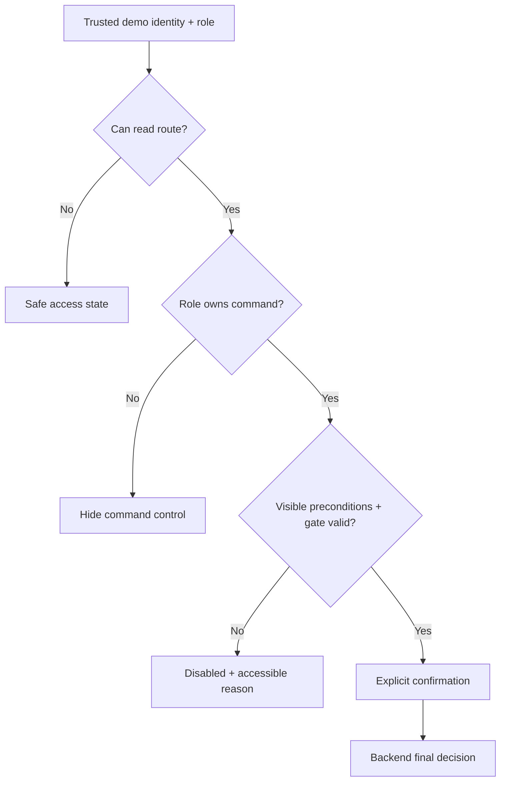

# Permission UX

Представление [[roles-permissions]] в UI. Backend проверяет доверенную роль, purpose, gate, state, versions и inputs независимо от controls.

## Модель решения

## Hide, disable, reject

| Situation | UI | Reason |
|---|---|---|
| command never belongs to role | hidden | no false authority |
| role owns command, state/gate not ready | disabled or next-step text | explain process |
| `WORKER` views assignment | start/complete hidden; «Ведение фиксирует мастер» | assignee is not digital recorder |
| serial action before first article | disabled with gate reason | no gate bypass |
| protected audit/payroll route | link hidden; direct URL safe access | confidentiality |
| function out of scope | no control, even disabled | not part of workflow |
| backend denies shown control | safe error + refresh | stale/tampered UI |

Отрицательная приёмка, rework, reassignment, sequence labels, repeated release и real payroll отсутствуют.

## Route matrix

| Route | Planner | Master | Worker | Quality | Admin |
|---|:---:|:---:|:---:|:---:|:---:|
| `S-01` batches | ✓ | ✓ | ✓ | ✓ | ✓ |
| `S-02` new batch | ✓ | — | — | — | — |
| `S-03` batch | ✓ | ✓ | summary | ✓ | ✓ |
| `S-04` set/cards | ✓ | ✓ | own/read-only | ✓ | ✓ |
| `S-05` card | ✓ | ✓ | own/read-only | ✓ | ✓ |
| `S-06` audit | — | — | — | — | ✓ |
| `S-07` payroll | — | — | — | — | ✓ |

Protected route data is never loaded before being hidden.

## Action matrix

| UI action | Planner | Master | Worker | Quality | Admin | Condition |
|---|:---:|:---:|:---:|:---:|:---:|---|
| select prepared passport/create batch | enabled | hidden | hidden | hidden | hidden | valid passport + quantity |
| release all sets | enabled/disabled | hidden | hidden | hidden | hidden | unreleased batch + version |
| select first-article card | hidden | enabled/disabled | hidden | hidden | hidden | pending gate, no first card |
| serial mass selection/assignment | hidden | enabled/disabled | hidden | hidden | hidden | `SERIAL_ALLOWED` |
| record start | hidden | enabled/disabled | hidden | hidden | hidden | `ASSIGNED`, purpose/gate valid |
| record complete | hidden | enabled/disabled | hidden | hidden | hidden | `IN_PROGRESS` |
| accept first article | hidden | hidden | hidden | enabled/disabled | hidden | first card `COMPLETED`, pending gate |
| synthetic per-card serial quality/close | hidden | hidden | hidden | enabled/disabled | hidden | serial `COMPLETED`, open gate; does not record final batch acceptance |
| accept completed batch | hidden | hidden | hidden | enabled/disabled | hidden | all mandatory gates accepted, all required WorkCard `CLOSED`, no prior acceptance, current batch version |
| sign physical cards | hidden | hidden | hidden | hidden | hidden | `N/A`: physical signature is not digitized |
| open audit | hidden | hidden | hidden | hidden | enabled | card accessible |
| first mock export | hidden | hidden | hidden | hidden | enabled/disabled | `CLOSED`, assignee, no record |
| open payroll record | hidden | hidden | hidden | hidden | enabled | record exists |

## Role variants `S-05`

### `PLANNER`

- reads batch/set/card origin;
- no assignment, lifecycle, quality, audit or payroll controls;
- never sees editable operation/norm fields.

### `MASTER`

- `ASSIGNED`: «Зафиксировать начало»;
- `IN_PROGRESS`: «Зафиксировать завершение»;
- `COMPLETED`: next step says БТК, no separate master confirmation;
- assignment only on `S-04`; no reassignment;
- sees assignee and “recorded by master” separately.

### `WORKER`

- reads only own assignment details and status;
- no start/complete controls in any state;
- sees explanation «Статус рабочей карточки фиксирует мастер»;
- cannot edit assignee or purpose.

### `QUALITY_CONTROLLER`

- first-article `COMPLETED`: «Принять первую деталь и открыть серию»;
- serial `COMPLETED` + open gate: «Подтвердить качество и закрыть карточку» plus provenance note «не финальная приёмка партии»;
- на `S-03` для all-closed batch: «Принять завершённую партию»; после success — read-only actor/time/acceptance ID;
- no reject/return/rework/separate close;
- no physical-signature control;
- `CLOSED`: terminal read-only.

### `ADMIN_AUDITOR`

- no production lifecycle actions;
- audit/payroll links;
- first export only for eligible `CLOSED`, else existing record link;
- no edit/delete of audit/payroll.

## Disabled reasons

| Control | Accessible reason |
|---|---|
| release | «Партия уже выпущена» / «Обновите данные» |
| first-article selection | «Выберите ровно одну доступную карточку» / «Первая деталь уже выбрана» |
| serial assignment | «Сначала требуется положительная приёмка первой детали» |
| assignment submit | «Выберите карточки и исполнителя» |
| master start | «Карточка должна быть назначена; serial gate должен быть открыт» |
| master complete | «Сначала мастер должен зафиксировать начало» |
| first-article acceptance | «Требуется завершённая first-article карточка» |
| synthetic per-card quality | «Требуется завершённая serial-карточка и открытый gate; действие не фиксирует финальную приёмку партии» |
| final-batch acceptance | «Требуются принятые первые детали всех обязательных комплектов, полный состав CLOSED-карточек и актуальная версия партии» |
| mock export | «Доступно для закрытой карточки с исполнителем» |

## Role switcher

Prepared identity/role only; no arbitrary role input. Shell/dialogs show active identity. Switch reloads route/permissions, clears selection and protected cache, and never changes domain data.

## Backend permission failure

1. no optimistic success;
2. stop pending;
3. safe message;
4. explicit refresh of all affected aggregates;
5. recompute controls;
6. no local success event/auto retry.

## Tampering/stale UI

- DOM manipulation does not grant API permission;
- role/actor/assignee/purpose/version changes are revalidated;
- deep link cannot bypass guard;
- previous admin cache not reused;
- UUID display never becomes user-facing detail number.

## Accessibility

- hidden controls absent from accessibility tree;
- disabled reason linked via `aria-describedby` or adjacent text;
- role/gate changes announced;
- permission differences not color-only;
- confirmation names active role, operation scope and count, not detail-number range.

## Future checks

| ID | Check |
|---|---|
| `UX-PERM-001` | each role sees only owned controls |
| `UX-PERM-002` | `WORKER` cannot see/call start or complete |
| `UX-PERM-003` | audit/payroll protected |
| `UX-PERM-004` | role switch clears protected state |
| `UX-PERM-005` | БТК sees only correct positive action |
| `UX-PERM-006` | master owns assignment/start/complete and no reassignment |
| `UX-PERM-007` | admin cannot bypass lifecycle/edit records |
| `UX-PERM-008` | backend denial triggers refresh |
| `UX-PERM-009` | serial controls blocked until first article accepted |
| `UX-PERM-010` | no per-card action is labeled as final batch acceptance or physical signature |
| `UX-PERM-011` | no UI label implies card/detail sequence |
| `UX-PERM-012` | only `QUALITY_CONTROLLER` sees `RecordFinalBatchAcceptance` when every prerequisite is met |
| `UX-PERM-013` | final-batch permission denial and stale version produce no acceptance or optimistic success |

Эти проверки дополняют API targets из [[requirements-traceability]].
