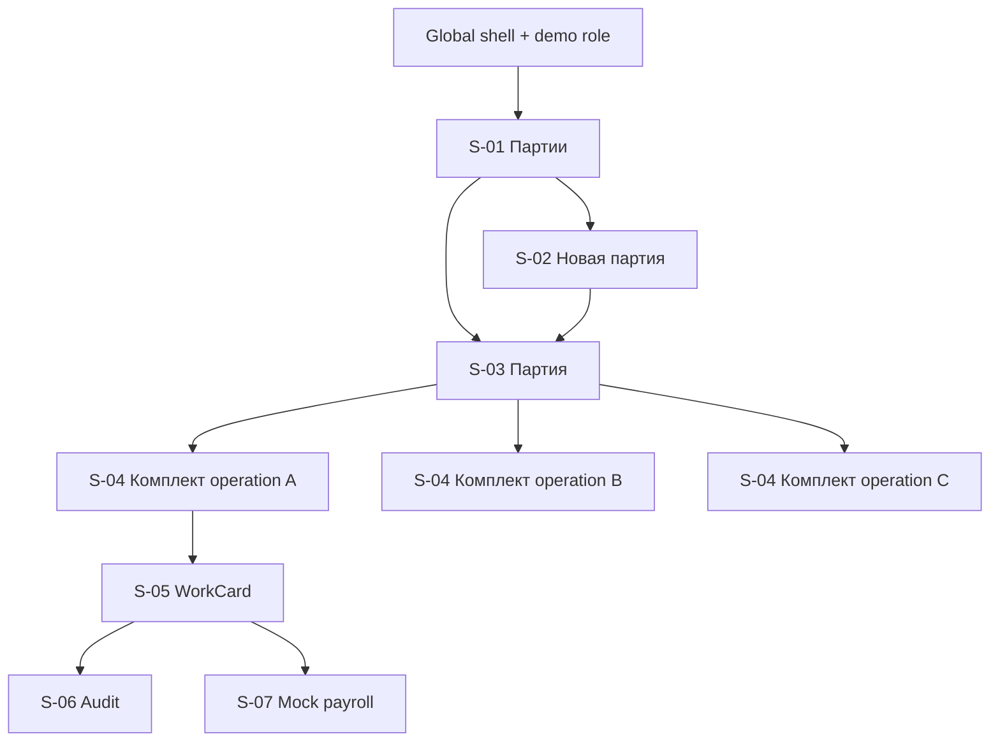

# Screen Map

Карта браузерного MVP v1 после доменной коррекции. UX следует [[decision-provenance]], не создаёт нумерацию деталей и не подменяет backend permissions.

## Принципы

- навигация: `Паспорт → Партия → несколько комплектов → WorkCard`;
- партия показывает quantity и снимок паспорта, но не один норматив;
- комплект является operation-scoped: собственные норма, planned count и first-article gate;
- карточка показывает внутренний UUID только во вложенном закрытом developer context «Сведений о прототипе», не как `#01` или номер детали;
- мастер владеет assignment/start/complete controls, `WORKER` получает read-only view;
- БТК видит positive-only first-piece action или синтетическое per-card serial quality action;
- на экране партии БТК отдельно выполняет `RecordFinalBatchAcceptance` только после всех first-article gates и закрытия всех обязательных WorkCard;
- UX явно сообщает, что per-card `CLOSED` не является `FinalBatchAcceptance`, а цифровая запись уровня партии не заменяет физическую подпись БТК;
- audit/payroll доступны только `ADMIN_AUDITOR`;
- отсутствуют отрицательный контроль, доработка, переназначение, повторный выпуск и real payroll.

## Глобальная оболочка

На защищённых маршрутах присутствуют название, переход к партиям, активные demo identity/role, breadcrumbs, `aria-live`, состояние загрузки и явный refresh. После conflict выполняются только безопасные чтения всех целей; при их ошибке доступен явный повтор чтения, а следующая команда требует нового решения. Role switch перечитывает permissions и очищает command state без предметного эффекта.

## Реестр экранов

| ID | Экран / маршрут | Содержимое | Чтение | Действия | Use cases |
|---|---|---|---|---|---|
| `S-01` | Партии `/batches` | quantity, паспорт, release, sets/cards totals | demo-роли | создать партию — `PLANNER` | `UC-001`, `UC-007` |
| `S-02` | Новая партия `/batches/new` | выбор read-only паспорта и quantity; preview operation plans | `PLANNER` | создать | `UC-001` |
| `S-03` | Партия `/batches/:batchId` | паспорт-снимок, quantity, operation plan, комплекты, completion summary и read-back `FinalBatchAcceptance` | demo-роли | выпустить один раз — `PLANNER`; принять завершённую партию — `QUALITY_CONTROLLER` | `UC-002`, `UC-007`, `UC-011`, `UC-012`, `UC-015` |
| `S-04` | Комплект `/card-sets/:setId` | operation scope, норма, planned count, gate, assignment summary, карточки | demo-роли по матрице | first-article/serial assignment — `MASTER` | `UC-003`, `UC-007`, `UC-011`, `UC-012` |
| `S-05` | WorkCard `/work-cards/:workCardId` | status, purpose, assignee, batch quantity snapshot, operation/norm snapshots, version, UUID metadata | demo-роли по матрице | master lifecycle или БТК action по точному state/gate | `UC-004`–`UC-007`, `UC-009`, `UC-012` |
| `S-06` | Audit context | card/set/batch history и операция по correlation | `ADMIN_AUDITOR` | read/copy ID | `UC-008`, `UC-014` |
| `S-07` | Тестовый учёт нормо-часов `/work-cards/:workCardId/payroll` | существующая запись либо карточка, beneficiary и operation-scoped norm перед созданием | `ADMIN_AUDITOR` | переход с `S-05` только читает; первый export здесь после отдельного подтверждения, существующая запись read-only | `UC-009`, `UC-013` |

## Иерархия

`S-06`/`S-07` защищены route/backend guards. Источник полного correlation-набора закреплён в [[api-contracts]]: server-side query с authoritative totals и cursor pagination.

## Пользовательские статусы

| Предметное состояние | Метка | Следующий участник |
|---|---|---|
| партия не выпущена | Не выпущена | ПДБ выпускает |
| партия выпущена | Выпущена | Мастер открывает комплекты |
| партия завершена, acceptance отсутствует | Готова к финальной приёмке | БТК выполняет отдельное действие |
| `FINAL_ACCEPTED` | Финальная приёмка выполнена | Read-only actor/time/acceptance ID |
| `FIRST_ARTICLE_PENDING` | Ожидается первая деталь | Мастер выбирает/ведёт first article, затем БТК |
| `SERIAL_ALLOWED` | Обработка партии разрешена | Мастер распределяет карточки обработки партии |
| `RELEASED` | Выпущена | Мастер |
| `ASSIGNED` | Назначена исполнителю | Мастер фиксирует начало |
| `IN_PROGRESS` | Выполняется | Мастер фиксирует завершение |
| `COMPLETED` | Работа завершена | БТК может выполнить digital per-card действие |
| `CLOSED` | Закрыта | Admin может mock export; финальная приёмка партии не выводится |

Technical enums доступны только во вложенном закрытом developer context «Сведений о прототипе». Tooltip и `aria-*` используют русские пользовательские формулировки.

## Списки и фильтры

### Партии

- поиск по коду/редакции паспорта и названию изделия в загруженных страницах; UUID партии не является производственным поисковым полем;
- фильтр release status;
- columns quantity, set count, total card count;
- один норматив партии не показывается.

### Комплекты

- таблица operation scopes с norm, planned/actual cards, gate и assignment summary;
- fixture показывает `112`, `112`, `26`, total `250`.

### Карточки комплекта

- фильтры status, purpose, assignee;
- status и assignee входят в server query; purpose уточняет загруженную выборку, а доступная следующая страница остаётся явной;
- counts `показано / карточек комплекта`, но не `n из batchQuantity`;
- selection хранит `workCardId + version`; карточка не получает пользовательский порядковый номер;
- assignment summary выражается counts по исполнителям, например `60 + 52 = 112`.

## Навигационные правила

- create: `S-02 → S-03`;
- release: пользователь остаётся `S-03`, видит несколько комплектов и total;
- assignment: остаётся `S-04`, перечитываются комплект и карточки;
- lifecycle/acceptance: остаётся `S-05`, затем refresh card + set;
- final-batch acceptance: остаётся `S-03`, затем refresh batch + completion summary + acceptance read-back;
- тестовый учёт: `S-05 → S-07` только читает; при отсутствии записи отдельное подтверждение export сохраняет результат на `S-07`;
- conflict сохраняет маршрут, не повторяет команду автоматически.

## Покрытие

| UX-обязательство | Экраны |
|---|---|
| core sequence с first-article gate и повторным serial-шагом | `S-01`–`S-05`, `S-07` |
| `112 → 3 sets → 250` | `S-03`, `S-04` |
| UUID без нумерации детали | `S-04`, `S-05`, `S-06` |
| `60 + 52 = 112` | `S-04` |
| мастерское ведение | `S-04`, `S-05` |
| separate first-piece acceptance и synthetic per-card quality | `S-04`, `S-05` |
| отдельная digital `FinalBatchAcceptance` без автоматического вывода или ложной подписи | `S-03`, `S-05`, `S-06` |
| conflict recovery | `S-03`–`S-05` |
| audit/payroll | `S-06`, `S-07` |

## Трассировка stories

| Stories | UX |
|---|---|
| `US-001`, `US-002`, `US-013` | `S-01`–`S-04`, preview passport и counts fixture |
| `US-003` | `S-04`, first-article/serial assignment, distribution summary |
| `US-004`–`US-007` | `S-05`, master и БТК controls |
| `US-008`, `US-018` | read-only breadcrumbs и snapshots |
| `US-009`, `US-017`, `US-020` | `S-06` |
| `US-010`, `US-011`, `US-016` | `S-05`, `S-07` |
| `US-012`, `US-015`, `US-019` | conflict flow |
| `US-014` | global role switch |
| `US-021` | `S-03`, completion summary, отдельный control и acceptance read-back |

Детали: [[user-flows]], [[wireframes]], [[ui-states]], [[permission-ux]]. Интерактивный [14-шаговый прототип](prototype.html) отдельно реализует core sequence и не смешивается с текстовой спецификацией.
