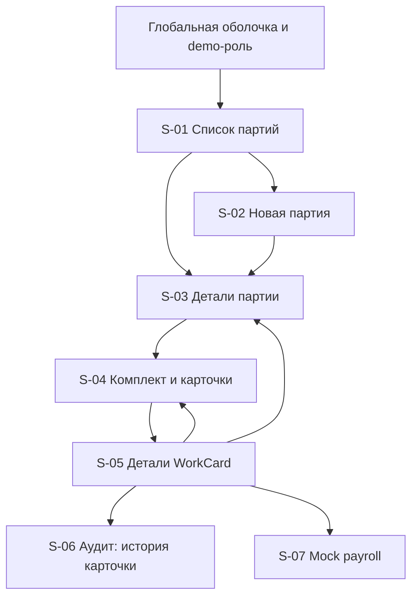

# Screen Map

Карта экранов браузерного MVP v1. Она переводит [[use-cases]] и [[roles-permissions]] в информационную архитектуру, не добавляя новых бизнес-команд. Канонические состояния и переходы по-прежнему задаёт [[work-card-state-machine]].

## Принципы информационной архитектуры

- основной объект навигации — производственная партия, от неё пользователь проходит к комплекту и отдельной карточке;
- происхождение карточки всегда доступно цепочкой `Партия → Комплект → Карточка`;
- один экран деталей карточки обслуживает все роли, но показывает разные разрешённые действия;
- активная demo-личность и роль видимы в глобальной оболочке на каждом экране;
- история и mock payroll защищены отдельными маршрутами для `ADMIN_AUDITOR`;
- массовое назначение выполняется из списка карточек и не превращается в отдельный режим редактирования;
- отсутствуют экраны и действия отклонения БТК, доработки, переназначения, снятия назначения, повторного выпуска и реального payroll.

## Глобальная оболочка

На всех защищённых маршрутах присутствуют:

1. название продукта и переход к списку партий;
2. переключатель подготовленной demo-личности с явным отображением активной роли;
3. хлебные крошки для предметного контекста;
4. область уведомлений `aria-live` для результатов команд и ошибок;
5. индикатор загрузки маршрута без блокировки уже прочитанного содержимого;
6. ссылка «Обновить данные», когда требуется ручное перечитывание после конфликта.

Смена demo-роли обновляет permissions и данные защищённых областей, но не изменяет партии, карточки, версии или audit log по `AC-DEM-001`.

## Реестр экранов

| ID | Экран / маршрут | Основное содержимое | Доступ на чтение | Контекстные действия | Use cases |
|---|---|---|---|---|---|
| `S-01` | Партии `/batches` | список партий, статус выпуска, количество, маршрут, норматив | все demo-роли | «Создать партию» только `PLANNER` | `UC-001`, `UC-007` |
| `S-02` | Новая партия `/batches/new` | форма `quantity`, `routeCode`, `routeName`, `normHours` | `PLANNER` | «Создать» | `UC-001` |
| `S-03` | Партия `/batches/:batchId` | реквизиты партии, версия, выпуск, связанный комплект, сверка `N` | все demo-роли | «Выпустить карточки» только `PLANNER` для невыпущенной партии | `UC-002`, `UC-007`, `UC-011`, `UC-012` |
| `S-04` | Комплект и карточки `/card-sets/:setId` | партия-источник, `plannedQuantity`, таблица карточек, фильтры и счётчики | все demo-роли | выбор и «Назначить» только `MASTER` для доступных `RELEASED` | `UC-003`, `UC-007`, `UC-011`, `UC-012` |
| `S-05` | Рабочая карточка `/work-cards/:workCardId` | статус, исполнитель, маршрут/норма, версия, этапы жизненного цикла | все demo-роли | одно допустимое действие активной роли и состояния | `UC-004`–`UC-007`, `UC-009`, `UC-011`, `UC-012` |
| `S-06` | Защищённое представление аудита | история карточки и сопоставление полного набора событий операции по `correlationId` | только `ADMIN_AUDITOR` | смена audit-контекста/копирование ID, без изменений данных | `UC-008`, `UC-014` |
| `S-07` | Mock payroll `/work-cards/:workCardId/payroll` | единственная `PayrollRecord`, бенефициар, снимок нормо-часов, время | только `ADMIN_AUDITOR` | первый export инициируется из `S-05`; здесь только чтение | `UC-009`, `UC-013` |

## Иерархия и переходы

`S-06` и `S-07` не отображаются в навигации для других ролей. Прямой переход по URL всё равно проходит backend-проверку и показывает безопасный отказ без раскрытия защищённых данных. Browser-route и способ получения полного набора событий по `correlationId` будут согласованы с [[api-contracts]] на этапе 5; UX здесь фиксирует потребность, а не API endpoint.

## Представление статусов

| Предметное состояние | Пользовательская метка | Следующий ожидаемый участник |
|---|---|---|
| партия не выпущена | Не выпущена | Планировщик |
| партия выпущена | Выпущена | Мастер |
| `RELEASED` | Выпущена | Мастер назначает |
| `ASSIGNED` | Назначена | Назначенный исполнитель |
| `IN_PROGRESS` | В работе | Назначенный исполнитель |
| `COMPLETED` | Выполнена | Мастер подтверждает |
| `MASTER_CONFIRMED` | Подтверждена мастером | БТК подтверждает качество |
| `CLOSED` | Закрыта | Администратор может выполнить mock export |

В UI одновременно показываются локализованная метка и техническое значение в деталях/подсказке, чтобы демонстрация оставалась понятной, а связь с требованиями — проверяемой.

## Списки, фильтры и сохранение контекста

### Партии

- поиск по ID, коду и названию маршрута;
- фильтр `все / не выпущены / выпущены`;
- сортировка по дате создания, новые сверху;
- возврат из партии сохраняет фильтр и позицию списка в текущей сессии.

### Карточки комплекта

- фильтры по статусу и исполнителю;
- поиск по ID или порядковому номеру;
- счётчики `показано / всего / plannedQuantity`;
- выбор строк доступен только мастеру и только для неназначенных `RELEASED`;
- выбор хранит пары `workCardId + version`, очищается после смены роли, успешной команды или обновления набора;
- пагинация или виртуализация не меняют семантику массовой операции: отправляется только явно выбранный непустой набор.

## Навигационные правила

- после создания партии `S-02 → S-03`, с уведомлением об успехе;
- после выпуска пользователь остаётся на `S-03`, видит результат `N из N` и явную ссылку на комплект;
- после массового назначения пользователь остаётся на `S-04`; таблица перечитывается целиком, выбор очищается;
- после перехода жизненного цикла пользователь остаётся на `S-05` и видит новый статус/версию;
- после первого или повторного mock export `S-05 → S-07`;
- после конфликта версии маршрут сохраняется, автоматического повторения команды нет.

## Покрытие

| UX-обязательство | Экраны |
|---|---|
| core happy path `UC-001 → UC-002 → UC-003 → UC-004 → UC-005 → UC-006 → UC-009` | `S-01`–`S-05`, `S-07` |
| полное функциональное покрытие демонстрационного сценария | core path плюс поддерживающие `UC-007`, `UC-008`, `UC-010`–`UC-014` через чтение, аудит, role switch и conflict recovery |
| проверка ровно `N` карточек | `S-03`, `S-04` |
| атомарное массовое назначение | `S-04` |
| восстановление после конфликта | `S-03`–`S-05` |
| защищённый audit log и корреляция | `S-06` |
| единственная mock payroll запись | `S-05`, `S-07` |
| переключение ролей без предметного эффекта | глобальная оболочка |

## Трассировка user stories

| Истории | UX-реализация |
|---|---|
| `US-001`, `US-002`, `US-013` | `S-01`–`S-04`, потоки `F-01`, `F-02`, сверка `N из N` |
| `US-003` | `S-04`, `F-03`, атомарная панель массового назначения |
| `US-004`–`US-007` | `S-05`, `F-04`–`F-06`, одно ролевое действие для точного состояния |
| `US-008`, `US-018` | широкое чтение `S-01`, `S-03`–`S-05` и breadcrumb происхождения |
| `US-009`, `US-017`, `US-020` | защищённый `S-06`, упорядоченная история и отдельный audit-контекст полной операции по `correlationId` |
| `US-010`, `US-011`, `US-016` | первый/повторный export на `S-05`, read-only запись `S-07` |
| `US-012`, `US-015`, `US-019` | общий conflict-flow `F-09`, ручное перечитывание и отсутствие optimistic success |
| `US-014` | глобальный переключатель подготовленного demo-контекста и `F-10` |

Детальные шаги приведены в [[user-flows]], компоновка — в [[wireframes]], состояния — в [[ui-states]], правила видимости действий — в [[permission-ux]].
