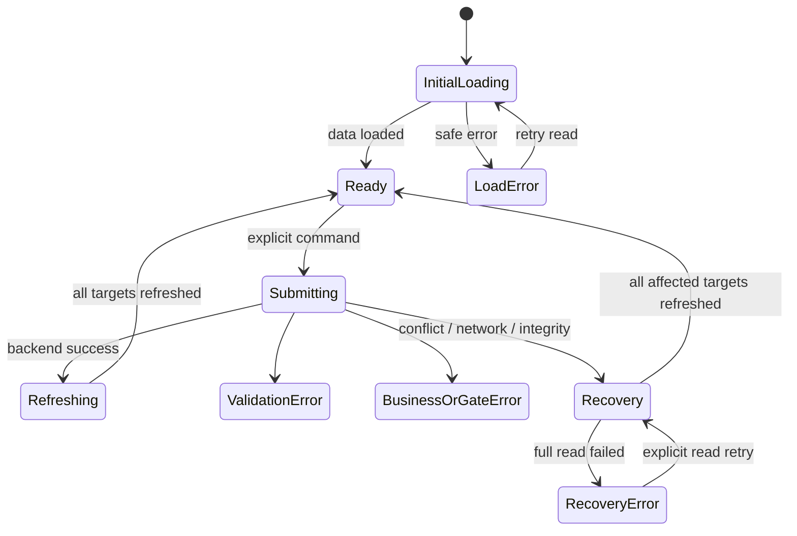

# UI States

Loading, empty, success, error, gate и concurrency states для [[screen-map]]. Backend state всегда важнее локального представления.

## Общая модель запроса



Если исход команды или обязательного read-back не подтверждён, UI немедленно очищает устаревшие selection/dialog state и выполняет только безопасные чтения. Mutation не повторяется; частичные результаты чтений не применяются, а новая команда требует нового явного решения по свежим данным.

## Типы состояний

| State | Представление | Действие |
|---|---|---|
| initial loading | loading panel/skeleton, shell/role видимы | wait/navigation |
| background refresh | existing data + progress; commands blocked | read |
| submitting | command label + spinner; duplicate disabled | wait |
| empty | причина и role-relevant next step | CTA/reset filter |
| validation | summary + field errors | correct/resubmit |
| authorization/access | safe message without protected data | back/switch role |
| state/gate conflict | доступная причина и current state | refresh |
| version conflict | blocking alert; no overwrite | reload all targets, then new decision |
| network/server | request ID, no false result | automatic safe reads; explicit read retry on failure |
| integrity warning | passport plan/counts/snapshots disagree | stop commands, refresh |

## Loading

- первичный вход и явное «Обновить данные» перемонтируют предметный экран и показывают loading state до свежего чтения;
- безопасное recovery внутри экрана может сохранять ранее подтверждённое представление, но помечает перечитывание и блокирует соответствующие команды/selection;
- подгрузка cursor page сохраняет уже полученные строки; ошибка следующей страницы не выдаёт их за полную выборку;
- protected cache is cleared on role switch;
- slow loading is announced without claiming error.

## Empty states

| Context | Message | CTA |
|---|---|---|
| `S-01`, no batches, `PLANNER` | «Партий пока нет» | create |
| `S-01`, no batches, other role | «Партии появятся после создания ПДБ» | none |
| `S-02`, no prepared passports | «Нет доступного подготовленного паспорта» | no create; fixture/configuration required |
| `S-03`, not released | «Комплекты ещё не выпущены» | release for `PLANNER` |
| `S-04`, cards missing vs planned | integrity warning | refresh; assignment blocked |
| `S-04`, filter empty | «Нет карточек с такими условиями» | reset filters |
| `S-06`, no history | «Успешных событий не найдено» | refresh |
| `S-07`, no payroll | «Тестовая запись ещё не создана»; карточка и отсутствие записи перечитаны | для eligible `CLOSED` — создание после отдельного подтверждения; иначе доступная причина |

## Success feedback

| Command | Message after confirmed refresh | Main change |
|---|---|---|
| `CreateProductionBatch` | созданная партия по выбранному паспорту и quantity | `S-03`, version 1 |
| `ReleaseWorkCards` | «Выпущены 3 комплекта, 250 карточек» для канонического паспорта | sets `112/112/26`; повторное действие disabled с причиной |
| first-article `AssignWorkCards` | «Карточка назначена для первой детали» | set stores technical first-article UUID |
| serial `AssignWorkCards` | «Все N карточек назначены» | rows + distribution summary |
| `StartWorkCard` | «Мастер зафиксировал начало» | `IN_PROGRESS` |
| `CompleteWorkCard` | «Мастер зафиксировал завершение; ожидается БТК» | `COMPLETED` |
| `AcceptFirstArticle` | «Первая деталь принята; серийная работа разрешена» | card `CLOSED`, set `SERIAL_ALLOWED` |
| `ConfirmWorkCardQuality` | «Карточка цифрово закрыта; финальная приёмка партии не записана» | `CLOSED` only for selected WorkCard |
| `RecordFinalBatchAcceptance` | «Завершённая партия принята БТК» | `FINAL_ACCEPTED` + immutable acceptance actor/time/ID |
| first export | «Тестовая запись создана и перечитана» | неизменяемая запись на текущей `S-07` |
| repeat export / existing read | «Открыта существующая тестовая запись» | та же `S-07`, без нового начисления |

Toast дополняет, но не заменяет visible state.

## Validation

### Партия

- паспорт обязателен и выбирается только из prepared list;
- quantity — positive integer;
- route/norm editable fields отсутствуют;
- invalid passport snapshot блокирует create/release.

### Assignment

- first article: exactly one available row, valid `WORKER`, pending gate, no registered first article;
- serial: nonempty unique rows from one set, valid worker, `SERIAL_ALLOWED`;
- duplicate IDs cannot arise from UI, but backend failure applies to entire set;
- distribution summary is derived from confirmed assignments, not user-entered total.

## Errors and safe disclosure

| Category | UI text pattern | Не показывать |
|---|---|---|
| authorization | «Действие недоступно активной demo-роли» | internal rules/protected existence |
| worker write attempt | «Ведение карточки выполняет мастер» | control that implies worker can force it |
| gate conflict | «Сначала требуется положительная приёмка первой детали» | bypass/force serial |
| state conflict | «Действие недоступно в текущем состоянии» | force transition |
| transaction failure | «Операция не завершена; частичный результат не подтверждён» | per-row optimistic success |
| premature final acceptance | «Сначала завершите все обязательные комплекты и закройте все карточки» | auto-accept / bypass completion predicate |
| integrity | «Структура выпуска не совпадает с паспортом; продолжение заблокировано» | automatic repair |
| network uncertainty | «Перечитайте данные перед повтором» | automatic command retry |

## Version conflict

```text
┌ Данные изменились — перечитываем ────────────────────────────────┐
│ Загруженные версии устарели. Команда не повторяется.              │
│ Выбор и прежний диалог сброшены; читаются все связанные цели.     │
└───────────────────────────────────────────────────────────────────┘

┌ Свежие данные получены ──────────────────────────────────────────┐
│ Доступность действия пересчитана. Для новой команды заново        │
│ выберите цели и подтвердите решение.                              │
└───────────────────────────────────────────────────────────────────┘
```

- create recovery reloads batch/passport lists, clears the form and sends the user to the fresh batch list before another create decision;
- assignment reloads set + all selected cards and clears selection;
- start/complete reload card + related set;
- first-article acceptance reloads card + set;
- release reloads batch + existing sets;
- per-card quality confirmation reloads card + related set;
- final-batch acceptance reloads batch + all completion counters + existing acceptance;
- payroll export reloads card + existing record;
- fresh state is applied only after every required read succeeds; otherwise commands remain blocked and only a read retry is offered;
- new explicit action and, where applicable, a new confirmation dialog are required after refresh;
- force overwrite, auto merge and automatic command retry are absent.

Ошибки валидации полей не считаются неизвестным результатом: форма сохраняет выбор и ввод, показывает связанные с полями ошибки и разрешает исправление. При неизвестном исходе создания перечитывается список партий, чтобы пользователь не создавал дубликат вслепую.

### Тестовый учёт нормо-часов

Переход `S-05 → S-07` только читает карточку и существующую запись. Если записи нет, кнопка создания открывает диалог с нормой, исполнителем и группой операций; отмена ничего не отправляет. Mutation выполняется только после подтверждения, а success — после полного read-back. При recovery диалог закрывается; новая попытка требует нового подтверждения. Существующая запись скрывает создание и остаётся неизменяемой.

## Атомарные операции

### Release

- UI не показывает постепенное `1…250` создание;
- success только при confirmed three sets `112/112/26`, total `250`;
- mismatch is integrity warning.

### Assignment

- no optimistic row statuses;
- one failed row leaves whole current command unchanged;
- confirmed distribution uses counts `60 + 52`, not number ranges.

### First-article acceptance

- card `CLOSED` без set `SERIAL_ALLOWED` и обратное считаются integrity failure;
- UI не открывает serial controls до refresh обоих aggregates.

### Final-batch acceptance

- success наблюдается только когда `FinalBatchAcceptance`, `FINAL_ACCEPTED`, новая версия партии и `FinalBatchAccepted` согласованы;
- до успеха UI отдельно показывает gates, `CLOSED / planned` и отсутствие acceptance;
- тот же command ID не показывает второе success-событие, новый command после `FINAL_ACCEPTED` недоступен;
- transaction/network uncertainty требует read-back batch + acceptance перед повтором.

### Acceptance provenance

- `FirstPieceAcceptance` показывает отдельную подтверждённую первую приёмку перед серией;
- `ConfirmWorkCardQuality` всегда помечен как synthetic per-card close;
- UI не показывает `FinalBatchAcceptance` или batch accepted как автоматический результат закрытия одной/всех WorkCard;
- отдельный success `RecordFinalBatchAcceptance` показывает цифровой actor/time/ID уровня партии;
- физические подписи остаются AS-IS-контекстом и не отображаются как данные цифровой acceptance.

## Offline/retry

Offline commands не входят в MVP. Stale cached reads имеют label; commands blocked. Mutations не ставятся в background queue. Mock export backend-idempotency не разрешает hidden client retries.

## Role switch

Permission-sensitive cache, selections и dialogs очищаются; unfinished form требует confirmation. Protected routes become access state. Предметные данные не меняются.

## Проверяемые UX-цели

| ID | Future browser test |
|---|---|
| `UX-T-001` | duplicate submit blocked; result shown after refresh |
| `UX-T-002` | conflict triggers a full safe reload of all targets and requires a new explicit command decision |
| `UX-T-003` | failed mass assignment changes no row |
| `UX-T-004` | role switch clears protected/command state |
| `UX-T-005` | repeat export opens same record |
| `UX-T-006` | loading/empty/error accessible |
| `UX-T-007` | fixture shows 3 sets/250 and no sequence labels |
| `UX-T-008` | first-article gate blocks serial controls until acceptance |
| `UX-T-009` | `WORKER` sees read-only assignment, `MASTER` sees lifecycle controls |
| `UX-T-010` | final-batch action disabled until gates and all required cards complete |
| `UX-T-011` | only `QUALITY_CONTROLLER` sees final-batch action; read-back shows actor/time/ID |
| `UX-T-012` | per-card close does not auto-create acceptance; replay does not show duplicate result |

Ролевые правила — [[permission-ux]].
