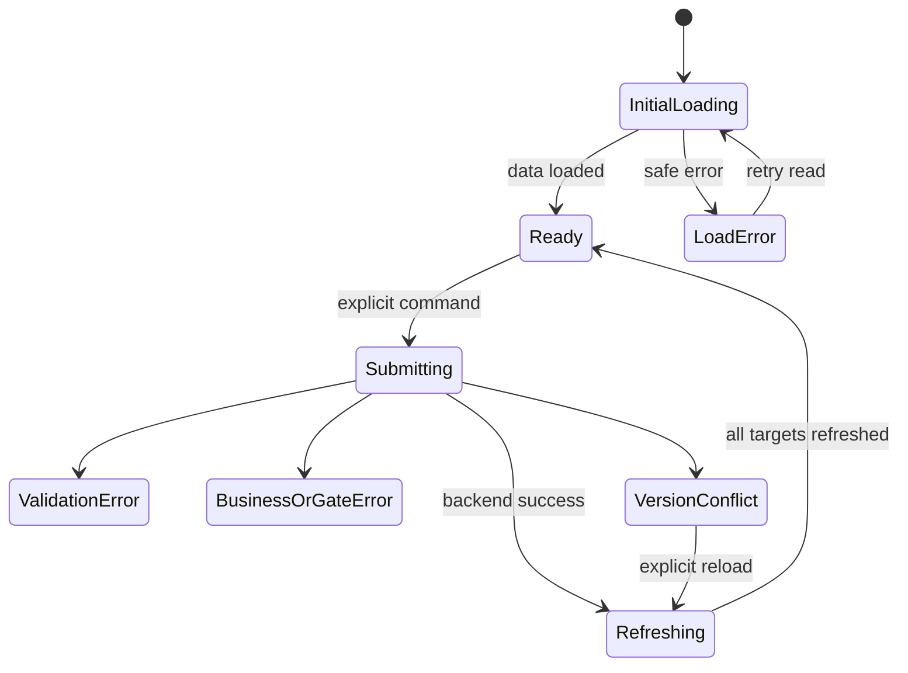

# UI States

Loading, empty, success, error, gate и concurrency states для [[screen-map]]. Backend state всегда важнее локального представления.

## Общая модель запроса



Если backend подтвердил command, но refresh не удался, UI сообщает неопределённость результата и требует read before retry.

## Типы состояний

| State | Представление | Действие |
|---|---|---|
| initial loading | skeleton итоговой структуры, shell/role видимы | wait/navigation |
| background refresh | existing data + progress; commands blocked | read |
| submitting | command label + spinner; duplicate disabled | wait |
| empty | причина и role-relevant next step | CTA/reset filter |
| validation | summary + field errors | correct/resubmit |
| authorization/access | safe message without protected data | back/switch role |
| state/gate conflict | доступная причина и current state | refresh |
| version conflict | blocking alert; no overwrite | reload all targets |
| network/server | request ID, no false result | retry read first |
| integrity warning | passport plan/counts/snapshots disagree | stop commands, refresh |

## Loading

- `S-03` skeleton reserves operation-plan/set table;
- `S-04` background refresh preserves cards/distribution but blocks selection;
- `S-05` shows current status/gate as updating and blocks command;
- protected cache is cleared on role switch;
- slow loading is announced without claiming error.

## Empty states

| Context | Message | CTA |
|---|---|---|
| `S-01`, no batches, `PLANNER` | «Партий пока нет» | create |
| `S-01`, no batches, other role | «Партии появятся после создания ПДБ» | none |
| `S-02`, no prepared passports | «Нет доступного подготовленного паспорта» | no create; fixture/configuration required |
| `S-03`, not released | «Комплекты ещё не выпущены» | release for `PLANNER` |
| `S-04`, cards missing vs planned | integrity warning | refresh; assignment blocked |
| `S-04`, filter empty | «Нет карточек с такими условиями» | reset filters |
| `S-06`, no history | «Успешных событий не найдено» | refresh |
| `S-07`, no payroll | safe not-found; first export lives on `S-05` | back |

## Success feedback

| Command | Message after confirmed refresh | Main change |
|---|---|---|
| `CreateProductionBatch` | «Партия B-112 создана по паспорту PP-DEMO» | `S-03`, version 1 |
| `ReleaseWorkCards` | «Выпущены 3 комплекта, 250 карточек» | sets `112/112/26`; release removed |
| first-article `AssignWorkCards` | «Карточка назначена для первой детали» | set stores technical first-article UUID |
| serial `AssignWorkCards` | «Все N карточек назначены» | rows + distribution summary |
| `StartWorkCard` | «Мастер зафиксировал начало» | `IN_PROGRESS` |
| `CompleteWorkCard` | «Мастер зафиксировал завершение; ожидается БТК» | `COMPLETED` |
| `AcceptFirstArticle` | «Первая деталь принята; серийная работа разрешена» | card `CLOSED`, set `SERIAL_ALLOWED` |
| `ConfirmWorkCardQuality` | «Карточка цифрово закрыта; финальная приёмка партии не записана» | `CLOSED` only for selected WorkCard |
| first export | «Mock payroll запись создана» | `S-07` |
| repeat export | «Показана существующая запись» | same `S-07` |

Toast дополняет, но не заменяет visible state.

## Validation

### Партия

- паспорт обязателен и выбирается только из prepared list;
- quantity — positive integer;
- route/norm editable fields отсутствуют;
- invalid passport snapshot блокирует create/release.

### Assignment

- first article: exactly one available row, valid `WORKER`, pending gate, no registered first article;
- serial: nonempty unique rows from one set, valid worker, `SERIAL_ALLOWED`;
- duplicate IDs cannot arise from UI, but backend failure applies to entire set;
- distribution summary is derived from confirmed assignments, not user-entered total.

## Errors and safe disclosure

| Category | UI text pattern | Не показывать |
|---|---|---|
| authorization | «Действие недоступно активной demo-роли» | internal rules/protected existence |
| worker write attempt | «Ведение карточки выполняет мастер» | control that implies worker can force it |
| gate conflict | «Сначала требуется положительная приёмка первой детали» | bypass/force serial |
| state conflict | «Действие недоступно в текущем состоянии» | force transition |
| transaction failure | «Операция не завершена; частичный результат не подтверждён» | per-row optimistic success |
| integrity | «Структура выпуска не совпадает с паспортом; продолжение заблокировано» | automatic repair |
| network uncertainty | «Перечитайте данные перед повтором» | automatic command retry |

## Version conflict

```text
┌ Данные изменились ────────────────────────────────────────────────┐
│ Загруженные версии устарели. Команда не применена и не повторится.│
│ Перечитайте карточку и связанный комплект.                        │
│                              [Остаться] [Перечитать данные]       │
└───────────────────────────────────────────────────────────────────┘
```

- assignment reloads set + all selected cards and clears selection;
- first-article acceptance reloads card + set;
- release reloads batch + existing sets;
- new explicit confirmation is required after refresh;
- force overwrite/auto merge absent.

## Атомарные операции

### Release

- UI не показывает постепенное `1…250` создание;
- success только при confirmed three sets `112/112/26`, total `250`;
- mismatch is integrity warning.

### Assignment

- no optimistic row statuses;
- one failed row leaves whole current command unchanged;
- confirmed distribution uses counts `60 + 52`, not number ranges.

### First-article acceptance

- card `CLOSED` без set `SERIAL_ALLOWED` и обратное считаются integrity failure;
- UI не открывает serial controls до refresh обоих aggregates.

### Acceptance provenance

- `FirstPieceAcceptance` показывает отдельную подтверждённую первую приёмку перед серией;
- `ConfirmWorkCardQuality` всегда помечен как synthetic per-card close;
- UI не показывает `FinalBatchAcceptance`, batch accepted или подпись БТК как результат закрытия одной/всех WorkCard;
- подтверждённая финальная приёмка всей партии и физические подписи описываются как AS-IS-контекст вне прямого digital workflow MVP.

## Offline/retry

Offline commands не входят в MVP. Stale cached reads имеют label; commands blocked. Mutations не ставятся в background queue. Mock export backend-idempotency не разрешает hidden client retries.

## Role switch

Permission-sensitive cache, selections и dialogs очищаются; unfinished form требует confirmation. Protected routes become access state. Предметные данные не меняются.

## Проверяемые UX-цели

| ID | Future browser test |
|---|---|
| `UX-T-001` | duplicate submit blocked; result shown after refresh |
| `UX-T-002` | conflict requires explicit reload of all targets |
| `UX-T-003` | failed mass assignment changes no row |
| `UX-T-004` | role switch clears protected/command state |
| `UX-T-005` | repeat export opens same record |
| `UX-T-006` | loading/empty/error accessible |
| `UX-T-007` | fixture shows 3 sets/250 and no sequence labels |
| `UX-T-008` | first-article gate blocks serial controls until acceptance |
| `UX-T-009` | `WORKER` sees read-only assignment, `MASTER` sees lifecycle controls |

Ролевые правила — [[permission-ux]].
