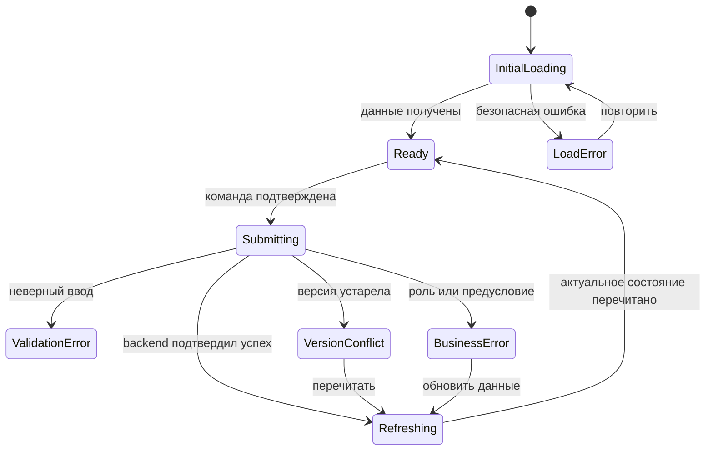

# UI States

Каталог loading, empty, success, error и concurrency-состояний для экранов [[screen-map]]. UI не угадывает бизнес-результат: подтверждённое backend-состояние всегда важнее локального представления.

## Общая модель запроса



Успех команды не считается полностью отображённым до перечитывания затронутого объекта или набора. Если команда подтверждена, но refresh не удался, UI сообщает: «Действие могло выполниться; обновите данные», не предлагает слепой повтор.

## Типы состояний

| Состояние | Представление | Допустимое действие |
|---|---|---|
| initial loading | skeleton структуры экрана, заголовок маршрута сохраняется | дождаться / отменить навигацией |
| background refresh | тонкий progress, существующие данные помечены как обновляемые | чтение разрешено, команды временно блокируются |
| submitting | текст действия + spinner, повторный submit заблокирован | отмена только до отправки |
| empty | объяснение, почему данных нет, и релевантный следующий шаг | роль-зависимый CTA или сброс фильтров |
| success | краткое сообщение и подтверждённые новые данные | продолжить workflow |
| validation error | сводка и ошибки возле полей | исправить и отправить заново |
| authorization/access | безопасное сообщение без защищённых деталей | вернуться к партиям / сменить demo-роль |
| not found | безопасное «объект недоступен или не существует» | вернуться к родительскому списку |
| business/state conflict | причина на уровне доступного контекста | обновить данные |
| version conflict | отдельный blocking alert, старая версия не перезаписывается | перечитать объект |
| network/server error | request ID при наличии, без ложного бизнес-результата | повторить чтение; команду — только осознанно |
| integrity warning | ожидаемое `N` не совпало с наблюдаемым результатом | обновить; не продолжать массовое действие |

## Loading

- skeleton повторяет финальную структуру, чтобы layout не прыгал;
- глобальная смена маршрута не стирает breadcrumb и активную роль;
- `S-04` при background refresh сохраняет таблицу, но блокирует checkbox и массовую панель;
- `S-05` сохраняет видимый статус, помечает его как обновляемый и блокирует команду;
- `S-06` и `S-07` не используют кэш другого demo-контекста после смены роли;
- loading дольше согласованного порога показывает текст «Загрузка занимает больше времени», а не объявляет ошибку.

## Empty states

| Контекст | Сообщение | CTA |
|---|---|---|
| `S-01`, партий нет, `PLANNER` | «Производственных партий пока нет» | «Создать партию» |
| `S-01`, партий нет, другая роль | «Партии появятся после создания планировщиком» | нет бизнес-действия |
| `S-01`, фильтр ничего не нашёл | «По выбранным условиям партий нет» | «Сбросить фильтры» |
| `S-03`, партия не выпущена | «Комплект ещё не создан» | выпуск только для допустимого `PLANNER` |
| `S-04`, карточек нет при ожидаемом `N > 0` | предупреждение о неполном/недоступном выпуске | «Обновить», назначение заблокировано |
| `S-04`, фильтр ничего не нашёл | «Нет карточек с такими параметрами» | «Сбросить фильтры» |
| `S-06`, история пуста | «Успешных событий для карточки не найдено» | «Обновить» |
| `S-07`, payroll отсутствует | безопасный not-found; на `S-05` — первый export, если разрешён | вернуться к карточке |

Empty state не создаёт доменные данные автоматически и не предлагает действие, запрещённое активной роли.

## Success feedback

| Команда | Сообщение после подтверждённого refresh | Изменение экрана |
|---|---|---|
| `CreateProductionBatch` | «Партия B-… создана» | открыть `S-03`, версия `1` |
| `ReleaseWorkCards` | «Выпущен комплект: N из N карточек» | показать комплект, убрать выпуск |
| `AssignWorkCards` | «Все N карточек назначены исполнителю …» | обновить строки, очистить выбор |
| `StartWorkCard` | «Работа начата» | `IN_PROGRESS`, новая версия |
| `CompleteWorkCard` | «Работа завершена и ожидает мастера» | `COMPLETED` |
| `ConfirmWorkCardByMaster` | «Выполнение подтверждено; ожидается БТК» | `MASTER_CONFIRMED` |
| `ConfirmWorkCardQuality` | «Качество подтверждено; карточка закрыта» | `CLOSED`, нет lifecycle-действий |
| первый mock export | «Mock payroll запись создана» | открыть `S-07` |
| повтор mock export | «Показана существующая mock payroll запись» | открыть тот же `S-07`, не заявлять новое начисление |

Toast дополняет, но не заменяет изменение основного содержимого; его исчезновение не лишает пользователя подтверждения результата.

## Validation states

### Партия

- `quantity`: обязательное положительное целое;
- `routeCode`, `routeName`: обязательные непустые значения;
- `normHours`: обязательное положительное число;
- клиентская проверка формата срабатывает до submit, серверная ошибка отображается в тех же местах;
- нераспознанные серверные поля попадают в общую сводку.

### Массовое назначение

- нулевой выбор: панель действия отсутствует или кнопка disabled с причиной «Выберите хотя бы одну карточку»;
- повторяющиеся ID не могут появиться через UI, но серверный отказ показывается как ошибка всего набора;
- исполнитель обязателен и выбирается только из подготовленных `WORKER`;
- при невалидном исполнителе все строки остаются неизменными.

## Errors and safe disclosure

| Категория требований | Текстовый шаблон UI | Что не показывать |
|---|---|---|
| authorization | «Действие недоступно для активной demo-роли» | внутренние правила, существование защищённой записи |
| ownership | «Этой карточкой может управлять только назначенный исполнитель» — только когда карточка уже законно прочитана | идентичности из недоступного объекта |
| not found / protected read | «Объект недоступен или не существует» | различие, позволяющее перечислять защищённые объекты |
| state conflict | «Действие больше не доступно в текущем состоянии. Обновите данные» | кнопка обхода состояния |
| transactional failure | «Операция не завершена; подтверждённого частичного результата нет» | утверждение, что отдельные строки изменились |
| network uncertainty after command | «Не удалось подтвердить результат. Перечитайте данные перед повтором» | автоматический повтор изменяющей команды |

Точные коды и безопасная детализация будут определены в [[api-contracts]]. UX задаёт категории поведения, не предрешая HTTP-контракт.

Категории охватывают version/state/authorization и transactional outcomes из `NS-001`–`NS-040`: предметные причины показываются только в законно прочитанном контексте, а внутренние ошибки оболочки событий, корреляции и транзакции сворачиваются в безопасный общий отказ без ложного частичного успеха.

## Version conflict

```text
┌ Данные изменились ──────────────────────────────────────────────────┐
│ Загруженная версия: 3. Текущие данные необходимо перечитать.        │
│ Команда не была применена и не будет повторена автоматически.       │
│                                  [Остаться] [Перечитать данные]      │
└──────────────────────────────────────────────────────────────────────┘
```

- после «Перечитать» UI показывает актуальные статус и версию;
- если действие ещё допустимо, пользователь подтверждает новую команду отдельно;
- если действие стало недоступным, кнопка исчезает и появляется причина;
- для `S-04` перечитывается весь выбранный набор, а выбор очищается;
- введённая форма партии не относится к optimistic concurrency, так как создаёт новый объект;
- кнопки «перезаписать», «игнорировать версию» и автоматический retry отсутствуют.

## Атомарные операции

### Выпуск

- до ответа `0 из N` не превращается постепенно в `1…N`;
- успех допустим только при наблюдаемом одном комплекте и `N из N`;
- несоответствие отображается как integrity warning, а не частичный успех.

### Массовое назначение

- строки не получают optimistic status;
- при общем отказе все выбранные строки остаются в исходном UI до refresh;
- результат формулируется только для всего набора;
- отсутствие одной строки после refresh считается причиной повторно проверить весь набор.

## Offline и повтор запросов

- полноценный offline mode не входит в MVP;
- при потере сети чтение может показывать последние данные с явной меткой «могут быть устаревшими», команды блокируются;
- изменяющая команда не ставится в фоновую очередь;
- после timeout пользователь сначала перечитывает данные;
- исключение по предметной идемпотентности mock export не даёт UI права создавать скрытый цикл повторов.

## Смена demo-контекста

- кэш permission-sensitive данных очищается;
- выбранные карточки и открытые command-диалоги закрываются;
- незавершённая форма требует подтверждения потери данных;
- текущий route сохраняется лишь если новый контекст имеет право его читать;
- недоступные `S-06`/`S-07` заменяются access state, а не содержимым предыдущего пользователя.

## Проверяемые UX-цели

| ID | Цель будущего browser test |
|---|---|
| `UX-T-001` | команда блокирует повторный submit и показывает результат после refresh |
| `UX-T-002` | конфликт версии не перезаписывается и требует ручного перечитывания |
| `UX-T-003` | массовый отказ не меняет ни одну строку |
| `UX-T-004` | смена demo-роли очищает выбор и защищённые данные |
| `UX-T-005` | повтор export открывает ту же запись без сообщения о новом начислении |
| `UX-T-006` | loading, empty и error states доступны с клавиатуры и объявляются assistive technology |

Ролевые причины видимости и блокировки приведены в [[permission-ux]].
