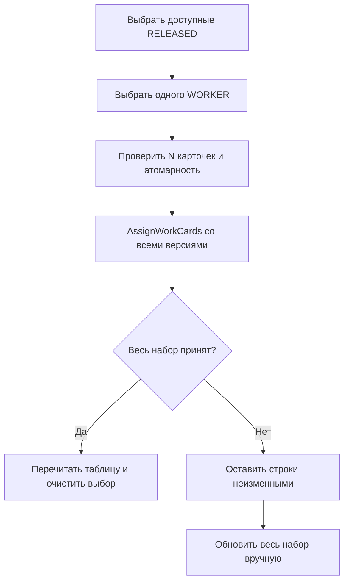
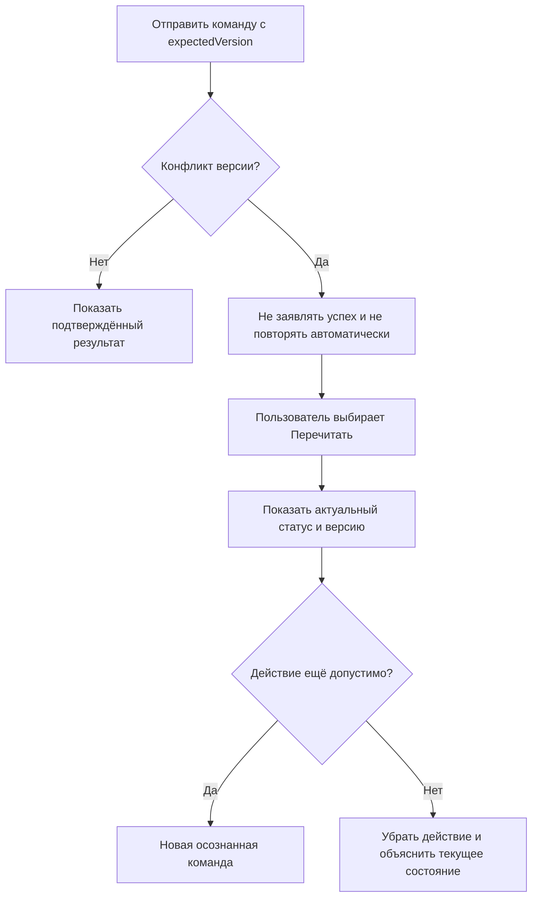

# User Flows

Пользовательские потоки MVP v1 для экранов из [[screen-map]]. Любая изменяющая команда использует версию загруженного объекта; backend остаётся окончательной границей permissions и бизнес-инвариантов.

## Core happy path

Точный линейный путь MVP: `UC-001 → UC-002 → UC-003 → UC-004 → UC-005 → UC-006 → UC-009`. Чтение, аудит, переключение роли, проверка полноты и восстановление после конфликта поддерживают этот путь, но не являются его последовательными бизнес-шагами.

```mermaid
flowchart LR
    P1["PLANNER: создать партию"] --> P2["PLANNER: выпустить N карточек"]
    P2 --> M1["MASTER: выбрать RELEASED"]
    M1 --> M2["MASTER: назначить одному WORKER"]
    M2 --> W1["WORKER: начать свою карточку"]
    W1 --> W2["WORKER: завершить"]
    W2 --> M3["MASTER: подтвердить"]
    M3 --> Q1["QUALITY_CONTROLLER: подтвердить качество"]
    Q1 --> A1["ADMIN_AUDITOR: mock export"]
```

Между шагами участник меняет только доверенный demo-контекст. Система после каждой смены перечитывает permissions и защищённые области; предметные данные не изменяются.

## Поддерживающее функциональное покрытие

- `UC-007` обеспечивает чтение производственных данных на основных экранах;
- `UC-008` предоставляет историю карточки администратору-аудитору;
- `UC-010` переключает доверенный demo-контекст между шагами core path;
- `UC-011` проверяет полноту и происхождение выпуска;
- `UC-012` задаёт ручное восстановление после version conflict;
- `UC-013` позволяет прочитать существующую mock payroll запись;
- `UC-014` позволяет сопоставить полный набор событий массовой операции по `correlationId`.

Вместе core path и эти сценарии образуют полное функциональное покрытие демонстрационного сценария, но не один линейный экранный поток.

## F-01. Создание партии

**Связи:** `UC-001`, `US-001`, `AC-BAT-001`.

1. `PLANNER` открывает `S-01` и выбирает «Создать партию».
2. На `S-02` вводит количество, код/название маршрута и нормо-часы.
3. Клиент валидирует обязательность и формат, но не считает это заменой серверной валидации.
4. После подтверждения форма блокирует повторную отправку до ответа.
5. При успехе открывается `S-03`, показываются ID, версия `1`, статус «Не выпущена» и уведомление.
6. При validation-ошибке значения сохраняются, ошибки привязываются к полям; фокус переходит к первому ошибочному полю.
7. При неизвестной/системной ошибке данные формы сохраняются, пользователь может повторить отправку вручную.

## F-02. Атомарный выпуск

**Связи:** `UC-002`, `UC-011`, `US-002`, `US-013`, `AC-BAT-002`, `AC-BAT-003`.

1. `PLANNER` открывает невыпущенную партию `S-03`.
2. Экран показывает ожидаемый результат: «Будет создан 1 комплект и N карточек».
3. Пользователь выбирает «Выпустить карточки» и подтверждает необратимость операции в диалоге.
4. Команда отправляется с текущим `expectedVersion`; действие блокируется до ответа.
5. При успехе экран перечитывается и показывает `N из N`, один комплект и ссылку на `S-04`.
6. Повторная кнопка выпуска исчезает; вместо неё видны статус «Выпущена» и ссылка на существующий комплект.
7. Любой частичный ответ считается ошибкой целостности: UI не объявляет успех и предлагает перечитать партию.

## F-03. Массовое назначение

**Связи:** `UC-003`, `US-003`, `AC-ASG-001`–`AC-ASG-003`.

1. `MASTER` открывает `S-04` и при необходимости фильтрует таблицу по `RELEASED`.
2. Чекбоксы доступны только у неназначенных `RELEASED`; выбор строки сохраняет её ID и версию.
3. Панель массового действия показывает количество выбранных карточек и кнопку «Назначить».
4. Мастер открывает панель, выбирает одного подготовленного пользователя роли `WORKER` и видит полный список выбранных карточек.
5. Подтверждение явно формулирует атомарность: «Будут назначены все N карточек или ни одна».
6. Во время команды выбор и фильтры блокируются, но список остаётся видимым.
7. При успехе таблица перечитывается, выбранные карточки становятся `ASSIGNED`, выбор очищается, показывается итог `N назначено`.
8. При ошибке любой карточки ни одна строка оптимистически не меняется; панель показывает общий отказ и предлагает обновить весь набор.
9. UI не предлагает переназначить, заменить или снять исполнителя.

## F-04. Работа исполнителя

**Связи:** `UC-004`, `US-004`, `US-005`, `AC-LIF-001`, `AC-LIF-002`, `AC-AUT-002`.

1. Активируется подготовленная demo-личность `WORKER`.
2. Пользователь открывает `S-05`; для своей `ASSIGNED` карточки видит «Начать работу».
3. После подтверждения и успеха карточка становится `IN_PROGRESS`, версия обновляется, действие меняется на «Завершить работу».
4. После завершения карточка становится `COMPLETED`; экран объясняет, что ожидается подтверждение мастера.
5. Для чужой карточки действие отсутствует; факт широкого чтения не даёт права изменить её.
6. Повторный клик во время запроса не создаёт вторую команду.

## F-05. Подтверждение мастером

**Связи:** `UC-005`, `US-006`, `AC-LIF-003`.

1. `MASTER` открывает карточку `COMPLETED` на `S-05`.
2. Экран показывает исполнителя, завершение и текущую версию.
3. Мастер выбирает «Подтвердить выполнение» и подтверждает действие.
4. При успехе статус становится `MASTER_CONFIRMED`, а экран сообщает «Ожидается подтверждение БТК».
5. В других состояниях действие не отображается; отдельного действия закрытия нет.

## F-06. Подтверждение качества

**Связи:** `UC-006`, `US-007`, `AC-LIF-004`, `AC-LIF-005`.

1. `QUALITY_CONTROLLER` открывает карточку `MASTER_CONFIRMED`.
2. Диалог «Подтвердить качество и закрыть карточку» явно сообщает, что закрытие произойдёт атомарно.
3. При успехе карточка становится `CLOSED` и больше не показывает действия жизненного цикла.
4. UI не содержит отклонения, возврата, комментария о доработке или состояния `REWORK_REQUIRED`.

## F-07. Mock payroll и идемпотентный повтор

**Связи:** `UC-009`, `UC-013`, `US-010`, `US-011`, `US-016`, `AC-PAY-001`–`AC-PAY-005`.

1. `ADMIN_AUDITOR` открывает закрытую карточку `S-05`.
2. Если записи нет, доступно действие «Создать mock payroll запись» с пояснением: нормо-часы, не деньги.
3. При первом успехе открывается `S-07` с ID, карточкой, бенефициаром, снимком нормо-часов и временем.
4. Если запрос повторён или запись уже существует, backend возвращает ту же запись; UI открывает `S-07` без сообщения о новом начислении.
5. После обнаружения записи на `S-05` показывается «Открыть mock payroll запись», а не «Экспортировать повторно».
6. Редактирование и удаление `PayrollRecord` отсутствуют.

## F-08. Аудит и корреляция

**Связи:** `UC-008`, `UC-014`, `US-009`, `US-017`, `US-020`, `AC-AUD-001`–`AC-AUD-004`.

1. `ADMIN_AUDITOR` открывает историю карточки с `S-05`.
2. `S-06` показывает события карточки по версии и времени; технические поля доступны в раскрываемой области.
3. Из события аудитор переходит в audit-контекст его `correlationId`, который должен охватывать полный набор событий выпуска или массового назначения, включая связанные агрегаты.
4. Счётчик результата помогает сопоставить число событий с числом карточек, но не объявляет транзакцию корректной вместо backend/тестов.
5. Источник данных для audit-контекста не фиксируется в UX: отдельный серверный query по `correlationId` или клиентское сопоставление будет выбрано в [[api-contracts]].
6. Другие роли не видят ссылку; прямой browser-route возвращает безопасный access state.

## F-09. Восстановление после конфликта версии

**Связи:** `UC-012`, `US-015`, `US-019`, `AC-CON-001`, `AC-CON-002`.

- введённые данные формы сохраняются, если они ещё применимы;
- выбор массового назначения очищается после перечитывания, чтобы версии всех строк были выбраны заново;
- модальный диалог конфликта не содержит «всё равно сохранить»;
- повтор со старой версией и автоматический merge запрещены.

## F-10. Переключение demo-роли

**Связи:** `UC-010`, `US-014`, `AC-DEM-001`, `AC-AUT-001`.

1. Пользователь открывает переключатель и видит только заранее подготовленные личности.
2. После выбора оболочка показывает имя и роль нового контекста.
3. Текущий маршрут по возможности сохраняется; экран перечитывает данные и permissions.
4. Если новый контекст не имеет права на защищённый экран, он получает безопасное состояние доступа и переход к `S-01`.
5. Незавершённые формы и выбранные строки очищаются с предупреждением до смены контекста.

## Общие правила команд

- destructive/необратимые в рамках MVP действия требуют явного подтверждения: выпуск, массовое назначение, подтверждение мастера, подтверждение БТК, первый mock export;
- кнопка команды блокируется после первой отправки до ответа;
- успех показывается только после подтверждения backend и последующего перечитывания изменённого объекта;
- клиент не меняет статус оптимистически;
- безопасный повтор допускается пользователем, но не скрытой автоматикой; идемпотентность mock export обеспечивается backend;
- отказ не отображается как audit event успеха.

Состояния каждого шага конкретизированы в [[ui-states]], а видимость и блокировки — в [[permission-ux]].
