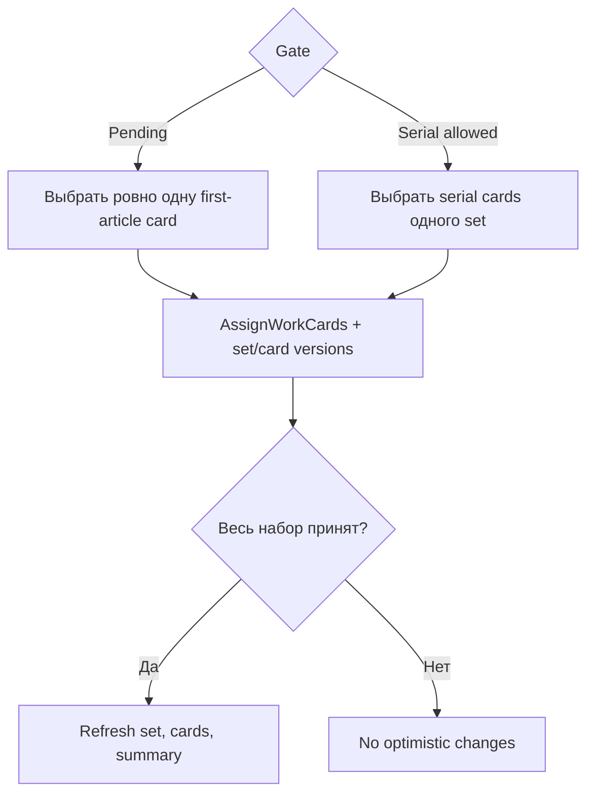
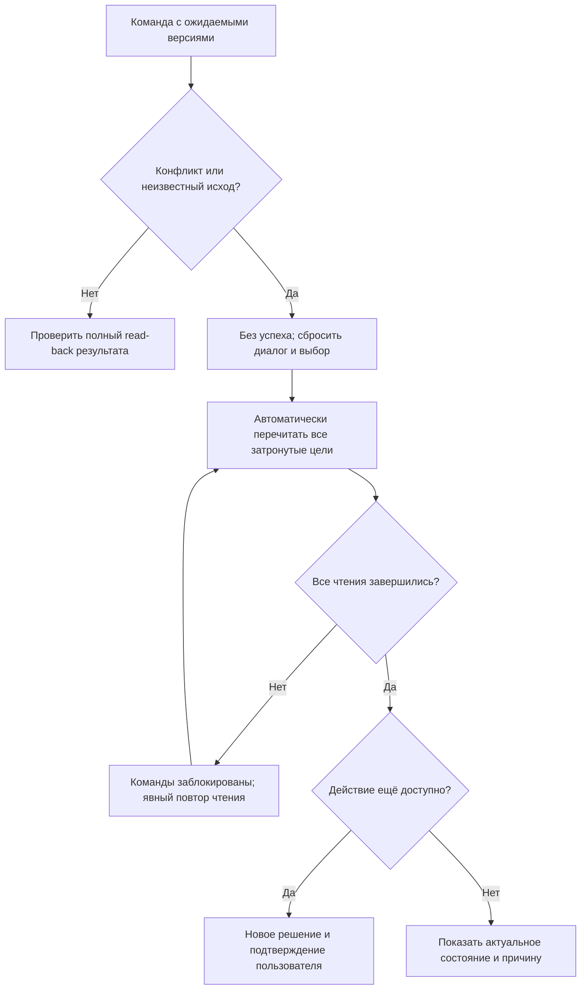

# User Flows

Потоки браузерного MVP v1. Backend проверяет roles, purpose, gate, state и versions; клиент не заявляет optimistic success.

## Core demo sequence

`UC-001 → UC-002 → UC-003(first article) → UC-004 → UC-005 → UC-003(serial) → UC-004 → UC-006 → UC-015 → UC-009`.

```mermaid
flowchart LR
    P1["ПДБ: выбрать паспорт и создать batch 112"] --> P2["ПДБ: выпустить 3 sets / 250 cards"]
    P2 --> M1["MASTER: назначить first-article card"]
    M1 --> M2["MASTER: start + complete"]
    M2 --> Q1["БТК: accept first article"]
    Q1 --> M3["MASTER: serial assignment 60 + 52"]
    M3 --> M4["MASTER: start + complete serial card"]
    M4 --> Q2["БТК: synthetic per-card close"]
    Q2 --> Q3["БТК: принять all-closed партию"]
    Q3 --> A1["ADMIN: mock export"]
```

`UC-007` дополнительно проверяет provenance: per-card close не записывает финальную приёмку, а `UC-015` создаёт её только отдельной командой. `UC-008`, `UC-010`–`UC-014` дают остальные supporting-сценарии.

Полный браузерный проход описан в [[demo-script]]. Перед финальной приёмкой все обязательные карточки должны пройти реальные команды мастера и БТК; подготовленное состояние документационного прототипа не является backend-доказательством. Числа `3/3` и `250/250` относятся к каноническому паспорту: для другого подготовленного паспорта readiness определяется всем его планом, а не фиксированными константами.

## F-01. Создание партии

**Связи:** `UC-001`, `US-001`, `AC-BAT-001`.

1. `PLANNER` открывает `S-02`.
2. Выбирает подготовленный паспорт; UI показывает read-only operation plan и нормы.
3. Вводит quantity `112`; полей route/norm нет.
4. После backend success открывается `S-03`, version `1`, статус «Не выпущена».
5. Validation сохраняет выбор/quantity и связывает errors с полями.

## F-02. Атомарный выпуск

**Связи:** `UC-002`, `UC-011`, `AC-BAT-002`, `AC-BAT-003`.

1. `S-03` показывает preview: три комплекта `112`, `112`, `26`, total `250`.
2. `PLANNER` подтверждает однократность выпуска.
3. Команда отправляется с batch version.
4. При успехе UI после refresh показывает все sets, norms, gates и total `250`; sequence/range отсутствуют.
5. Частичный ответ — integrity error, не success.

## F-03. First-article и serial assignment

**Связи:** `UC-003`, `US-003`, `AC-ASG-001`–`003`.

### First article

1. `MASTER` открывает set `FIRST_ARTICLE_PENDING`.
2. Выбирает ровно одну `RELEASED` карточку по row selection; visible label использует operation context, не номер детали.
3. В assignment panel purpose фиксирован как «Первая деталь»; выбирается `WORKER`.
4. Success регистрирует first-article UUID и `ASSIGNED`.

### Serial

1. До `SERIAL_ALLOWED` serial controls недоступны с причиной.
2. После acceptance master выбирает serial cards и одного assignee; каждая команда атомарна.
3. Для fixture first-article assignee уже имеет `1`; master назначает ему ещё `59`, второму — `52`.
4. Summary показывает `Алексей — 60; Сергей — 52; всего 112`, не ranges `1–60`/`61–112`.
5. Error любой карточки оставляет весь текущий набор без изменения.

## F-04. Ведение карточки мастером

**Связи:** `UC-004`, `US-004`, `US-005`, `AC-LIF-001`, `AC-LIF-002`, `AC-AUT-002`.

1. `MASTER` открывает `ASSIGNED` карточку на `S-05` и видит assignee.
2. «Зафиксировать начало» вызывает `StartWorkCard`; status становится `IN_PROGRESS` после refresh.
3. «Зафиксировать завершение» вызывает `CompleteWorkCard`; status становится `COMPLETED`.
4. `WORKER` видит назначение read-only и не видит эти controls.
5. Экран явно различает «исполнитель» и «зафиксировал мастер».

## F-05. `FirstPieceAcceptance`

**Связи:** `UC-005`, `US-006`, `AC-LIF-003`, `AC-LIF-005`.

1. БТК открывает зарегистрированную first-article карточку `COMPLETED`.
2. Диалог сообщает: карточка закроется, serial gate комплекта откроется одной операцией.
3. Success refreshes card (`CLOSED`) and set (`SERIAL_ALLOWED`).
4. Отрицательных actions, rework и повторной acceptance нет.

## F-06. Синтетическое per-card serial quality

**Связи:** `UC-006`, `US-007`, `AC-LIF-004`, `AC-LIF-005`.

1. БТК открывает serial-карточку `COMPLETED` в открытом gate.
2. «Подтвердить качество и закрыть» вызывает positive-only command.
3. Success показывает `CLOSED` только для этой WorkCard; lifecycle controls исчезают.
4. Постоянная provenance-подсказка сообщает: `FinalBatchAcceptance` всей завершённой партии и подписи БТК на физических карточках подтверждены AS-IS, но этим действием не записываются.

## F-07. Отдельная финальная приёмка партии

**Связи:** `UC-015`, `US-021`, `AC-FBA-001`–`007`.

1. БТК открывает `S-03`; UI раздельно показывает `first-article gates: 3/3`, `closed cards: 250/250`, `FinalBatchAcceptance: ещё нет`.
2. До выполнения любого условия action disabled с точной причиной; другие роли его не видят.
3. «Принять завершённую партию» вызывает `RecordFinalBatchAcceptance` с batch version и явным confirmation.
4. Success перечитывает batch и показывает финальную приёмку, актора и время; `FINAL_ACCEPTED`, `acceptanceId` и технические версии доступны только во вложенном закрытом блоке «Технические коды для разработчика». Физическая подпись не показывается.
5. Replay того же command ID показывает существующую запись без нового success; новый command недоступен.

## F-08. Mock payroll

1. `ADMIN_AUDITOR` открывает `S-05` и переходит в «Тестовый учёт нормо-часов» (`S-07`). Переход только читает карточку и проверяет существующую запись.
2. Если запись отсутствует и карточка `CLOSED` с исполнителем, «Создать тестовую запись нормо-часов» открывает диалог с группой операций, исполнителем и нормой. Только отдельное подтверждение отправляет первый export.
3. Ответ команды обязательно сверяется с read-back; `S-07` показывает неизменяемую запись operation-scoped нормы, исполнителя, администратора и время.
4. Повторное открытие или существующая запись показывают ту же `S-07` без новой команды и сообщения о новом начислении. Если конкурирующий export уже создал запись, идемпотентный ответ также показывает существующий результат.
5. Money, taxes, actual time, edit/delete отсутствуют.

## F-09. Audit и correlation

1. `ADMIN_AUDITOR` открывает историю карточки.
2. События показываются в порядке versions/time с русскими названиями; technical envelope раскрывается во вложенном developer context.
3. Контекст события открывает server-side correlation query и загружает все страницы выпуска, assignment или first-article acceptance, включая batch/set/card aggregates.
4. Клиент сверяет authoritative totals, уникальность, порядок и общий command/correlation context. Полный выпуск канонической партии даёт 254 события: партия, три комплекта и 250 карточек. Частичный набор не показывается как полный аудит. Endpoint закреплён в [[api-contracts]].

## F-10. Conflict recovery

Сброс прежнего диалога и selection происходит до безопасного перечитывания. Assignment перечитывает set и все выбранные cards; first-article acceptance — card и set; final acceptance — batch, completion summary и существующую acceptance; payroll — card и существующую запись. Частичные чтения не применяются. Mutation не повторяется автоматически, «Force overwrite» отсутствует. Ошибки ввода сохраняют редактируемые поля; неизвестный результат создания партии требует актуального списка партий перед новой попыткой.

## F-11. Role switch

Выбор подготовленной identity заменяет серверную HttpOnly session и CSRF token в памяти. Shell, route data и permissions перечитываются; прежний экран размонтируется, незавершённые чтения отменяются, command dialogs/selections и защищённое состояние очищаются. Если route защищён, показывается access state до загрузки предметных данных. Предметные данные не меняются.

## Общие правила команд

- подтверждение требуется для release, assignment, first-piece acceptance, synthetic per-card quality, final-batch acceptance и первого export;
- submit блокируется до ответа;
- success отображается только после backend response и refresh;
- клиент не меняет status/gate оптимистически;
- network uncertainty требует read before retry;
- UUID доступен для copy/debug только во вложенном закрытом developer context «Сведений о прототипе» и никогда не оформляется как номер детали.

Состояния описывает [[ui-states]], permissions — [[permission-ux]]. [Кликабельный прототип](prototype.html) проходит эти flow за 14 шагов и демонстрирует role-aware controls.
